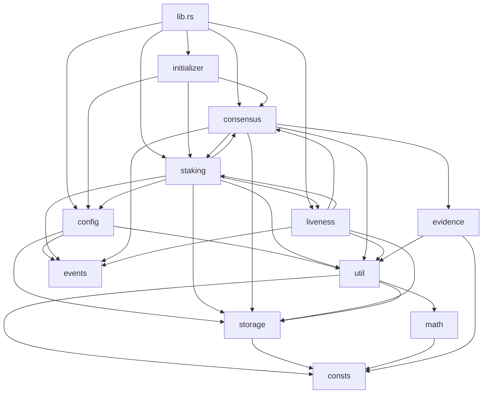
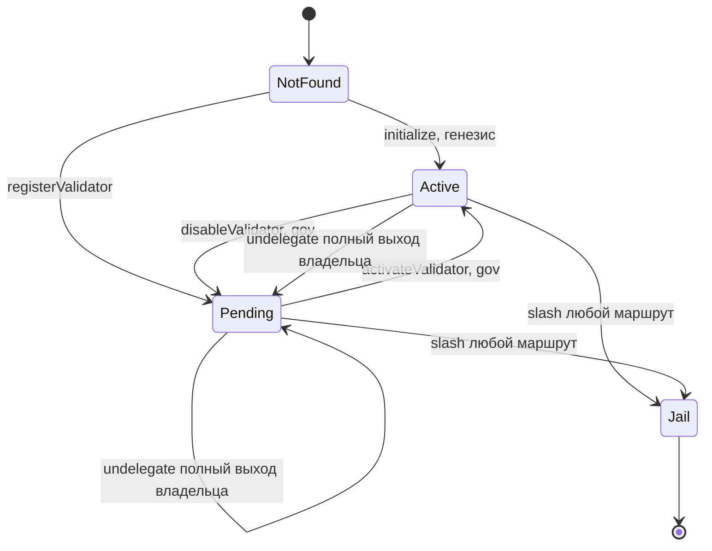
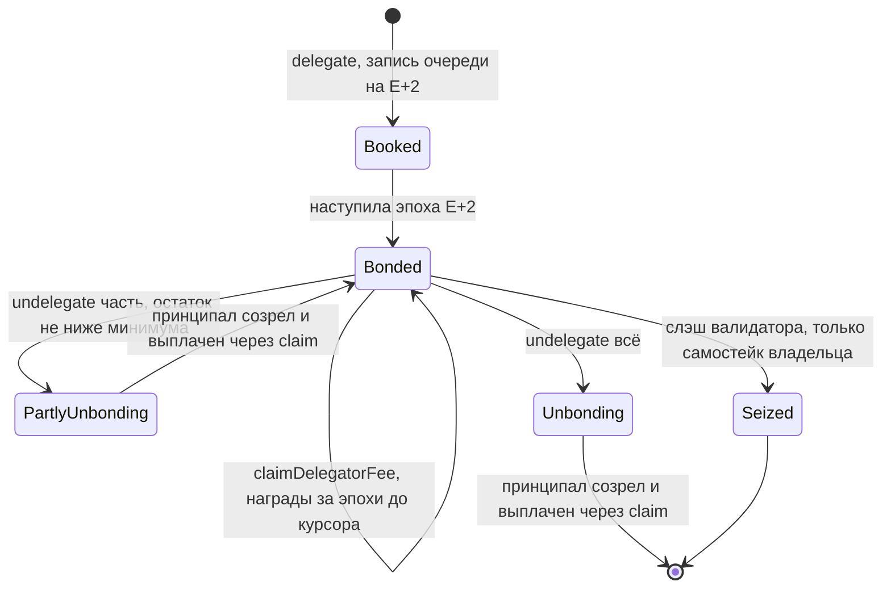
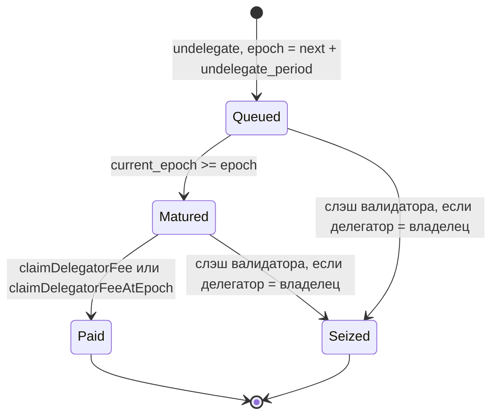
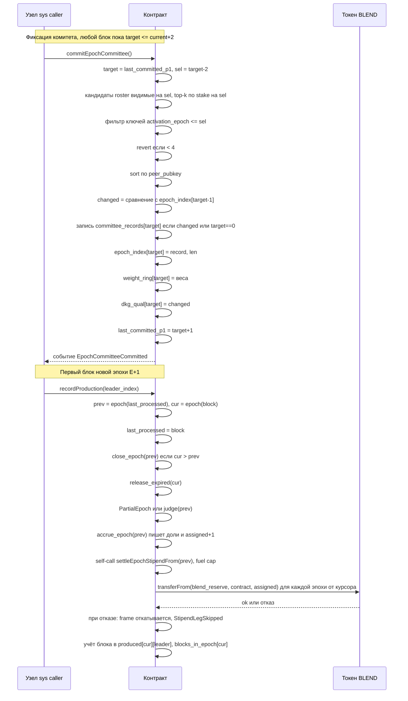

# Стейкинг-контракт (Rust/rWASM): разбор

Источник: `/home/djadjka/Work/staking-fresh`, все ссылки вида `файл:строка` указывают в `src/` этого каталога. Дата прохода: 2026-09-03.

Ограничения прохода: прочитаны только `Cargo.toml` и `src/*.rs` (включая `tests.rs` и тестовые модули внутри `math.rs`, `util.rs`, `evidence.rs`). `README.md` не открывался. Комментарии в коде как доказательство не использовались. Каталог `.dpos-study/` был просмотрен командой `ls` при проверке места для записи: видны имена файлов `AUDIT.md`, `AUDIT-BEACON.md`, `AUDIT-CORE.md`, `CONTRACT.md`, `COVERAGE.md`, `REFS.md`, `REGISTER.md`, `UNDERSTANDING.md`, `VERIFY-BLOCKERS.md` и их размеры. Ни один из них не открывался.

Пометка ГИПОТЕЗА означает вывод, не подтверждённый прочитанной строкой контракта (обычно про поведение хоста rWASM, SDK, токена или верификатора).

---

## 1. Карта модулей

| Файл | Строк | Назначение | Использует |
|---|---|---|---|
| `lib.rs` | 160 | Точка входа, разбор селектора, диспетчер | все модули |
| `consts.rs` | 573 | Селекторы, коды ошибок, лимиты, адреса, слоты ERC-7201 | sdk |
| `types.rs` | 134 | Структуры аргументов вызовов (Codec) | sdk |
| `storage.rs` | 336 | Раскладка хранилища, 5 пространств имён | consts |
| `math.rs` | 99 | Компактный баланс, сужение награды, `f`, эпоха по блоку | consts |
| `util.rs` | 260 | revert, проверки вызова, эпохи, ABI, ERC-20 переводы | consts, math, storage |
| `events.rs` | 290 | События (derive Event) | sdk |
| `initializer.rs` | 111 | Одноразовая инициализация | config, consensus, staking, storage, util |
| `config.rs` | 841 | Параметры governance: геттеры, сеттеры, чекпоинты cap | consts, events, math, storage, util |
| `staking.rs` | 2173 | Валидаторы, делегации, снапшоты, отбор, награды, стипендия | config, consensus, liveness, math, storage, util |
| `consensus.rs` | 1114 | Ключи и PoP, фиксация комитета, кольцо весов, слэшинг | evidence, math, staking, storage, util |
| `liveness.rs` | 570 | Учёт произведённых блоков, закрытие эпохи, вердикты, исключения | consensus, staking, storage, util |
| `evidence.rs` | 744 | Разбор доказательств эквивокации (uvarint, конкатенация) | consts, util |
| `tests.rs` | 9070 | Тесты (in-crate) | всё |

Зависимости между `staking.rs`, `consensus.rs`, `liveness.rs` циклические на уровне модулей (`staking` вызывает `consensus::committee_at`, `consensus::read_weights`, `liveness::readmit_at_epoch_of`; `consensus` вызывает `staking::selected_validators_at`, `staking::remove_active`, `staking::set_selection_visible`, `staking::remove_delegation_from_totals`; `liveness` вызывает `staking::accrue_epoch`, `staking::apply_production_exclusion`, `staking::release_production_exclusion`, `consensus::committee_at`, `consensus::read_weights`). Подтверждение: импорты `staking.rs:3-22`, `consensus.rs:3-18`, `liveness.rs:3-13`.

`Cargo.toml`: crate-type `cdylib` (`Cargo.toml:13`), зависимость только `fluentbase-sdk` (`Cargo.toml:7`), dev-зависимость `fluentbase-testing` (`Cargo.toml:10`), фича `devnet-views` по умолчанию выключена (`Cargo.toml:17-23`).

---

## 2. Внешний интерфейс

Вход: `main_entry` (`lib.rs:33-151`). Первые 4 байта входа — селектор big-endian u32 (`lib.rs:35-43`); короче 4 байт — `ExitCode::MalformedBuiltinParams` без данных (`lib.rs:35-37`); неизвестный селектор — revert `UnknownMethod()` (`lib.rs:149`). Селекторы — keccak от сигнатуры через `derive_keccak256_id!` (`consts.rs:20-232`), значения закреплены тестом `tests.rs:1082-1146`.

Обозначения прав: **any** — любой вызывающий; **gov** — только `GENESIS_GOVERNANCE` (константа SDK, проверка `util.rs:59-65`); **sys** — только `SYSTEM_CALLER` = `0xff…fe` (`consts.rs:553`); **self** — только сам контракт; **owner** — владелец валидатора; **init** — требуется `initialized == true` (`util.rs:49-57`). Все обработчики проверяют `contract_value == 0` (`util.rs:35-40`), мутирующие — ещё и не-static (`util.rs:42-47`).

### 2.1 Инициализация

| Сигнатура | Селектор | Право | Возврат | События |
|---|---|---|---|---|
| `initialize(address,address[],uint256[],bytes[],bytes[],bytes32[],uint16,address,uint32,uint32,uint32,uint256,uint256,uint64,address,uint256,address)` | `0xdfa8efb0` | any, один раз (`initializer.rs:29-33`) | ничего | `ActiveValidatorsLengthChanged`, `EpochBlockIntervalChanged`, `UndelegatePeriodChanged`, `MinValidatorStakeAmountChanged`, `MinStakingAmountChanged`, `DposActivationBlockChanged`, `MinVerdictDueBlocksChanged`, `ExclusionBackoffCapChanged`, `ProductionLivenessDisabledChanged`, `BlsVerifierChanged` (если верификатор ненулевой), `BlendReserveChanged` (`config.rs:84-142`); на каждого генезис-валидатора `ValidatorAdded` (`staking.rs:165-171`) и `ConsensusKeysSet` (`consensus.rs:265-271`) |

Аргументы по порядку: `initial_stake_owner`, `validators`, `initial_stakes`, `bls_pubkeys_uncompressed`, `bls_pops_uncompressed`, `peer_pubkeys`, `commission_rate`, `staking_token`, `active_validators_length`, `epoch_block_interval`, `undelegate_period`, `min_validator_stake_amount`, `min_staking_amount`, `dpos_activation_block`, `bls_verifier`, `min_undelegate_blocks`, `blend_reserve` (`types.rs:11-33`).

### 2.2 Конфигурация (модуль `config.rs`)

Константы, читаемые как view (any, без init): `MAX_ACTIVE_VALIDATORS()` `0x5d887462` → 51 (`config.rs:193-196`); `MAX_BLEND_STIPEND_PER_EPOCH()` `0x2bc2fec4` → 10^24 (`config.rs:201-204`); `DEFAULT_MIN_VERDICT_DUE_BLOCKS()` `0x6fd3afb7` → 100; `DEFAULT_EXCLUSION_BACKOFF_CAP()` `0xd4c30c1a` → 128; `MAX_MIN_VERDICT_DUE_BLOCKS()` `0x9b9a11ba` → 100 (та же константа, `config.rs:227-230`).

Геттеры (any, без init): `getStakingToken()` `0x9f9106d1`; `getActiveValidatorsLength()` `0x32cc6f08` (скаляр, последнее запланированное значение); `getActiveValidatorsLengthAt(uint64)` `0xd9b083ba` (по чекпоинтам, `config.rs:263-281`); `getEpochBlockInterval()` `0x346c90a8`; `getDposActivationBlock()` `0xa2a50528`; `getUndelegatePeriod()` `0x5e7b72ad`; `getMinValidatorStakeAmount()` `0x6f856847`; `getMinStakingAmount()` `0xeea9a01b`; `getSlashFundAddress()` `0xc910df38`; `getBlendStipendPerEpoch()` `0xc8f45d87`; `getBlsVerifier()` `0xc6b904ad`; `getBlendReserve()` `0x37dff538`; `getMinVerdictDueBlocks()` `0xee3ad0e7`; `getExclusionBackoffCap()` `0x6bed0322`; `getProductionLivenessDisabled()` `0x9a4c46bb`.

Сеттеры — все **gov + init** (`config.rs:19-23`), все испускают событие `<Имя>Changed(prev,new)`:

| Сигнатура | Селектор | Проверки | Строки |
|---|---|---|---|
| `setSlashFundAddress(address)` | `0xa79e7263` | ненулевой | 430-447 |
| `setBlendStipendPerEpoch(uint256)` | `0x2c91b879` | ≤ 10^24 | 462-486 |
| `setActiveValidatorsLength(uint32)` | `0xc227a412` | ≥ 4 и ≤ 51; пишет скаляр и чекпоинт с `from_epoch = next_epoch` | 488-530 |
| `setEpochBlockInterval(uint32)` | `0xaf70fa2c` | ≠0; DPoS ещё не активен; `activation % value == 0` если activation≠0; окно undelegate ≥ min_undelegate_blocks | 532-560 |
| `setDposActivationBlock(uint64)` | `0xf517ca6a` | DPoS ещё не активен; `value % interval == 0`; `value ≥ block_number` | 562-589 |
| `setUndelegatePeriod(uint32)` | `0x41d8a080` | ≠0; DPoS не активен; окно ≥ min | 591-616 |
| `setMinValidatorStakeAmount(uint256)` | `0xe1a2e863` | ≠0; кратно 10^10 | 618-639 |
| `setMinStakingAmount(uint256)` | `0x612d669e` | ≠0; кратно 10^10 | 641-659 |
| `setMinVerdictDueBlocks(uint32)` | `0x4fae9dea` | ≠0; ≤ 100 | 684-711 |
| `setExclusionBackoffCap(uint32)` | `0x3b543e1c` | ≠0 | 726-746 |
| `setProductionLivenessDisabled(bool)` | `0x8fc07556` | нет | 761-778 |
| `setBlsVerifier(address)` | `0x466ae541` | ненулевой | 793-810 |
| `setBlendReserve(address)` | `0x7899ae8f` | ненулевой | 827-841 |

«DPoS активен» = `activation != 0 && block_number >= activation` (`config.rs:25-31`).

### 2.3 Валидаторы и делегации (`staking.rs`)

| Сигнатура | Селектор | Право | Возврат / эффект | Строки |
|---|---|---|---|---|
| `currentEpoch()` | `0x76671808` | any, init | u64 | 784-788 |
| `nextEpoch()` | `0xaea0e78b` | any, init | u64 | 793-797 |
| `isValidator(address)` | `0xfacd743b` | any | bool: status ≠ 0 | 802-806 |
| `isValidatorActive(address)` | `0x42ad55ac` | any | bool: status==ACTIVE и входит в live-выборку | 811-817 |
| `getValidatorStatus(address)` | `0xa310624f` | any | `(owner, status u8, stake wei, changed_at, claimed_at, commission u16)`; stake и commission берутся из снапшота `changed_at` | 822-840 |
| `getValidatorByOwner(address)` | `0x30108c22` | any | address | 845-852 |
| `getValidators()` | `0xb7ab4db5` | any | `address[]` live-выборка | 857-860 |
| `activateValidator(address)` | `0xb46e5520` | gov, init | PENDING→ACTIVE; `ValidatorModified` | 865-912 |
| `disableValidator(address)` | `0x1fe97684` | gov, init | ACTIVE→PENDING; `ValidatorModified` | 917-928 |
| `changeValidatorCommissionRate(address,uint16)` | `0x14f8649f` | owner, init | ставка с next_epoch; `ValidatorModified` | 933-954 |
| `changeValidatorOwner(address,address)` | `0x0052c9e1` | owner, init | всегда revert `ValidatorOwnerImmutable()` после проверки владельца | 959-976 |
| `getValidatorDelegation(address,address)` | `0xd951e186` | any | `(amount wei, epoch)` последней записи очереди | 982-1003 |
| `getValidatorDelegatedStakeAt(address,uint256)` | `0xe8810ea7` | any | stake wei на эпоху блока | 1008-1019 |
| `registerValidator(address,uint16,uint256,bytes,bytes,bytes32)` | `0x8d6067ed` | any, init | владелец = caller; NOT_FOUND→PENDING; `ValidatorAdded`, `ConsensusKeysSet`; `transferFrom(caller)` | 1024-1067 |
| `delegate(address,uint256)` | `0x026e402b` | any, init | `Delegated`; `transferFrom(caller)` | 1072-1079 |
| `undelegate(address,uint256)` | `0x4d99dd16` | any, init | `Undelegated`; при полном выходе владельца ещё `ValidatorModified` | 1172-1179 |
| `getValidatorFee(address)` | `0x457179fd` | any, init | U256 | 1618-1626 |
| `getPendingValidatorFee(address)` | `0xc6fb9065` | any, init | U256 (до next_epoch) | 1631-1642 |
| `claimValidatorFee(address)` | `0xff4794fc` | any, init | `transfer(owner)`; `ValidatorOwnerClaimed` | 1687-1693 |
| `claimValidatorFeeAtEpoch(address,uint64)` | `0xadf2a79c` | any, init | то же, epoch ≤ current | 1698-1710 |
| `getDelegatorFee(address,address)` | `0x52b7bea2` | any, init | U256 (награда + созревший принципал) | 1715-1738 |
| `getPendingDelegatorFee(address,address)` | `0xc2fd58fc` | any, init | U256 | 1743-1769 |
| `claimDelegatorFee(address)` | `0x426594b1` | any (делегатор = caller), init | `transfer(caller)`; `Claimed` | 1818-1825 |
| `claimDelegatorFeeAtEpoch(address,uint64)` | `0xfe38ebef` | caller, init | то же, epoch ≤ current | 1830-1849 |
| `calcAvailableForRedelegateAmount(address,address)` | `0x5ef9e8c6` | any, init | `(amount, dust)` | 1854-1878 |
| `redelegateDelegatorFee(address)` | `0x8ecb3fc9` | caller, init | `Redelegated`; ре-делегирует кратную 10^10 часть, пыль переводит | 1883-1893 |
| `getEpochRewards(uint64)` | `0x54c3e84b` | any, init | сумма `total_blend_rewards` по комитету эпохи | 1898-1921 |
| `settleEpochStipend(uint64)` | `0xa631344a` | sys, init | оплата эпох до `up_to` | 2146-2154 |
| `settleEpochStipendFrom(uint64)` | `0x92d321ab` | self, init | то же | 2162-2173 |

### 2.4 Консенсус (`consensus.rs`)

| Сигнатура | Селектор | Право | Возврат / эффект | Строки |
|---|---|---|---|---|
| `getConsensusKeys(address)` | `0xad36f42f` | any, init | `(bytes bls96, bytes32 peer, uint64 activation_epoch)`; пусто если peer==0 | 277-282 |
| `getValidatorsWithKeys()` | `0xd41c52eb` | any, init | `(address[], ConsensusKeys[])` live-выборка | 303-307 |
| `getRegistryWithKeys()` | `0xd96cbd7b` | any, init | все из `active_validators` с ключами | 312-322 |
| `getValidatorsWithKeysAt(uint64)` | `0x7cfba9f3` | any, init | выборка на эпоху; ключи с `activation_epoch > epoch` обнуляются, адрес остаётся | 327-335 |
| `nextEpochToCommit()` | `0xc06a82de` | any, init | `last_committed_epoch_p1` | 340-349 |
| `committeeSelectionEpoch()` | `0x8bd070e4` | any, init | `nextEpochToCommit − 2` (saturating) | 354-363 |
| `commitEpochCommittee()` | `0xe505b249` | sys, init | фиксирует комитет `target`; `EpochCommitteeCommitted` | 590-673 |
| `getDkgQual(uint64)` | `0x2660899f` | any, init | bool | 678-689 |
| `getEpochCommittee(uint64)` | `0x80b562de` | any, init | `address[]` (пустой если не зафиксирован) | 736-743 |
| `getEpochCommitteeWithStakes(uint64)` | `0xa4d160c1` | any, init | `(address[], ConsensusKeys[], uint256[] stakes, bool[] tombstoned)`; `stakes` пуст, если кольцо весов перезаписано | 763-795 |
| `slashEquivocation(uint64,uint32)` | `0xdc6fb3f2` | sys, init | по `(epoch, signer_idx)`; повтор — тихий `Ok` | 950-971 |
| `slashEquivocationNotarize(bytes,bytes,bytes,bytes)` | `0xe28d2f63` | any, init | по доказательству | 1066-1075 |
| `slashEquivocationFinalize(bytes,bytes,bytes,bytes)` | `0xadd07a3e` | any, init | по доказательству | 1080-1089 |
| `slashEquivocationNullifyFinalize(bytes,bytes,bytes,bytes)` | `0xa10827e9` | any, init | по доказательству | 1094-1103 |

События слэшинга: `ValidatorJailed(validator, penalty_epoch)`, `EquivocationSlashed(validator, conflict_epoch)`, `EquivocationStakeSeized(validator, seized, recipient)` (`consensus.rs:991-1040`).

### 2.5 Liveness (`liveness.rs`)

| Сигнатура | Селектор | Право | Эффект | Строки |
|---|---|---|---|---|
| `recordProduction(uint8)` | `0x1752910e` | sys, init | учёт блока; при смене эпохи — закрытие предыдущей | 46-121 |
| `blocksInEpoch(uint64)` `0xf06be669`, `producedAt(uint64,uint32)` `0x91c7d453`, `pendingExclusions()` `0xaef690f9`, `lastProcessedBlock()` `0x33de61d2` | | any, без init | view; только с фичей `devnet-views` (`lib.rs:86-93`) | 514-570 |

События закрытия эпохи: `PartialEpoch`, `ProductionVerdictFailed`, `CorrelatedFailureEpoch`, `ProductionExclusionApplied`, `ProductionExclusionReleased`, `EpochWeightsUnavailable`, `EpochBlendRewardsCommitted`, `StipendSkipped`, `StipendLegSkipped` (`events.rs:126-248`).

### 2.6 Исходящие вызовы

BLS-верификатор (адрес из конфигурации): `compressG2Unchecked(bytes)` `0xa5d2dd22`, `compressG1Unchecked(bytes)` `0x8f498050`, `verify(bytes,bytes,bytes,bytes,bytes)` `0x8bf26133` (`consts.rs:217-232`). Токен: `transferFrom(address,address,uint256)` `0x23b872dd`, `transfer(address,uint256)` `0xa9059cbb` (`consts.rs:95-98`). Сам контракт: `settleEpochStipendFrom` с лимитом топлива (`liveness.rs:491-503`).

### 2.7 Сводка по правам

- Только governance: 13 сеттеров §2.2, `activateValidator`, `disableValidator`.
- Только system caller: `commitEpochCommittee`, `recordProduction`, `slashEquivocation`, `settleEpochStipend`.
- Только сам контракт: `settleEpochStipendFrom`.
- Только владелец валидатора: `changeValidatorCommissionRate`, `changeValidatorOwner` (последний всегда revert).
- Любой: `initialize` (один раз), `registerValidator`, `delegate`, `undelegate`, все claim/redelegate (претензия делегатора — на caller; претензия владельца — на владельца, но вызвать может любой, `staking.rs:1673-1675`), три `slashEquivocation*` по доказательству, все view.

---

## 3. Модель хранения

Пять корней ERC-7201 (`consts.rs:568-573`): `Fluent.storage.Initializer`, `Fluent.storage.ChainConfig`, `Fluent.storage.Consensus`, `Fluent.storage.StakingStorage`, `Fluent.storage.ProductionLiveness`. Раскладка внутри корня — `#[derive(Storage)]` из SDK (`storage.rs:17`, `24`, `210`, `241`, `274`); порядок полей = порядок объявления. Конкретные смещения упаковки закреплены тестом `tests.rs:60-117`; сам механизм упаковки — в SDK (ГИПОТЕЗА относительно правил).

### 3.1 `InitializerStorage` (`storage.rs:18-21`)
`initialized: bool`, `initializing: bool`. Второй флаг поднят на время внешних вызовов верификатора внутри `initialize` (`initializer.rs:47`, `72-74`).

### 3.2 `ChainConfigStorage` (`storage.rs:25-55`)

| Поле | Тип | Единицы |
|---|---|---|
| `staking_token` | address | |
| `active_validators_length` | u64 | штук (скаляр, последнее запланированное) |
| `epoch_block_interval` | u64 | блоков |
| `undelegate_period` | u64 | эпох |
| `dpos_activation_block` | u64 | номер блока; 0 = не активирован |
| `min_validator_stake_amount` | U256 | wei, кратно 10^10 |
| `min_staking_amount` | U256 | wei, кратно 10^10 |
| `slash_fund_address` | address | 0 = сжигать на `0x…dead` |
| `blend_stipend_per_epoch` | U256 | wei за эпоху |
| `bls_verifier` | address | |
| `min_undelegate_blocks` | U256 | блоков (пишется только при init, `config.rs:60-62`; сеттера нет) |
| `blend_reserve` | address | источник стипендии (`transferFrom`) |
| `cap_checkpoints` | Vec<{from_epoch u64, value u32}> | история cap по эпохам |
| `min_verdict_due_blocks` | u32 | блоков |
| `exclusion_backoff_cap` | u32 | эпох |
| `production_liveness_disabled` | bool | при init = true (`config.rs:75-77`) |

### 3.3 `StakingStorage` (`storage.rs:242-256`)

- `validators: Map<Address, ValidatorStorage>` — `owner`, `status u8`, `changed_at u64` (наибольшая материализованная эпоха снапшота), `claimed_at u64` (курсор выплат владельцу, эпоха) (`storage.rs:62-68`).
- `owner_validators: Map<Address, Address>` — владелец → валидатор.
- `active_validators: Vec<Address>` — валидаторы со статусом ACTIVE (push `staking.rs:154-158`, `899-901`; swap-pop `38-56`).
- `selection_roster: Vec<Address>` — все, кто хоть раз стал видимым для отбора; только растёт (`staking.rs:182-186`, `205-215`).
- `selection_membership: Map<Address, SelectionMembershipStorage>` — история видимости глубиной три перехода: `visible/effective_from`, `prev_visible/prev_from`, `prev2_visible/prev2_from`, плюс `rostered` (`storage.rs:140-154`).
- `validator_snapshots: Map<Address, Map<u64 epoch, {total_delegated U112 (единицы 10^10 wei), commission_rate u16 (bps), total_blend_rewards U96 (wei)}>>` (`storage.rs:72-78`).
- `validator_snapshot_epochs: Map<Address, Vec<u64>>` — отсортированный список материализованных эпох (`storage.rs:255`; вставка `staking.rs:484-515`).
- `validator_delegations: Map<Address validator, Map<Address delegator, ValidatorDelegationStorage>>`: `delegate_queue: Vec<{amount U112 кумулятивный, epoch}>`, `undelegate_queue: Vec<{amount U112, epoch созревания}>`, `undelegate_gap u64` (индекс первой невыплаченной записи), `pending_undelegated U256` (wei, сумма невыплаченных), `claimed_through_epoch u64` (`storage.rs:111-127`).
- `last_rewarded_epoch_p1: u64` — курсор оплаченных эпох + 1.

### 3.4 `ConsensusStorage` (`storage.rs:211-235`)

- `consensus_keys: Map<Address, {bls_pubkey [B256;3] (96 байт сжатого G2), peer_pubkey B256, activation_epoch u64}>` (`storage.rs:158-163`).
- `peer_pubkey_owner: Map<B256, Address>`; `bls_pubkey_owner: Map<B256 keccak(compressed), Address>`.
- `committee_records: Map<u64 minting_epoch, Vec<Address>>` — записи членства, добавляются только при смене состава; никогда не удаляются.
- `epoch_index: Map<u64, {record u32, length u32}>` — какая запись и сколько членов у эпохи; `length == 0` = не зафиксирована (`consensus.rs:365-392`).
- `weight_ring: [WeightPairStorage; 16 * 26 = 416]` — замороженные веса: слот `(epoch % 16) * 26 + i/2`, в паре `a`, `b` (U112) и `stamp u32 = epoch as u32` (`storage.rs:203-207`, `consensus.rs:424-426`).
- `dkg_qual: Map<u64, bool>` — «состав изменился относительно предыдущей эпохи».
- `last_committed_epoch_p1: u64`.
- `tombstoned: Map<Address, bool>` — нигде не сбрасывается (grep по `tombstoned_accessor … set_checked` вне тестов: только `consensus.rs:1019-1022`).

### 3.5 `ProductionLivenessStorage` (`storage.rs:275-316`)

- `last_processed_block u64`; `produced: Map<u64 epoch, Map<u32 index, u32>>`; `blocks_in_epoch: Map<u64, u32>`; `pending_exclusions: Vec<Address>`; `validators: Map<Address, {last_failed_epoch_p1 u64, readmit_at_epoch u64, kick_count u32}>` (`storage.rs:264-271`); `assigned_at_close_p1: Map<u64, U256>` (сумма начисленного + 1; 0 = закрытие не выполнялось).

### 3.6 Единицы и точность

- Стейк: хранится как U112 в единицах `BALANCE_COMPACT_PRECISION = 10^10` wei (`consts.rs:342`); любой вход не кратный 10^10 — revert `WrongAmountPrecision()` (`math.rs:11-16`, `staking.rs:90-92`, `1095-1097`, `1192-1194`, `config.rs:625-627`, `163-164`).
- Награды: `total_blend_rewards` U96 в wei; `narrow_reward` даёт `IntegerOverflow` при переполнении (`math.rs:24-26`, `staking.rs:2051`).
- Комиссия: bps, максимум 3000 (`consts.rs:335`, `348`); применение `total * rate / 10000` с округлением вниз в пользу делегаторов (`staking.rs:1334-1340`).
- Доля делегатора за эпоху: `pool * delegated / total` с округлением вниз (`staking.rs:1403-1409`); остатки никому не начисляются.
- Доля стипендии: `pot * w_i / W` в компактных единицах веса, округление вниз; сумма долей ≤ pot (`staking.rs:2043-2055`).
- Эпоха: `(block − activation) / interval`, 0 до активации или при `activation == 0` (`math.rs:49-57`).
- Веса в кольце: компактные U112 (`consensus.rs:471`); наружу разворачиваются в wei (`consensus.rs:892-896`, `liveness.rs:284`); в `assign_epoch_shares` используются сырые компактные (`staking.rs:2026`).

Выводимое, не хранимое: текущая эпоха; live-выборка `getValidators()`; таинт неполной эпохи (`recorded != expected`, `liveness.rs:173`); `f = (n−1)/3` (`math.rs:32-38`).

---

## 4. Инварианты

| # | Утверждение | Где поддерживается | Поддерживается ли |
|---|---|---|---|
| I1 | `snapshot[v][E].total_delegated == Σ_d delegated_amount_at(v,d,E)` | `set_validator` пишет обе стороны (`staking.rs:126-152`); `delegate_to` обновляет все снапшоты ≥ E+2 и очередь (`1125-1154`); `undelegate_from` — снапшоты ≥ next_epoch и очередь (`1266-1277`); `seize_self_stake` вычитает из снапшотов ≥ next_epoch (`consensus.rs:964`) | Для эпох ≥ next_epoch — да. Для эпох < next_epoch после конфискации нарушается: очередь владельца очищена (`consensus.rs:966`), а старые снапшоты его вклад сохраняют. Нигде не проверяется утверждением |
| I2 | `4 ≤ len(committee[E]) ≤ cap_at(E−2) ≤ 51` | нижняя: `consensus.rs:718-720`; верхняя: `top_k` обрезает по cap (`staking.rs:452,464`); cap ≤ 51: `config.rs:158`, `506`; cap ≥ 4: только сеттер `config.rs:499`, не init | Да, кроме генезиса с cap < 4 (init допускает cap=1..3; первый commit тогда revert) |
| I3 | `len(committee) ≤ 52` (кольцо) | `consensus.rs:459-465` | Да |
| I4 | `last_committed_epoch_p1` растёт на 1 за commit | `consensus.rs:768-770` | Да |
| I5 | `last_rewarded_epoch_p1` не убывает, оплата подряд без пропусков | `staking.rs:2130-2139` | Да |
| I6 | `last_processed_block` не убывает; блок учитывается один раз | `liveness.rs:57-67` | Да |
| I7 | Эпоха по номеру блока не убывает | `set_dpos_activation_block` только при неактивном DPoS и `value ≥ block` (`config.rs:570-577`); `set_epoch_block_interval` только при неактивном (`543`) | Да, пока DPoS не активен; после активации оба сеттера закрыты |
| I8 | `peer_pubkey` уникален и неизменяем | `consensus.rs:142-149`, `227-234`; нет сеттера ключей | Да |
| I9 | `keccak(compressed bls)` уникален и неизменяем | `consensus.rs:169-176`, `237-248` | Да |
| I10 | Один валидатор на владельца; один владелец на валидатора; владелец неизменяем | `staking.rs:99-106`, `959-976` | Да |
| I11 | Статус `JAIL` терминален, `tombstoned` навсегда | переходы §5.1; сброса `tombstoned` нет | Да |
| I12 | `sum(produced[E][*]) == blocks_in_epoch[E]` | оба инкремента после обоих «парковочных» выходов (`liveness.rs:92-120`) | Да |
| I13 | `assigned_at_close_p1[E] − 1 == Σ total_blend_rewards[v][E]` по комитету | одна переменная `assigned` пишется в оба места (`staking.rs:1944-1957`, `2049-2055`) | Да (но `getEpochRewards` суммирует по всем членам, включая tombstoned с нулём) |
| I14 | Неотрицательность стейка | U112 `checked_sub` → `IntegerOverflow` (`staking.rs:661-664`, `717`), в `undelegate_from` — revert `InsufficientBalance()` (`1217-1225`) | Да, отказом |
| I15 | `active_validators` содержит ровно валидаторов со статусом ACTIVE | push/remove при каждом переходе; live-выборка дополнительно фильтрует по статусу (`staking.rs:418`) | Да, по коду; дублирующий фильтр указывает на неуверенность автора |
| I16 | Стейк, посчитанный для комитета E, заморожен | снапшоты по эпохам + кольцо весов, пишутся в commit (`consensus.rs:759-763`) | Да, на 16 эпох (кольцо) |
| I17 | Вес, использованный для отбора, тот же, что для вердикта и стипендии | `selected_committee_at` возвращает вес вместе с адресом (`staking.rs:441-466`, `consensus.rs:568-584`), он же пишется в кольцо | Да |

---

## 5. Жизненные циклы

### 5.1 Валидатор

Статусы: `NOT_FOUND=0`, `ACTIVE=1`, `PENDING=2`, `JAIL=3` (`consts.rs:11-14`).

Переходы и их побочные записи:

- Генезис (`initializer.rs:48-67`): `set_validator(v, owner=v, ACTIVE, rate, stake, changed_at=0)` — запись владельца, снапшот эпохи 0, запись очереди `(stake, 0)`, push в `active_validators`, видимость с эпохи 0 (`seed_selection_membership`, `staking.rs:175-203`), затем `store_consensus_keys(activation_epoch=0)`. Токены тянутся одним `transferFrom` с `initial_stake_owner` в конце (`initializer.rs:75`, `102-111`).
- Регистрация (`staking.rs:1024-1067`): комиссия ≤ 3000; адрес не занят; `initial_stake ≥ min_validator_stake_amount`; проверка ключей и PoP через верификатор (§8); `set_validator(PENDING, changed_at = next_epoch)`; ключи с `activation_epoch = next_epoch`; `transferFrom(caller, initial_stake)` последним. Видимость: невидим, в roster не попадает (`staking.rs:159-164`, `182-186`). Адрес валидатора задаёт вызывающий, владелец = вызывающий; никакой связи между адресом валидатора и подписью не проверяется.
- Активация (`staking.rs:865-912`): статус PENDING; `delegated_amount_at(v, owner, next_epoch) ≠ 0`; статус ACTIVE; push в active; roster; видимость с next_epoch, но только если `readmit_at_epoch == 0` (`907-909`); материализация снапшота next_epoch.
- Отключение (`staking.rs:917-928`): статус ACTIVE; удаление из active; PENDING; невидим с next_epoch (`deactivate_validator_at(current_epoch)` → `set_selection_visible(false, current)` → `effective = current+1`, `staking.rs:58-70`, `226`).
- Полный выход владельца (`staking.rs:1228-1301`): если делегатор == владелец, статус ACTIVE или PENDING, остаток 0 и нет чужих делегаций во всех будущих снапшотах (`only_self_stake_remains_after_decrease`, `696-723`) — статус PENDING, невидим с next_epoch. Если чужие делегации есть, полный выход запрещён (`ERR_OWNER_SELF_STAKE_BELOW_MINIMUM`, `1235-1246`).
- Слэш (`consensus.rs:1008-1041`): статус ≠ NOT_FOUND; `tombstoned = true`; если ACTIVE — из active; статус JAIL; невидим с next_epoch; конфискация самостейка владельца (§9.2); события. Из JAIL нет переходов: `activateValidator` требует PENDING, `disableValidator` требует ACTIVE, полный выход требует ACTIVE/PENDING.

Tombstone: ставится при слэше, проверяется при регистрации ключей (`consensus.rs:129-135`), при делегировании (`staking.rs:1113-1119`), при возврате из исключения (`staking.rs:366-372`), при распределении стипендии (`staking.rs:2013-2018`), в повторном слэше (`consensus.rs:1066-1072`, `1005-1011`), в `getEpochCommitteeWithStakes` (`consensus.rs:884-889`).

### 5.2 Делегация

- `delegate_to` (`staking.rs:1081-1167`): сумма ≥ `min_staking_amount` и кратна 10^10; валидатор существует и не tombstoned; эффект с `current + WARMUP_DELAY(2)` (`1122-1124`); в снапшоты ≥ E+2 добавляется сумма (`1125-1127`); в очередь — новая запись `(prev+amount, E+2)` или слияние в последнюю, если её эпоха ≥ E+2 (`1129-1154`); `transferFrom(delegator)` после записей (`1156-1158`). Статус валидатора не проверяется (PENDING, JAIL принимают делегации; JAIL отрезан tombstone).
- `undelegate_from` (`staking.rs:1181-1311`): сумма ≠ 0, кратна 10^10; очередь непуста; последняя запись очереди не позже next_epoch (иначе `PendingDelegation`, `1213-1215`); остаток ≥ 0; остаток снапшота next_epoch ≥ 0; для владельца: остаток ≥ `min_validator_stake_amount` либо полный выход без чужих делегаций; для остальных: остаток 0 или ≥ `min_staking_amount` (`1258-1264`); снапшоты ≥ next_epoch уменьшаются; очередь получает запись `(remaining, next_epoch)` или правит последнюю; в `undelegate_queue` — `(amount, next_epoch + undelegate_period)` (`1280-1285`); `pending_undelegated += amount` в wei. Токены не движутся.
- Выплата принципала — только через claim делегатора (`consume_delegator_claim`, `staking.rs:1575-1597`): записи со сроком ≤ `principal_before_epoch` выплачиваются подряд от `undelegate_gap`; окно ограничено `first_unpaid_maturity + 1000` (`1497-1522`). Награда и принципал уходят одним `transfer` (`1804`).

### 5.3 Заявка на вывод

Созревание сравнивается с `before_epoch` претензии (`staking.rs:1582`), где `before_epoch` = current (или явно заданная ≤ current). Изменение `undelegate_period` governance не трогает уже записанные сроки (`tests.rs:4275-4310`). Конфискация забирает `pending_undelegated` целиком, включая созревшие, но не выплаченные суммы (`consensus.rs:949-953`, `869`).

---

## 6. Переход эпохи

Участники: узел (system caller), контракт, BLS-верификатор, токен BLEND. Контракт сам эпоху не «переключает» — эпоха выводится из номера блока. Два системных вызова несут переход: `commitEpochCommittee` (может выполняться заранее на 2 эпохи) и `recordProduction` (закрывает предыдущую эпоху первым записанным блоком новой).

### 6.1 Что атомарно

- `commitEpochCommittee` — один вызов, все записи (`consensus.rs:743-775`) либо все, либо ни одной при revert (ГИПОТЕЗА о хосте: возврат `Err` откатывает состояние вызова; тесты эмулируют это в `tests.rs:186-197`). Проверено тестом отсутствие частичной записи при `CommitteeTooSmall` (`tests.rs:3569-3618`).
- `recordProduction` с закрытием: три «ноги» закрытия (`liveness.rs:132-202`): освобождение исключений и вердикты — в основном фрейме; начисление (`accrue_epoch`) — в основном фрейме; оплата — во вложенном self-call с лимитом топлива `12_000_000 * FUEL_DENOM_RATE` (`consts.rs:491`; тест закрепляет `12_000_000 * 20`, `tests.rs:9202-9206`). Отказ оплаты не отменяет остальное: результат self-call читается как статус, испускается `StipendLegSkipped` (`liveness.rs:498-502`). Вложенный фрейм при ошибке откатывает только свои записи — ГИПОТЕЗА о хосте, тест эмулирует (`tests.rs:8924-8955`).
- Любая ошибка в основном фрейме закрытия (в `judge`, `accrue_epoch`, чтении хранилища) — ошибка всего `recordProduction`.

### 6.2 Что при прерывании на каждом шаге

- Commit не вызван вовремя: `recordProduction` видит `committee_length_at(cur) == 0` и паркует блок (не учитывает), `last_processed` всё равно продвигается (`liveness.rs:82-94`). Эпоха закроется как неполная (`PartialEpoch`).
- Commit отстал более чем на 2 эпохи: нет ограничения снизу; `target ≤ current + 2` — только сверху (`consensus.rs:709-715`). Commit можно догонять по одному вызову за раз.
- Commit с недобором (< 4 после фильтра ключей): revert `CommitteeTooSmall`; курсор не двигается; следующий вызов повторит ту же выборку.
- Пропуск нескольких эпох без записей: закрывается только эпоха последнего записанного блока (`liveness.rs:63-74`); промежуточные эпохи не начисляются; при оплате они форфейтятся, если для них нет `blocks_in_epoch` (`staking.rs:2079-2091`).
- Кольцо весов перезаписано более поздней эпохой (закрытие позже чем через 16 эпох): вердикты и стипендия эпохи форфейтятся с событием `EpochWeightsUnavailable` (`liveness.rs:268-275`, `staking.rs:1997-2004`).
- Отказ токена при оплате: курсор `last_rewarded_epoch_p1` остаётся, следующее закрытие повторяет с той же эпохи, до 4 эпох за вызов (`staking.rs:2132`, `consts.rs:472`).
- Оплата вызвана раньше закрытия эпохи с блоками: revert `EpochNotAccrued` (`staking.rs:2086-2088`) — внутри self-call это тихий отказ ноги.

---

## 7. Отбор комитета

Алгоритм `selected_committee_at(sel)` (`consensus.rs:568-584`) поверх `selected_validators_at(sel)` (`staking.rs:385-392`):

1. Эпоха отбора: `sel = target − 2` с насыщением, `target = last_committed_epoch_p1` (`consensus.rs:706-716`). Для target 0, 1, 2 → sel = 0.
2. Кандидаты: обход всего `selection_roster` в порядке добавления; берутся те, у кого `selection_visible_at(v, sel)` (`staking.rs:285-300`). Видимость — кусочно-постоянная функция трёх переходов (`staking.rs:260-283`); эпохи ниже самого старого записанного перехода отвечают `false`.
3. Вес: `validator_total_at(v, sel)` = `total_delegated` последнего снапшота с эпохой ≤ sel, развёрнутый в wei; 0 если снапшотов нет или статус NOT_FOUND (`staking.rs:725-746`). Стейк-минимума нет: кандидат с нулевым стейком проходит.
4. Cap: `active_validators_length_at(sel)` — обратный проход по `cap_checkpoints`, первый с `from_epoch ≤ sel`; если чекпоинтов нет — скаляр (`config.rs:263-281`).
5. Top-k: сортировка выбором на `k = min(cap, n)` позиций; на каждой позиции ищется первый строго больший стейк и делается swap (`staking.rs:452-463`); обрезка до k. При равном стейке побеждает элемент, стоящий раньше в текущем (уже частично переставленном) массиве; swap может переставить равные элементы, так что «порядок roster» для равных не гарантирован в общем случае (при cap 1 и двух равных выигрывает первый в roster, `tests.rs:3621-3643`).
6. Фильтр ключей после обрезки: остаются только те, у кого `peer_pubkey ≠ 0` и `activation_epoch ≤ sel` (`consensus.rs:538-552`, `563-571`). Отсеянные не заменяются никем из-за черты.
7. Порог: если осталось меньше 4 — revert `CommitteeTooSmall` (`consensus.rs:718-720`).
8. Порядок в комитете: `sort_unstable_by_key(peer_pubkey)` по возрастанию (`consensus.rs:729`); уникальность peer-ключей исключает ничьи. Индекс в этом массиве = индекс подписанта в консенсусе (используется в `slashEquivocation` по `signer_idx`, `consensus.rs:801-822`, и в `recordProduction` по `leader_index`, `liveness.rs:98-105`).
9. Недобор до cap не восполняется: размер = сколько прошло.

Live-выборка `selected_validators()` (`staking.rs:410-429`) — другой алгоритм: кандидаты из `active_validators` со статусом ACTIVE, стейк на текущую эпоху, cap — скаляр. Она питает `getValidators()`, `isValidatorActive`, `getValidatorsWithKeys()`, но не commit.

Задержки в сумме: делегация действует с E+2; видимость после активации/исключения — с E+1; комитет на T выбирается из T−2. Валидатор, активированный в эпоху A, впервые попадает в комитет эпохи A+3 (виден с A+1, sel=T−2 ≥ A+1 → T ≥ A+3). Исключение, поставленное в E, бьёт по комитету E+3.

---

## 8. Ключи и PoP

Что хранится (`storage.rs:158-163`): 96 байт сжатого BLS-ключа (три слова), 32-байтный `peer_pubkey`, `activation_epoch`. Индексы обратной привязки: `peer_pubkey → validator` и `keccak(compressed bls) → validator` (`storage.rs:213`, `234`).

Проверка при регистрации и генезисе — `verify_consensus_keys` (`consensus.rs:121-211`):

1. Валидатор не tombstoned (`129-135`).
2. Длины: несжатый ключ 256 байт, несжатый PoP 128 байт, `peer_pubkey ≠ 0` (`136-141`).
3. `peer_pubkey` не занят (`142-149`).
4. Адрес верификатора ненулевой, иначе revert `BlsVerifierNotConfigured()` (`151-156`). При init с нулевым верификатором и непустым списком валидаторов инициализация упадёт здесь; с пустым списком — пройдёт, и регистрация будет невозможна до `setBlsVerifier`.
5. Вызов `compressG2Unchecked(bytes)` → 96 байт, иначе `InvalidConsensusKeyEncoding()` (`157-167`).
6. `keccak(compressed)` не занят (`168-176`).
7. Вызов `verify(namespace, compressed_pubkey, DST_POP, pop_uncompressed, pubkey_uncompressed)` где `namespace = "FLUENT_DPOS_V1_" ‖ chain_id (u64 BE)` (`106-110`), `DST_POP = "BLS_POP_BLS12381G1_XMD:SHA-256_SSWU_RO_POP_"` (`consensus.rs:27`). Ответ `false` — revert `InvalidProofOfPossession(address)` (`177-193`). Как верификатор комбинирует namespace и сообщение — внутри верификатора, отсюда не видно (ГИПОТЕЗА: PoP есть подпись сжатого ключа под доменом namespace+DST).

Запись — `store_consensus_keys` (`consensus.rs:214-272`): повторные проверки занятости после внешних вызовов (`222-248`), три слова ключа, peer, `activation_epoch`, оба индекса, событие. Ключи неизменяемы: сеттера нет, повторный `store` для адреса с ненулевым peer — revert `ConsensusKeysAlreadySet` (`222-224`), но до него уже сработает `ValidatorAlreadyExists` в `set_validator` (`staking.rs:96-98`).

Привязка ключа к валидатору: только через эти два индекса. Адрес валидатора — произвольный параметр `registerValidator`; никакой подписи от него не требуется. При слэше по доказательству личность берётся из `bls_pubkey_owner[keccak(compressG2(pk))]` (`consensus.rs:1088-1105`).

Уровень G1/G2: ключи 96/256 байт (G2), подписи и PoP 48/128 байт (G1) (`consts.rs:500-508`); DST-строки называют G1 для подписей.

---

## 9. DKG и tombstone со стороны контракта

### 9.1 DKG

Контракт хранит один бит на эпоху — `dkg_qual[target] = changed` (`consensus.rs:764-767`), где `changed` = состав или порядок комитета отличается от `epoch_index[target−1]` (`394-421`; сравнение по длине и позиционно). Для `target == 0` бит всегда `false`, запись тем не менее создаётся (`640-650`; тест `tests.rs:3711-3764`). Никаких входов о ходе DKG контракт не принимает; `getDkgQual(uint64)` отдаёт этот бит. Всё остальное о DKG — вне контракта.

### 9.2 Tombstone и слэшинг

Два маршрута с одним исходом `apply_equivocation_penalty` (`consensus.rs:1008-1041`):

- Системный (`slashEquivocation(epoch, signer_idx)`, `950-971`): личность = `committee_records[record_of(epoch)][signer_idx]`; эпоха не зафиксирована — revert `EpochCommitteeNotCommitted`, индекс вне длины — `SignerIndexOutOfRange` (`698-719`); уже tombstoned — тихий `Ok`. Доказательство не проверяется.
- По доказательству (три селектора, `1066-1103` → `973-1061`): разбор blob по форме (§9.3); верификатор настроен; `compressG2Unchecked(pk)` → владелец ключа, иначе `EquivocationKeyNotRegistered`; уже tombstoned — revert `AlreadySlashedForEquivocation`; peer-ключ записан; `compressG1Unchecked(sig1/sig2)` побайтно совпадают с подписями из blob (`1028-1032`); два `verify(namespace(kind), msg, DST_SIG, sig_uncompressed, pk_uncompressed)` с `namespace = "FLUENT_DPOS_V1_" ‖ chain_id ‖ "_NOTARIZE" | "_NULLIFY" | "_FINALIZE"` (`818-827`), `DST_SIG = "BLS_SIG_BLS12381G1_XMD:SHA-256_SSWU_RO_POP_"` (`798`); оба `true`, иначе `EquivocationSignatureInvalid`. Эпоха из доказательства ни с чем не сверяется, только попадает в событие.

Исход: `tombstoned = true` до проверки статуса ACTIVE, но после проверки `status != NOT_FOUND` (`911-919`); удаление из active; статус JAIL; невидимость с next_epoch; конфискация (`829-894`): берётся последняя запись `delegate_queue[validator][owner]` (текущий кумулятивный самостейк) плюс `pending_undelegated`; снапшоты ≥ next_epoch уменьшаются на вклад владельца; обе очереди, курсор и `pending_undelegated` обнуляются; перевод на `slash_fund_address` или на `0x…dead` через `try_transfer` — отказ токена не откатывает слэш, в событии `seized = 0` (`885-893`). Слэшу подлежит только самостейк владельца; чужие делегации остаются и могут быть выведены.

### 9.3 Формат доказательства (`evidence.rs`)

Голая конкатенация без тегов: `Round = uvarint(epoch) ‖ uvarint(view)`; `Proposal = Round ‖ uvarint(parent) ‖ payload[32]`; `Attestation = uvarint(signer) ‖ sig[48]`. `ConflictingNotarize`/`ConflictingFinalize` = `(Proposal ‖ Attestation) × 2` (`185-193`); `NullifyFinalize` = `Round ‖ Attestation ‖ Proposal ‖ Attestation` (`195-203`). Форма задаётся только точкой входа (`62-76`). Проверки: один и тот же signer (`86-92`, `125-131`); совпадение epoch и view (`93-99`, `132-138`); для conflicting — различие parent или payload (`100-106`). Подписанные диапазоны вырезаются из входа как есть (`110-114`, `145-149`). Signer из доказательства дальше не используется. `uvarint`: до 10 байт, нестрогое (паддинг допускается, `tests` `611-623`), выше u64 — отказ (`224-246`); `finish` требует точной длины (`298-303`).

---

## 10. Governance и права

Governance = адрес `GENESIS_GOVERNANCE` из SDK; в хранилище контракта нет своего владельца и нет смены governance (`util.rs:59-65`).

Изменяемо после развёртывания:

| Параметр | Кто | Задержка | Мид-эпоха |
|---|---|---|---|
| `active_validators_length` | gov | чекпоинт с next_epoch; скаляр сразу (`config.rs:518-520`) | Скаляр влияет на live-view сразу; commit читает чекпоинт |
| `epoch_block_interval` | gov | только пока DPoS не активен | недоступно после активации |
| `dpos_activation_block` | gov | только пока не активен; ≥ текущего блока | недоступно после активации |
| `undelegate_period` | gov | только пока не активен; уже записанные сроки не меняются | недоступно после активации |
| `min_validator_stake_amount` | gov | сразу | Да; влияет на новые регистрации и на частичный вывод самостейка (`staking.rs:1232-1246`); на активацию не влияет (`891`) |
| `min_staking_amount` | gov | сразу | Да; влияет на delegate и остаток при undelegate |
| `blend_stipend_per_epoch` | gov | сразу; применяется в момент закрытия эпохи (`staking.rs:1981-1983`) | Да |
| `blend_reserve` | gov | сразу; читается при каждой оплате (`staking.rs:2114-2116`) | Да |
| `bls_verifier` | gov | сразу | Да; влияет на регистрацию и слэш по доказательству |
| `slash_fund_address` | gov | сразу | Да |
| `min_verdict_due_blocks` | gov | сразу; читается в `judge` при закрытии (`liveness.rs:294-298`) | Да |
| `exclusion_backoff_cap` | gov | сразу; читается в `stamp` (`liveness.rs:408-410`) | Да |
| `production_liveness_disabled` | gov | сразу; читается при закрытии (`liveness.rs:180-183`) | Да |
| статус валидатора | gov (activate/disable) | видимость с next_epoch | Да |
| комиссия | owner | с next_epoch | Да |
| `staking_token`, `min_undelegate_blocks` | никто после init | — | — |

Не governance, но меняет консенсусное состояние: любой адрес может слэшить по доказательству; system caller фиксирует комитет, учитывает блоки, слэшит по индексу, запускает оплату.

---

## 11. Обновляемость и владение

В контракте нет пути обновления кода, нет прокси, нет `selfdestruct`-аналога, нет адреса владельца (grep по всем селекторам `lib.rs:44-150`). `initialize` защищён флагом навсегда (`initializer.rs:29-33`). Адрес контракта — `GENESIS_STAKING` из SDK (тест `tests.rs:158`, `1642-1645`: не системный precompile). Замена кода возможна только средствами уровня цепи (генезис/форк) — ГИПОТЕЗА. Смена `GENESIS_GOVERNANCE` — только сменой константы SDK и пересборкой — ГИПОТЕЗА. Внешние зависимости (верификатор, резерв, slash fund) заменяемы governance; токен — нет.

---

## 12. Обработка ошибок

Три класса выхода:

1. **Revert с селектором**: `revert(code)` пишет 4 байта кода в выход и возвращает `Err(ExitCode::Panic)` (`util.rs:16-19`); `revert_with` дописывает ABI-кодированные аргументы (`21-33`). Коды — keccak сигнатур Solidity-ошибок (`consts.rs:234-328`). Все проверки прав, границ и состояния (§2) идут этим путём.
2. **ExitCode без данных**: вход короче 4 байт и любая ошибка ABI-декодирования → `MalformedBuiltinParams` (`lib.rs:36`, `util.rs:91`, `102`); ошибка кодирования возврата → тоже `MalformedBuiltinParams` (`util.rs:112`); `checked_*` арифметика → `IntegerOverflow` (например `staking.rs:1123-1124`, `2054-2055`, `consensus.rs:471`, `liveness.rs:110`); `epoch_block_interval == 0` → `IntegerDivisionByZero` (`util.rs:84`); вызов с value ≠ 0 → `Panic` без данных (`util.rs:35-40`); запись в static-вызове → `StateChangeDuringStaticCall` (`util.rs:42-47`).
3. **Проброс ошибки внешнего вызова**: при неуспехе `sdk.call` контракт пишет `result.data` в выход и возвращает статус вызываемого (`util.rs:153-156`, `198-201`, `consensus.rs:66-69`).

Тихие возвраты (`Ok` без эффекта): повтор блока, парковка блока без комитета, индекс лидера вне комитета (`liveness.rs:57-59`, `92-100`); повторный системный слэш (`consensus.rs:1066-1072`); освобождение исключения для tombstoned/не-ACTIVE (`staking.rs:366-375`); отказ поставить исключение (`334-347`); `settle_up_to` при `current == 0` или уже оплаченном (`staking.rs:2122-2129`); `StipendSkipped` для эпохи без начисления и без блоков (`2079-2091`); отказ токена в `try_transfer` при конфискации (`consensus.rs:988-990`); `safe_transfer` с нулём (`util.rs:192-194`); `pull_initial_stakes` с нулём (`initializer.rs:107-109`); стипендия при отказе ноги — событие и `Ok` (`liveness.rs:499-502`).

Паники Rust вне тестов: `unwrap`/`expect`/`panic!` в производственном коде нет (grep: только `util.rs:253,256` в `#[cfg(test)]`). Индексации и вычитания проверены по месту: `low − 1` (`staking.rs:1472`) при `low ≥ 1`, так как первая запись очереди всегда ≤ `start`; `before_epoch − 1` (`1299`) при `before_epoch = current+1`; `current − 1` (`2125`) после проверки `current == 0`; `pending.len − 1` (`liveness.rs:231`) внутри цикла с `index < len`; `accrued_p1 − 1` (`staking.rs:2093`) после проверки нуля.

Неожиданный вход: лишние байты после аргументов не проверяются в `decode` (ГИПОТЕЗА про SDK-декодер); `evidence` лишние байты отвергает (`evidence.rs:298-303`). `block_number > u64::MAX` в `getValidatorDelegatedStakeAt` → `IntegerOverflow` (`staking.rs:1014-1016`).

---

## 13. rWASM-специфика

- **Вход**: `entrypoint!(contract_main)` (`lib.rs:160`); `contract_main` вызывает `main_entry` и завершает `sdk.exit()` при `Ok` или `sdk.native_exit(code)` при `Err` (`lib.rs:153-158`). Входные байты — `sdk.bytes_input()` (`lib.rs:34`). Нет `fallback`/`receive`; value ≠ 0 отвергается каждым обработчиком.
- **Кодирование**: Solidity ABI через `SolidityABI::<T>::decode(input, 0)` для структур из статических полей (`util.rs:87-92`) и `decode_function_args` для структур с динамическими полями (`InitializeCommand`, `RegisterValidatorCommand`, кортеж `(Bytes,Bytes,Bytes,Bytes)` эквивокации; `util.rs:98-103`, `consensus.rs:1208-1217`). Возврат — `write_abi` (одно значение, `util.rs:105-115`) или `write_returns` (кортеж без внешнего offset, `consensus.rs:41-52`). Совместимость с `cast`-векторами закреплена тестами `tests.rs:631-996`.
- **Ошибки**: revert-данные — только то, что контракт сам записал в выход; `ExitCode::Panic` — маркер revert; прочие `ExitCode` (`MalformedBuiltinParams`, `IntegerOverflow`, `IntegerDivisionByZero`, `StateChangeDuringStaticCall`) — без данных. Откат состояния при ненулевом коде — обязанность хоста (ГИПОТЕЗА; тесты эмулируют `tests.rs:186-197`).
- **Хранилище**: `#[derive(Storage)]` с корнями ERC-7201; доступ через `*_accessor().get_checked(sdk)` / `set_checked(sdk, v)`, оба возвращают `Result` (`storage.rs`, вся кодовая база). `StorageVec::grow_checked` не обнуляет новый элемент (`config.rs:298-301` — обе половины пишутся явно). Чтение поля — отдельный `read_at(slot, offset)` даже для полей одного слота (`consensus.rs:372-378`). Размеры слотов и смещения — `tests.rs:60-117`.
- **Внешние вызовы**: `sdk.call(target, value, input, fuel: Option<u64>)` → `SyscallResult { status, data, … }` (`util.rs:152`, `consensus.rs:65`, `liveness.rs:498`). Топливо задаётся только для self-call стипендии; остальные вызовы — `None` (всё доступное, ГИПОТЕЗА про семантику `None`).
- **Газ/топливо**: `FUEL_DENOM_RATE` из SDK; лимит self-call = `12_000_000 * FUEL_DENOM_RATE` (`consts.rs:491`). Циклы по комитету ≤ 51; по roster — не ограничены; претензии ограничены 1000 эпох за вызов (`consts.rs:445`); оплата — 4 эпохи за закрытие (`consts.rs:472`).
- **События**: `#[derive(Event)]` + `.emit(sdk)?` (`events.rs`); `#[indexed]` задаёт topics. Логи системных вызовов не попадают в receipt — ГИПОТЕЗА (в коде это не видно; тесты читают логи напрямую).
- **Контекст**: `contract_caller()`, `contract_address()`, `contract_value()`, `contract_is_static()`, `block_number()`, `block_chain_id()` (`util.rs:36-61`, `consensus.rs:108`). `tx.origin`-аналог не используется.
- **Реентрантность**: явных замков нет, кроме `initializing` при init (`initializer.rs:47`). Внешние вызовы до записи состояния: верификатор в `verify_consensus_keys` (с повторными проверками занятости после, `consensus.rs:222-248`), верификатор в `slash_from_evidence` (записи после всех вызовов, `1060`). Внешние вызовы после записи состояния: `transferFrom` в `delegate_to` (`staking.rs:1156-1158`), `registerValidator` (`1066`), `initialize` (`initializer.rs:75`); `transfer` в claim после продвижения курсора (`staking.rs:1674-1675`, `1594-1597` → `1804`).
- **Отличия от привычного Solidity**: нет модификаторов — все проверки явные в начале каждого обработчика; нет `msg.value`-логики; нет `require`-строк — только кастомные ошибки; статические view-вызовы не запрещают запись на уровне языка, только `ensure_mutable` в мутирующих обработчиках; переполнение не паникует, а возвращает `IntegerOverflow`; `as u32` усечения без проверки (`consensus.rs:468`, `506`, `652`, `655`).

---

## 14. Покрытие тестами

Тестовая обвязка: `Harness` с откатом хранилища на любой не-`Ok` (`tests.rs:149-197`), заглушки верификатора и токена (`tests.rs:425-445`, `481-518`), эмуляция вложенного фрейма для self-call (`8924-8955`). Все тесты — единичные, на `TestingContextImpl`; интеграционных с реальным верификатором нет.

### Переход эпохи и фиксация комитета (§6, §7)

| Сценарий | Тест |
|---|---|
| Гейт system caller, состав, стейки, событие | `3300-3371` |
| Порядок по peer-ключу, `dkg_qual` при смене состава | `5797-5899` |
| Недобор < 4 → revert, состояние не тронуто | `3460-3492`, `3569-3618` |
| Фильтр ключей после обрезки (нет ключа / поздняя активация) | `3499-3562`, `2562-2626` |
| Cap по чекпоинту, не затрагивает начатые эпохи; слияние чекпоинтов в одной эпохе | `2483-2557`, `2629-2672` |
| Веса заморожены на эпоху отбора | `2420-2476`, `4669-4731` |
| Генезис-запись при `changed == false` | `3711-3764` |
| `committee_changed` позиционное | `3902-3941` |
| Кольцо: короткий преемник, нечётный состав, поздняя закрытие, перезапись | `3772-3818`, `3833-3892`, `8773-8817`, `8824-8881` |
| Читаемость комитета далеко в прошлом | `4019-4085`, `6660-6699` |
| Равный стейк при cap 1 | `3621-3643` |
| Поднятый минимум не опустошает комитет | `3649-3704` |
| `recordProduction`: идемпотентность, курсор до перезаписи, парковка, индекс вне диапазона, эпоха 0 короче на 1 | `7899-7953`, `7959-8005`, `8010-8063`, `8130-8198`, `8206-8296` |
| Закрытие: три ноги, отказ стипендии не трогает остальное, self-only вход | `8935-9058`, `9061-9070` |
| Оплата: полная, отложенная, отозванное разрешение, неоконченная эпоха, пропуск пустой, ставка на момент закрытия, `assigned+1`, повторное начисление | `4528-4654`, `4740-4925`, `4928-5008`, `5021-5226`, `5343-5380` |

Не покрыто: `EpochNotYetCommittable` (target > current+2); `CommitteeExceedsWeightRing`; `committeeSelectionEpoch()` не вызывается ни одним тестом; переход комитета с ненулевым `changed` при полной смене состава (только через `disableValidator` одного члена); догоняющий commit на несколько эпох за несколько вызовов; лимит 4 эпохи за оплату (`MAX_SETTLE_CATCHUP` не упоминается в тестах); закрытие с cap-чекпоинтом, поставленным между отбором и commit.

### Ключи и PoP (§8)

| Сценарий | Тест |
|---|---|
| Порядок вызовов верификатора, атомарная запись ключей, `cast`-calldata | `693-813`, `2109-2181` |
| Дубликат BLS-ключа, дубликат peer-ключа без частичного состояния | `2184-2268`, `3949-4010` |
| Ответ compress не 96 байт | `2271-2331` |
| Длины / нулевой peer | `631-661`, `5902-5931` |

Не покрыто: `InvalidProofOfPossession` (заглушка `verify` всегда `true` при регистрации); `BlsVerifierNotConfigured`; смена верификатора между регистрациями; отказ верификатора (revert) на пути регистрации.

### DKG-бит и tombstone (§9)

| Сценарий | Тест |
|---|---|
| Три маршрута по доказательству, домены по видам сообщений, неверный маршрут | `6244-6280`, `6294-6335`, `6779-6821` |
| Полный исход слэша, конфискация, отказ фонда (revert и `false`), нечего изымать | `6348-6428`, `6473-6539`, `6546-6604`, `6824-6919`, `5954-6059` |
| Незафиксированная эпоха в доказательстве; PENDING-валидатор; незарегистрированный ключ; неверные подписи; повторный слэш | `6612-6653`, `6702-6773`, `6922-6942`, `6945-6968`, `6971-7001` |
| Системный маршрут: гейт, исход, фонд, отчёт в снапшоте, повтор — no-op, нет записи | `7019-7047`, `7050-7111`, `7118-7166`, `7172-7209`, `7216-7249` |
| Декодер доказательств (корпус, префиксы, хвост, varint, signer > u32, view mismatch) | `evidence.rs:380-743` |
| Tombstone блокирует делегацию и ре-делегацию | `2939-2995`, `3002-3083` |

Не покрыто: `SignerIndexOutOfRange`, `EpochCommitteeNotCommitted` в системном маршруте (упомянут только в комментарии `6656`); `ConsensusKeysNotSet` (недостижимо через публичные пути); слэш валидатора с чужими делегациями и их последующий вывод; `getDkgQual` для не зафиксированной эпохи.

### Прочее

Покрыто: инициализация и её отказы (`1254-1316`, `1933-2106`), governance-сеттеры и их границы (`1723-1930`, `4088-4272`, `3378-3409`, `7252-7402`), делегация/вывод/минимумы (`2334-2413`, `2675-2933`, `3091-3233`, `4373-4525`), претензии (`3236-3297`, `5232-5292`, `5383-5794`), liveness-вердикты, корреляция, штампы, kill-switch (`7405-7735`, `8091-8124`, `8302-8682`), devnet-views (`7739-7789`, `1154-1184`), ABI/селекторы/события (`631-1251`), раскладка (`60-147`).

Не покрыто: вызовы с `value ≠ 0` и static-вызовы (`contract_value`, `contract_is_static` в тестах не встречаются); `getRegistryWithKeys`, `getPendingDelegatorFee`, `claimDelegatorFeeAtEpoch` (только в таблице селекторов); окно 1000 эпох для принципала; `undelegate` от делегатора у JAIL-валидатора; `InsufficientBalance`, `AmountTooLow`, `DelegationQueueEmpty`, `NotActiveValidator`, `NotPendingValidator`, `ValidatorOwnerAlreadyInUse`, `OnlyValidatorOwner`, `ActivationBlockInPast`, `InvalidChainConfig`, `NotInitialized`, `ZeroStakingToken`, `StakingTokenCallFailed` — ни один не проверяется по селектору.

---

## 15. Открытые вопросы и подозрения

Каждый пункт: что, где, почему смущает. Исправлений нет.

1. **Адрес валидатора не привязан к вызывающему.** `registerValidator` берёт `validator` из аргументов, владелец = caller (`staking.rs:1028`, `1054-1064`). Любой может зарегистрировать любой ещё не занятый адрес как «валидатор» под своим владением. Что этот адрес означает для узла — из контракта не видно.

2. **Cap < 4 при генезисе пропускается.** `validate_initialization` проверяет только `≠ 0` и `≤ 51` (`config.rs:157-158`), сеттер требует ≥ 4 (`499`). Генезис с cap 1..3 инициализируется, первый `commitEpochCommittee` всегда падает с `CommitteeTooSmall`. Тесты используют cap 1 и 2 (`2497`, `7419`, `7455`, `7510`), то есть такие конфигурации живут в тестах, но не могут зафиксировать комитет.

3. **Первые три комитета выбираются из эпохи 0.** `sel = target.saturating_sub(2)` (`consensus.rs:716`) даёт 0 для target 0, 1, 2. Любое изменение видимости в эпохе 0 отражается только на комитете 3. Ожидаемое поведение или побочный эффект насыщения — неясно.

4. **Roster растёт без ограничения, commit обходит его целиком.** `selection_candidates_at` (`staking.rs:285-300`) — линейный проход по `selection_roster` с бинарным поиском по снапшотам на каждого; `count_selection_visible_at` (`306-320`) — ещё один такой проход на каждый штамп исключения внутри закрытия эпохи. Удаления из roster нет. Стоимость системных вызовов растёт с числом когда-либо активированных валидаторов; лимита нет.

5. **Инвариант суммы стейка нарушается после конфискации для прошлых эпох** (I1 в §4). Очередь владельца очищается (`consensus.rs:966`), снапшоты ниже next_epoch остаются с его вкладом (`861` вычитает только ≥ next_epoch). `delegated_amount_at(v, owner, E_past)` даёт 0 при непустом `total`. Возможно намеренно, но нигде не сформулировано в коде.

6. **`get_validator_status` отдаёт стейк из снапшота `changed_at`**, а `changed_at` может быть будущей эпохой (`staking.rs:826-834`, `569-571`). «Текущий» стейк в этом view — на самом деле стейк на самую дальнюю материализованную эпоху.

7. **`getEpochRewards` суммирует по всем членам записи, включая tombstoned** (`staking.rs:1907-1919`), а `assign_epoch_shares` tombstoned пропускает (`2013-2018`). Число совпадёт (у tombstoned ноль), но при повторном начислении (`accrue_epoch` идемпотентно по assignment, `1936-1963`) старая ненулевая доля tombstoned-члена не обнуляется — `assign_epoch_shares` пропускает запись для него (`2018`) и не пишет ноль. Достижимо ли повторное начисление в проде — неясно (см. п. 8).

8. **Повторное закрытие одной эпохи.** `close_epoch(previous_epoch)` вызывается при `epoch > previous_epoch` (`liveness.rs:72-74`); `previous_epoch` вычисляется из `last_processed`. Повтор возможен только при откате `last_processed`, которого код не допускает. Тест `5083-5092` проверяет идемпотентность `accrue_epoch` напрямую, но не через путь закрытия. Открыт вопрос, зачем идемпотентность, если путь недостижим.

9. **Оплата в self-call и claim-гейт.** Претензии ограничены `last_rewarded_epoch_p1` (`staking.rs:1357-1360`, `1484`, `1659-1664`). При длительном отказе резерва начисления копятся, а выплаты владельцам и делегаторам заморожены. Каким образом токены, уже лежащие на контракте от предыдущих оплат, соотносятся с начислениями — из кода не видно: контракт не ведёт баланс «оплачено − выплачено».

10. **`try_transfer` в конфискации принимает пустой ответ как успех** (`util.rs:241`), а отказ — как ноль в событии. Токен, возвращающий пустые данные при неудаче, будет считаться перевёдшим. Зависит от поведения BLEND — ГИПОТЕЗА.

11. **Эпоха в доказательстве эквивокации не сверяется ни с чем** (`consensus.rs:1163` передаёт `evidence.epoch` только в событие). Подписи под `FLUENT_DPOS_V1_‖chain_id‖_KIND` от зарегистрированного ключа достаточно, независимо от того, был ли валидатор в комитете той эпохи и активны ли были ключи. Возможно намеренно («личность из ключа»), но открыт вопрос о подписях, сделанных до `activation_epoch`.

12. **Signer index в доказательстве не сверяется с владельцем ключа** (`evidence.rs:286-296` читает его только для сдвига курсора). Два маршрута слэша используют разные понятия личности: индекс в комитете против BLS-ключа.

13. **`as u32` усечения без проверки**: `stamp = epoch as u32` (`consensus.rs:468`, `506`), `record as u32` и `members.len() as u32` (`755-758`). Для эпох ≥ 2^32 запись `epoch_index.record` указывала бы на другую запись. Практически недостижимо, но защиты нет.

14. **`is_validator_active` и `getValidators` до инициализации** не проверяют `initialized` и доходят до `current_epoch` с `interval == 0` → `IntegerDivisionByZero` без селектора (`staking.rs:811-817`, `util.rs:84`). То же для `getValidatorDelegatedStakeAt`.

15. **Стейк-минимума при отборе нет.** Валидатор с нулевым `total_delegated` (после частичного вывода не бывает, но после конфискации у JAIL — невидим) или с PENDING-статусом не отбирается только из-за видимости. Видимость и статус связаны только через переходы §5.1; прямой проверки статуса при отборе нет (`staking.rs:285-300`). Если когда-либо появится путь, оставляющий `visible = true` при не-ACTIVE, отбор его не поймает. Сейчас такого пути не нашёл.

16. **Обнуление и повторный сеттер активации.** `setDposActivationBlock(0)` проходит только при `block_number == 0` (`config.rs:572-576`); в остальных случаях снять активацию нельзя. При `activation != 0` и `block < activation` можно переставить активацию сколько угодно раз вперёд.

17. **`min_undelegate_blocks` пишется только при init** (`config.rs:60-62`), сеттера нет, но проверяется двумя сеттерами (`548`, `600-604`). Параметр без пути изменения.

18. **Событие `ActiveValidatorsLengthChanged` при init** сообщает `prev_value = 21`, а `DposActivationBlockChanged` — `prev_value = block_number` (`config.rs:84-88`, `110-113`): «предыдущие» значения — константы и текущий блок, не прежнее состояние.

19. **`release_expired` очищает `readmit_at_epoch` даже когда возврат видимости пропущен** (tombstoned/не-ACTIVE, `liveness.rs:225-230`). Для PENDING это восстанавливается при `activateValidator` (`staking.rs:907-909`). Для tombstoned — безразлично. Логика распределена по двум модулям и держится на согласованности проверок.

20. **`judge` использует `current` (эпоха блока закрытия), а не `epoch` (закрываемая), для сроков исключения** (`liveness.rs:392`, `462-468`). При позднем закрытии срок отсчитывается от момента закрытия. Заявлено ли это где-то как правило — из кода не видно.

21. **Стипендия делится в сырых компактных единицах, вердикт — в wei** (`staking.rs:2026` против `liveness.rs:284`). Численно эквивалентно из-за пропорциональности, но два пути вычисляют одно и то же по-разному.

22. **`getValidatorsWithKeysAt` возвращает адреса с обнулёнными ключами, а commit их выбрасывает** (`consensus.rs:284-298` против `574-582`). Две функции, объявленные как «выборка на эпоху», дают разные списки; какой из них считает узел «истинным», отсюда не видно.

### Где моё понимание слабое

- Поведение хоста при `Err` из `main_entry` и при отказе вложенного `sdk.call`: откат состояния, судьба логов, семантика `fuel: None`. Всё — ГИПОТЕЗА, подтверждённая только эмуляцией в тестах.
- Правила упаковки `#[derive(Storage)]`: знаю только смещения, закреплённые тестом `tests.rs:60-117`; как выбираются слоты для `StorageMap`/`StorageVec` и что делает `grow_checked` с содержимым — не видел.
- Что именно вычисляет верификатор в `verify(namespace, msg, dst, sig, pk)`: порядок хеширования, роль namespace. Знаю только сигнатуру и аргументы.
- Точное поведение декодера `SolidityABI` на лишних байтах и на кортежах с динамическими полями.
- Значение `FUEL_DENOM_RATE` (тест закрепляет 20, `tests.rs:9204`, но это утверждение теста, не константа контракта).
- Как узел выбирает `leader_index` и `signer_idx` и совпадает ли их пространство с порядком по peer-ключу; контракт это только предполагает (`consensus.rs:721-729`).
- Как узел обрабатывает revert системных вызовов (`commitEpochCommittee`, `recordProduction`): «остановка цепи» — утверждение из комментариев, которые я не использовал как доказательство.
- Реальный порядок событий при DPoS-активации на живой цепи: что делает узел между `dpos_activation_block` и первым `commitEpochCommittee`, и почему эпоха 0 короче на один блок (`liveness.rs:162-166` — код, причина — вне контракта).
