# crates/dpos — разбор по коду

Источники: только `*.rs`, `Cargo.toml`, тесты. Комментарии в коде и `*.md` не использовались как доказательства.
Все пути даны от корня репозитория. Пометка ГИПОТЕЗА = вывод по косвенным признакам, а не прочитанный код.

## 0. Важное расхождение с постановкой задачи

`crates/dpos` — это не стейкинг-контракт. В нём нет валидаторов/делегаторов/стейков/наград как хранимых сущностей.
Это четыре крейта консенсусного слоя узла:

| Крейт | Пакет | Роль |
|---|---|---|
| `crates/dpos/bls` | `fluentbase-bls` | BLS12-381 MinSig обёртка над commonware: ключи, PoP, комбинированная схема голос+seed, keystore |
| `crates/dpos/staking-reader` | `fluentbase-staking-reader` | Чтение view-функций стейкинг-контракта из состояния reth; переход эпох (`EpochTransition`) |
| `crates/dpos/p2p` | `fluentbase-p2p` | Обёртка над `commonware_p2p::authenticated::discovery`: 9 каналов, bootstrappers |
| `crates/dpos/consensus` | `fluentbase-consensus` | Simplex ⇄ reth: ordering-plane, beacon (DKG, seed), executor, slasher, epoch manager |

Разделы 3, 5, 6, 7 (валидатор/делегация/анбонд/награды) заполнены тем, что реально есть в коде: чтение
контракта, комитеты, эпохи, DKG-шары, slashing-эвиденс. Стейк-математика (награды, комиссии, конвертация
долей) в этих крейтах отсутствует — контракт живёт вне `crates/dpos` (см. `staking-reader/src/reader.rs`
ABI-объявления). Где формула отсутствует — так и написано.

## 1. Карта крейта

### 1.1 bls (`crates/dpos/bls`)

| Файл | Строк | Назначение | Зависит от | Кто использует |
|---|---|---|---|---|
| `src/lib.rs` | 135 | Типы `Variant=MinSig`, `PeerPubkey=ed25519`, `BlsPubkey`, `BlsSignature`, `VoteScheme`, `Scheme=CombinedScheme`; `fluent_namespace(chain_id)` | commonware-cryptography/consensus | все крейты dpos, `crates/node`, genesis-bootstrap |
| `src/scheme.rs` | 153 | `EpochCommittee{epoch, bimap}`, `build_signer`, `build_verifier` | combined_scheme, keys, oracle | consensus (`scheme.rs`, `outer.rs`) |
| `src/combined_scheme.rs` | 1093 | `CombinedSignature` (97 B), `CombinedCertificate`, `CombinedScheme: CertScheme` | oracle, VoteScheme | consensus везде через `Scheme` |
| `src/beacon.rs` | 264 | `seed_namespace`, `dkg_namespace`, `sign_seed_partial`, `verify_seed_partial`, `recover_seed[_with_threshold]`, `verify_seed` | commonware threshold ops | consensus/beacon |
| `src/oracle.rs` | 64 | trait `SeedOracle` + `SeedCheck{Valid,Invalid,NoKey}` | — | combined_scheme; реализуется в consensus/beacon/oracle.rs |
| `src/keys.rs` | 316 | `ValidatorBlsKeypair` (generate/from_secret_bytes/read_from_file/read_from_keystore/derive_share_seal_key) | secret_store, share_seal | node, consensus |
| `src/pop.rs` | 117 | `sign_pop`, `verify_pop` | keys | node/genesis-bootstrap (ГИПОТЕЗА: не проверял вызовы) |
| `src/encoding.rs` | 124 | blst compressed → EIP-2537 uncompressed (G1 48→128, G2 96→256) | blst | consensus/slasher (calldata) |
| `src/keystore.rs` | 327 | EIP-2335 v4 decrypt (scrypt/pbkdf2, aes-128-ctr) | — | secret_store |
| `src/secret_store.rs` | 295 | `SecretBackend{Plaintext,Eip2335}`, `reject_insecure_mode`, `write_mode_0600`, `append_mode_0600` | keystore | keys; consensus/beacon/share_state (ГИПОТЕЗА) |
| `src/share_seal.rs` | 49 | `ShareSealKey` (32 B, zeroize), `SHARE_AT_REST_INFO` | — | keys, consensus/beacon/share_state |
| `src/error.rs` | 57 | enum `Error` (13 вариантов) | — | все |
| `tests/*.rs` | ~1100 | conformance: ed25519 ordering, EIP-2335 vectors, EIP-2537 roundtrip/vectors, hash-to-G1 corpus | — | — |

Граф модулей bls:

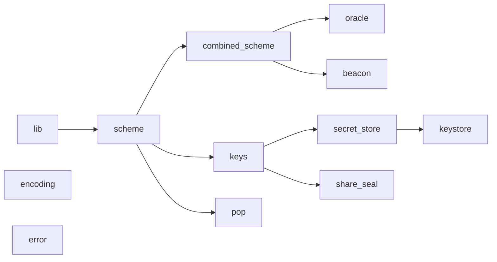

### 1.2 staking-reader (`crates/dpos/staking-reader`)

| Файл | Строк | Назначение | Зависит от | Кто использует |
|---|---|---|---|---|
| `src/lib.rs` | 45 | реэкспорт `reader`, `error`, `epoch_transition`, trait `StakingStateRead` | — | consensus, p2p, node, bins/fluent |
| `src/reader.rs` | 1496 | ABI стейкинг-контракта (`sol!`), `RethStakingStateReader` (view-вызовы через `transact_system_call`), `ValidatorSetSnapshot`, `epoch_of_block`/`is_epoch_boundary`, проверки комитета | fluentbase-bls, reth-evm/revm/storage-api, alloy | consensus (везде, где нужен комитет), node |
| `src/error.rs` | 129 | `ReadError` (14 вариантов) + строковые маркеры ошибок reth | — | reader, consensus/cert_inlet |
| `src/epoch_transition.rs` | 2447 | `EpochTransition` — событийный трекер границ эпох: `on_finalized`, `apply_at`, `track_and_trigger`, `soft_enter_span`, `cold_start` | reader, commonware-utils/runtime | consensus/dpos.rs (validator и follower) |

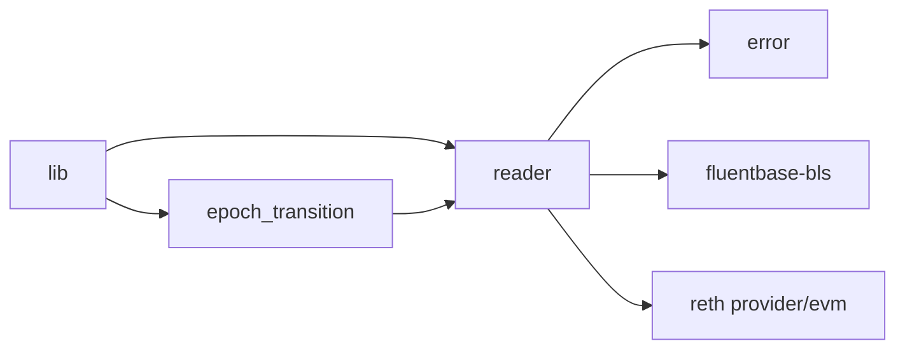

### 1.3 p2p (`crates/dpos/p2p`)

| Файл | Строк | Назначение | Зависит от | Кто использует |
|---|---|---|---|---|
| `src/lib.rs` | 502 | `FluentP2P::build` (9 каналов), `FluentP2PHandles`, `OracleHandle` (PeerSetSink/Blocker/Provider), `NoopBlocker`, чтение ed25519-ключа | commonware-p2p discovery | node, consensus (`NoopBlocker`, `OracleHandle`) |
| `src/config.rs` | 109 | `FluentP2PConfig` → commonware `Config` (deployed-сети по chain_id) | constants, ingress | node |
| `src/constants.rs` | 214 | id каналов 0..8, квоты, backlogs, `MAX_MESSAGE_SIZE`, `MAX_COMMITTEE_SIZE=51`, `DKG_SUBCHANNEL_BASE=2^32` | — | consensus (везде), staking-reader (`MAX_REGISTRY_PEER_SET`) |
| `src/ingress.rs` | 138 | `Ingress{Socket,Dns}`, `parse_ingress` | commonware hostname | config, node |
| `src/bootstrappers.rs` | 496 | загрузка bootstrappers из DNS/JSON | hickory-resolver | node |
| `tests/convergence.rs` | 227 | 5-node convergence + 3 `#[ignore]` заглушки | — | — |

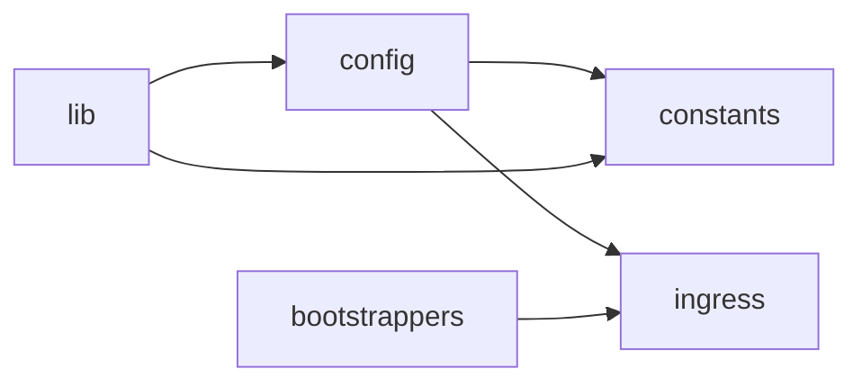

### 1.4 consensus (`crates/dpos/consensus`)

Корневые модули:

| Файл | Строк | Назначение | Зависит от (внутри) | Кто использует |
|---|---|---|---|---|
| `lib.rs` | 102 | реэкспорты, `SCHEME_RETENTION_EPOCHS=8`, `REPLAY_BUFFER`, `WRITE_BUFFER` | все | node |
| `dpos.rs` | 5117 | лончер валидатора (`DposLayer::launch`) и follower (`launch_follower`); cold start, crash recovery, jump | outer, epoch_manager, executor, beacon, cert_inlet, cold_start_jump | node |
| `outer.rs` | 2017 | `OuterBuilder`/`OuterEngine` — сборка marshal, executor, app, slasher, epoch_manager; `EpochSchemeProvider`; `MarshalResolver` | executor, application, epoch_manager, slasher, spec_exec | dpos |
| `epoch_manager.rs` | 3185 | per-epoch engine lifecycle: `reconcile_roles`, `soft_enter`, `spawn_engine`, catch-up, repair sweep, agreement prune | engine, beacon::surface, outer | outer |
| `engine.rs` | 327 | `EpochEngine` = simplex::Engine на одну эпоху с `WeightedVrf` | weighted_vrf, application, scheme | epoch_manager |
| `application.rs` | 2648 | `FluentApp`: `build_proposal`/`verify_block` (Automaton), Reporter → executor; result-gate, equivocation-gate, gas-limit | order_block, extra_data, slasher::evidence, beacon::Randomness | engine, outer |
| `executor.rs` | 12187 | `executor::Actor`: finalize → derive → FCU; speculation; backfill; re-jump; SafetyHalt; seed hold | order_block, fault, sync_metrics, beacon::Randomness, cold_start_jump | outer |
| `order_block.rs` | 912 | `OrderBlock` (F-type блок), codec, `K=3`, `result_target` | extra_data(нет), slasher::evidence (`MAX_EQUIVOCATION_SIZE`) | application, executor, marshal |
| `cert_inlet.rs` | 3301 | приём upstream-сертификатов (BLS-verify, seed capture, tee), `UpstreamResolver`, `CommitteeSource` | scheme, beacon::surface, cert_follow | dpos (follower), outer |
| `cold_start_jump.rs` | 1997 | EL-sync через FCU + devp2p, `cold_start_jump_with_threshold`, `verify_jump_*` | order_block, sync_metrics, cert_follow | dpos, executor |
| `cert_follow.rs` | 212 | trait `CertUpstream`, `fetch_verified_boundary` | cold_start_jump, cert_inlet | dpos, outer |
| `plane_upstream.rs` | 404 | frontier resolver (`FrontierKey`), `PlaneUpstreamHandle` | digest, order_block | dpos, outer |
| `weighted_vrf.rs` | 739 | stake-weighted leader elector по σ | staking-reader snapshot | engine |
| `spec_exec.rs` | 129 | Reporter: Notarization → seed record/quarantine → `Command::SpecNotarized` | executor, beacon | engine |
| `feed_sink.rs` | 50 | Reporter: Update → height канал | — | outer |
| `extra_data.rs` | 233 | production record `[ver][leader][accused]` | — | application |
| `fault.rs` | 326 | `Fault{class}`, `FaultClass`, `EngineError` | sync_metrics | executor, application |
| `sync_metrics.rs` | 859 | `SyncMetrics`, `PlaneClock`, `SafetyHalt` | — | executor, dpos, epoch_manager |
| `timeouts.rs` | 148 | `ConsensusTimeouts::fluent_1s()` + `validated()` | application constants | outer, engine |
| `scheme.rs` | 78 | `epoch_committee_from_snapshot`, `soft_enter_verifier` | bls | многие |
| `epocher.rs` | 170 | `OriginEpocher` | — | executor, beacon::actor, outer |
| `executed.rs` | 169 | `executed_state_hash(provider, h)` | reth | dpos |
| `digest.rs` | 95 | `Digest(B256)` | — | все |
| `byzantine.rs` | 339 | devnet `VoteEquivocator` (feature) | — | engine |

`beacon/` (рандомность и DKG):

| Файл | Строк | Назначение |
|---|---|---|
| `mod.rs` | 123 | реэкспорты, `JOURNAL_RETENTION_EPOCHS=1` |
| `surface.rs` | 2195 | trait `Randomness` — единственный интерфейс ядра к beacon; `PlaneRandomness`, `Absent`, `promote_gates`, W1/W3 |
| `plane.rs` | 831 | `build()` — сборка всего beacon: журналы, `DkgActor`, agreement launcher, resolver seam, write-back, seed promoter |
| `actor.rs` | 8076 | `DkgActor` — сетевой DKG: старт/seal/finalize над pinned set, journaling/resume, recompute-heal, serve логов |
| `ceremony.rs` | 2088 | `DkgCeremony` — dealer/player state machine над commonware dkg; `resume`, `recompute_scoped` |
| `dkg_agree.rs` | 3180 | agreement plane: `DkgProposal`, `ShareConfirm`, `ConfirmPool`, `entry_bar`, `DkgAgree` (Automaton/Relay), `DkgReporter` |
| `dkg_engine.rs` | 1587 | `spawn_agreement` (второй simplex, RoundRobin, namespace `_DKG_AGREE`), launcher |
| `dkg_transport.rs` | 260 | sub-channels `BASE|epoch`, body engine |
| `artifact.rs` | 1644 | `AgreedArtifact` verify/store (Metadata), `ArtifactBridge`/`ArtifactPull`, `restart_replay` |
| `keys.rs` | 1031 | `BeaconKeys` (epoch→PK, provenance `LocalDkg<Carried<Agreed`), `AgreedKeys`, `get_pk` ladder |
| `key_journal.rs` | 417 | durable `BeaconKeys` (Ordinal) — только Agreed |
| `certify.rs` | 901 | `SeedStore` (round→σ, retention 4096, quarantine, terminal pin) |
| `seed_journal.rs` | 998 | durable `SeedStore` (Ordinal, index `epoch<<32|view`) |
| `oracle.rs` | 841 | `BeaconOracle` (live ceremony store) и `KeyOnlyOracle` — impl `SeedOracle` |
| `carry.rs` | 474 | `chain_key_epoch` по `dkgQual`, `select_carry_scheme`, `frozen_dkg_qual` |
| `resolve.rs` | 394 | `beacon_share_resolver` (share-gate), `mint_diverges_from_attested` |
| `share_state.rs` | 1304 | файлы share/journal (v1/v2, XChaCha20-Poly1305), `reconcile_journals` |
| `log_store.rs` | 262 | `DealerLogStore` — кэш+journal для serve |
| `log_resolver.rs` | 578 | `DkgLogKey`, `BeaconFetchKey{Log,Artifact}`, `LogHandler`, `BeaconFetchHandler` |
| `follower.rs` | 1092 | `for_follower` — `FollowerRandomness` (только ключи через upstream + seed store) |
| `confirmations.rs` | 224 | минт `ShareConfirm` |
| `outcome.rs` | 300 | codec `DkgOutcome`, `validate_share_on_poly` |
| `seed.rs` | 159 | `Seed`, `prev_randao_from_seed`, fallback seeds |
| `verified_seed.rs` | 143 | `VerifiedSeed` newtype |
| `dkg_msg.rs` / `wire.rs` | 297 / 102 | wire DKG-сообщений |
| `metrics.rs` | 306 | `BeaconMetrics` |
| `dkg_oracle.rs` | 194 | test-only `run_local_dkg` |

`slasher/`:

| Файл | Строк | Назначение |
|---|---|---|
| `actor.rs` | 1525 | `Actor` (producer/consumer), `VoteStore`, `ChargeStore`, `EpochCursor`, WAL, `encode_calldata` |
| `evidence.rs` | 1116 | `verify_block_charge`, `extract_from_*` → `SlashCallArgs` (EIP-2537), vote-only verify |
| `gossip.rs` | 365 | `EvidenceBridge`, `ingest_batch` |
| `ingress.rs` | 137 | `Mailbox` (Reporter, Engine), `GossipSink` (Gossip) |
| `tombstone.rs` | 140 | `TombstoneSet` |

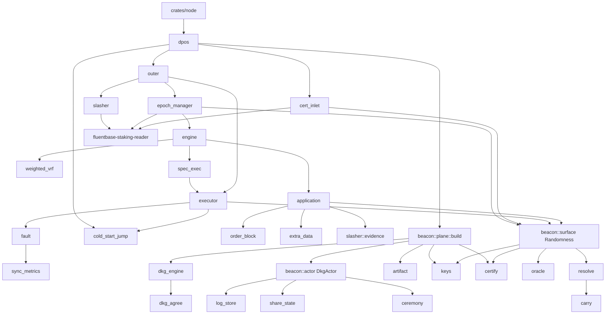

### 2.3 pub-API staking-reader
- `StakingStateRead` trait: `epoch_committee_snapshot(epoch, at)`, `dpos_activation_block(at)`, `scheduled_dpos_activation(at)` (default через `dpos_activation_block`), `epoch_block_interval(at)`, `active_registry_peers(at)` (`staking-reader/src/reader.rs:774-819`).
- `RethStakingStateReader::new(provider, evm_config, cfg)` и методы `epoch_block_interval`, `dpos_activation_block`, `scheduled_dpos_activation`, `active_validators_length`, `dkg_qual`, `epoch_committee_snapshot`, `active_registry_peers` (`:496-765`).
- Чистые функции: `epoch_of_block`, `is_epoch_boundary`, `check_peer_set_size`, `check_committee_ordering`, `compact_stake` (`:187-413`).
- Типы: `ConsensusKeys`, `ValidatorWithKeys`, `ValidatorSetSnapshot`, `StakingReaderConfig`, `ReadError`.
- `EpochTransition::new(reader, sink, max_peer_set_size, boundary_tx, executed_hash, result_lag)`, `on_finalized`, `cold_start`, `soft_enter_span`, `raise_anchor_height`, `frozen_geometry` (`staking-reader/src/epoch_transition.rs:142-741`); trait `PeerSetSink::track(epoch, Set)`.

### 2.4 pub-API p2p
- `FluentP2P::build(ctx, cfg) -> (FluentP2P, FluentP2PHandles)`, `start()` (`p2p/src/lib.rs:199-288`); `FluentP2PHandles` — 9 пар каналов + `oracle: OracleHandle`.
- `OracleHandle` реализует `PeerSetSink`, `Blocker`, `Provider` (`:301-381`); `NoopBlocker` (`:363-369`).
- `read_ed25519_key_from_file`, `generate_ephemeral_ed25519_key` (`:42-96`).
- `FluentP2PConfig`, `Ingress`, `parse_ingress`, `bootstrappers::{load_from_dns, load_from_json_path, classify_spec}`, все константы `constants::*`.

### 2.5 pub-API consensus
- Лончер: `DposLayer::launch(ctx, DposLayerConfig, SharedBeaconPlane, RethHandle) -> DposLayerHandle` и `launch_follower(...)` (`consensus/src/dpos.rs:1519, 2901`); `derive_cold_start_heights` (`:167`); партиции журналов (`:99-125`).
- Beacon: `beacon::build(ctx, BeaconConfig) -> Beacon` (`beacon/plane.rs:415`); `beacon::for_follower` (`beacon/follower.rs:120`); trait `Randomness` (`beacon/surface.rs:98-233`); `absent`, `for_keys`, `for_seeds`; `prev_randao_from_seed`, `constant_fallback_seed`, `witness_fallback_seed`; `decode_artifact` (`beacon/artifact.rs:318`).
- Ядро: `OuterBuilder`/`OuterEngine`, `EpochSchemeProvider` (`outer.rs`), `epoch_manager::Actor/Config`, `executor::{Actor, Mailbox, Command}`, `FluentApp` + traits `ExecutedChain`, `OrderingAssembler`, `BeaconEngineLike`, `DerivedBlock`, `DerivedBlockBuilder` (`application.rs:94-1205`), `OrderBlock`, `Digest`, `ConsensusTimeouts`, `OriginEpocher`, `SyncMetrics/SafetyHalt/PlaneClock`, `Fault/FaultClass/EngineError`, `WeightedVrf` (приватный модуль, `:63` lib.rs).
- Slasher: `slasher::{Actor, Config, ChargeStore, TombstoneSet, EvidenceBridge, Mailbox, Message}`, `evidence::{verify_block_charge, SlashCallArgs, SlashKind, extract_from_*}`, `actor::{SlasherTxSink, SubmitOutcome, init_wal_queue, encode_calldata}`, `gossip::{ingest_batch, encode_batch, decode_batch}`.
- Cert: `cert_inlet::{CertInlet, CommitteeSource, RethCommitteeSource, MarshalSink, LiveFrontierTee, UpstreamResolver, FollowerResolver, capture_certificate_seed}`; `cert_follow::{CertUpstream, UpstreamFinalized, fetch_verified_boundary}`; `cold_start_jump::{cold_start_jump_with_threshold, RethElSync, JumpOutcome, assert_l1_checkpoint}`; `plane_upstream::*`.

## 3. Модель данных и состояния

Стейков, делегаций и наград в крейтах нет. Состояние, которым владеет `crates/dpos`:

**On-chain (только чтение, `staking-reader`)**
- Комитет эпохи `E`: `getEpochCommitteeWithStakes(E) -> (addresses, ConsensusKeys{blsPubkey 96 B, peerPubkey 32 B, activationEpoch}, stakes, tombstoned)` → `ValidatorSetSnapshot{block_hash, block_number, epoch, validators: Vec<ValidatorWithKeys>, weights: Option<Vec<u128>>}` (`reader.rs:109-151, 235-252`). Веса = `stake / 1e10` (`:187-196`).
- Реестр `getRegistryWithKeys()`; `getDkgQual(E) -> bool`; геометрия `getEpochBlockInterval() -> u32`, `getDposActivationBlock() -> u64`; `getActiveValidatorsLength()`.
- Инварианты снапшота при чтении: `len(addrs)==len(keys)==len(tombstoned)`; `stakes` пуст или той же длины; ни одного keyless; строгий порядок peer_pubkey по байтам; размер ≥ 4 и ≤ 51 (`:691-733`, `p2p/constants.rs:175`).

**Консенсус (`consensus`)**
- `OrderBlock{parent, height, proposal_view, timestamp, fee_recipient, gas_limit, extra_data (≤4 KiB), result: B256 (EVM-hash блока height−K), txs, equivocation: Option<Bytes>}` (`order_block.rs:73-146`); `K = 3` (`:20`).
- `EpochCommittee{epoch, bimap: BiMap<PeerPubkey, BlsPubkey>}`; индекс участника = позиция в BiMap (сортировка по байтам peer key).
- `CombinedSignature{vote: 48 B, seed: Option<48 B>}` = 97 B; `CombinedCertificate{vote, seed: Option}` (`bls/combined_scheme.rs:114-172`).
- `EpochSchemeProvider: BTreeMap<Epoch, Arc<Scheme>>`, не более 8 записей (`outer.rs:257-376`).
- Executor: `LastCanonicalized{head, safe, finalized}` (три уровня FCU), `spec_executed: BTreeMap<height, SpecExecuted{digest, seed_round, parent_hash}>`, `parked_spec`, `deferred`, `awaiting_seed`, `finalized_heights_to_backfill: RangeInclusive` (`executor.rs:213-965`).
- Epoch manager: `active_epochs: BTreeMap<Epoch, Handle>`, `roles: BTreeMap<Epoch, Role{Signer,Verifier}>`, `dkg_agreements`, `deferred_spawns`, `sender_pins` (`epoch_manager.rs:410-491`).
- `SafetyHalt{engaged: AtomicBool, reason: OnceLock, marker file}` — защёлка без снятия (`sync_metrics.rs:427-604`). Маркер пишется `std::fs::write` без fsync и после установки защёлки (`:556-580`). [испр. аудит]

**Beacon**
- `CeremonyStore = Arc<RwLock<BTreeMap<mint_epoch, (Output, Share)>>>` — секрет узла (`beacon/actor.rs:169`); на диске `beacon-share-e<E>.bin` (v2: output ‖ share ‖ artifact, XChaCha20-Poly1305 при keystore) (`share_state.rs:64-249`).
- `DkgCeremony` (живая церемония на target-эпоху): `dealer: Option`, `player: Option`, `logs`, `signed_logs`, `recorded`, `unsent`, `emitted_acks` (`ceremony.rs:133-170`); журнал `beacon-dkgjournal-e<E>.bin` с записями `ReceivedDealing/OwnSeal/PeerLog/OwnDealerAck` (`share_state.rs:377-398`).
- `DkgLogIndex: epoch → idx → keccak256(SignedDealerLog)` (`actor.rs:178`); `ConfirmPool: epoch → idx → ShareConfirm` (`dkg_agree.rs:321-328`).
- `DkgProposal{target_epoch, logs: Vec<(u8,B256)>, group_key: Output, confirms}`; `AgreedArtifact = (DkgProposal, Finalization)` (`dkg_agree.rs:447-656`); `ArtifactStore: epoch → Arc<AgreedArtifact>` без вытеснения, durable через `Metadata` (`artifact.rs:418-617`).
- `BeaconKeys: epoch → (GroupPublic, KeySource{LocalDkg<Carried<Agreed})` (`keys.rs:153-175`), durable только Agreed (`key_journal.rs:170-181`).
- `SeedStore: Round → σ` (retention 4096 записей), `quarantined`, `terminal: epoch → (Round, σ)` (`certify.rs:71-112`); durable `Ordinal` по индексу `epoch<<32 | view` (`seed_journal.rs:136-143`).
- `dkgQual`-кэш `frozen_dkg_qual` без границы (`carry.rs:223-242`).

**Slasher**
- `VoteStore{notarizes, finalizes, nullifies: BTreeMap<(epoch, view, signer), Vote>, floor, floor_epoch}` (`slasher/actor.rs:474-483`); [испр. аудит] голоса попадают сюда до проверки подписи (Reporter батчера), `retain_floor` ограничивает view только снизу (`:604-606`) — член комитета может растить хранилище голосами с далёкими view; `ChargeStore: (epoch, accused u8) → Activity` (`:305`); `EpochCursor: AtomicU64` (`:409`); WAL `queue::shared` с payload `victim(20) ‖ calldata` (`:1276-1294`); `submitted_this_session: HashSet<Address>` (`:672`); `TombstoneSet: HashSet<PeerPubkey>` только рост (`tombstone.rs:42`).

Диаграмма состояний узла по роли в эпохе (`epoch_manager.rs:957-1234`):

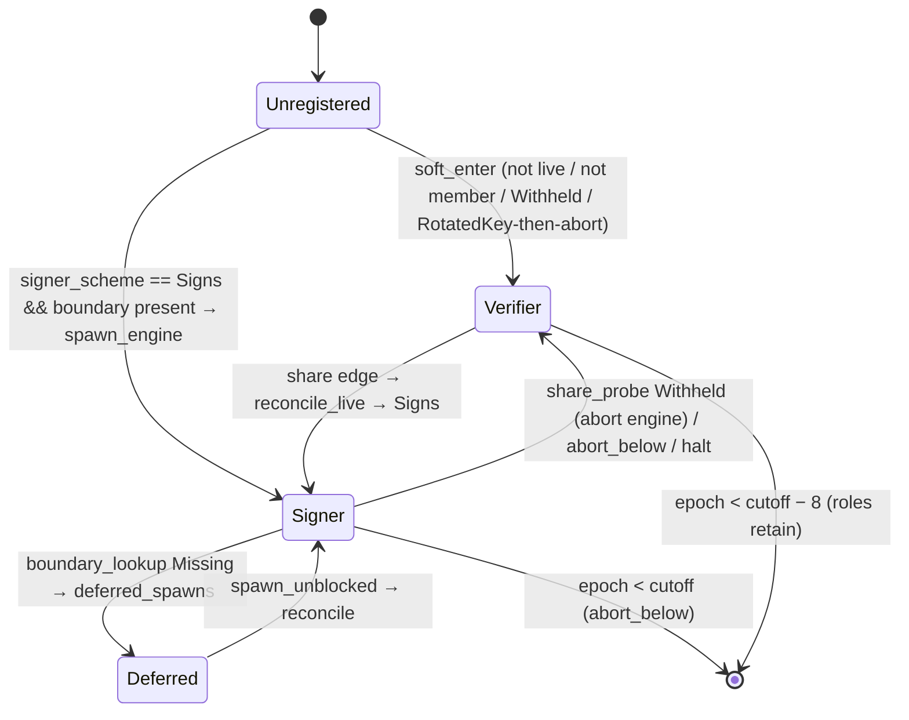

## 4. Инварианты

Явно проверяемые кодом (assert/ensure/expect/отказ):
1. Комитет: 4 ≤ n ≤ 51 (`reader.rs:161, 375-413`; `dpos.rs:1959-1973`; `outer.rs:816-822` `assert!(MAX_COMMITTEE_SIZE ≤ 255)`), строго возрастающие peer-ключи без дублей, ни одного keyless.
2. Индекс DKG-шары == индекс участника в BiMap: `CombinedScheme::new` (bls) и `BeaconOracle::sign_partial` (`oracle.rs:172-189`); `validate_share_on_poly` перед принятием recompute (`actor.rs:2210-2213`).
3. Threshold seed = `quorum(n)` и должен равняться `sharing.required()` (`bls/beacon.rs:147-156`; `combined_scheme.rs:359-393`) ⇒ размер vote-комитета == число игроков DKG.
4. Beacon-active эпоха (`epoch ≥ 2`) ⇒ каждый голос несёт seed partial, сертификат несёт σ; pre-beacon ⇒ ни один oracle не привязан (`surface.rs:169-171, 2107-2117`; `combined_scheme.rs:295-445`).
5. `OrderBlock.result` для высоты `h ≥ activation + K` равен EVM-hash блока `h−K` (`order_block.rs:174-198`; `application.rs:817-1010` result-gate; `executor.rs` guard #2 и обратный cross-check ⇒ `ForkSafety`).
6. `gas_limit`: ≥ 5000 и в пределах 1/1024 от родителя (`application.rs:189-191`); `Σ tx.gas_limit ≤ gas_limit` (`:496-509`).
7. `extra_data` production record ровно 3 байта, версия 1, `leader_index == expected`, `accused ∈ {0xFF} ∪ [0,51)` (`extra_data.rs:104-126`); presence charge ⇔ accused ≠ 0xFF (`application.rs:703-749`).
8. Один equivocation charge на блок, только для эпохи блока (`slasher/evidence.rs:121-157`; `application.rs:555`).
9. `SafetyHalt` — защёлка: после `engage` супервизор паркуется навечно, `disengage` отсутствует (`sync_metrics.rs:542-604`; `outer.rs:1377-1583`).
10. Ack финализации никогда не теряется: `park_halted` держит все ack; `try_derive` берёт `inflight_ack` через `expect` (`executor.rs:1655-1701, 3503-3507`).
11. Ключ `PK_E` в `BeaconKeys`: `Agreed` побеждает и никогда не удаляется `retain_from` (`keys.rs:300-378`); `Agreed`-vs-`Agreed` с разным значением — только `debug_assert` (`:343`).
12. Один агрегированный артефакт на target-эпоху: `certified_value` в agreement (`dkg_agree.rs:894-900`), `ArtifactStore::insert` first-wins (`artifact.rs:452-474`), `agreed_pinned` first-wins (`actor.rs:911-918`).
13. `DkgActor` никогда не re-deals после torn journal (`actor.rs:1673-1686`) и не re-seals после deadline (`ceremony.rs:793-809`); dealer RNG детерминирован от ключа+эпохи (`ceremony.rs:235-240`).
14. Только `Provenance::Engine` двигает `EpochCursor` (`slasher/actor.rs:1069-1072`); gossip-пакеты вне окна `[cur−1, cur]` отбрасываются до чтения комитета (`gossip.rs:418-426`).
15. Партиции per-epoch: consensus `consensus_epoch_{E}`, agreement `dkg_epoch_{E}` (`dkg_engine.rs:252-254`); sub-channel agreement `2^32 | E` не пересекается с `register(E)` (`dkg_transport.rs:66-71`).
16. Геометрия эпох (`activation`, `interval`) замораживается при первом чтении; interval == 0 отвергается (`epoch_transition.rs:44-65, 443-594`; `actor.rs:581-584`; `dpos.rs:71-88`).

Инварианты, которые код предполагает, но не проверяет (ГИПОТЕЗА, из структуры кода):
- Мint в `CeremonyStore` для `e > 2` ⇒ `dkgQual[e] = true` — иначе `ceremony_retain_floor` удалит действующий ключ (`actor.rs:224-227`; зависит от контракта вне репозитория). [испр. аудит] Узел решает «комитет сменился» сравнением МНОЖЕСТВ `peer_pubkey` (`actor.rs:1646`, `crates/node/src/dpos.rs:1419-1426`), а не `ConsensusKeys`/стейков; любое иное правило контракта для `dkgQual` даёт эпоху без пригодного минта (AUDIT A-12).
- `committee_pair_for` читает оба ростера при одном state hash (`actor.rs:1616-1625`); fallback на два чтения существует.
- `epochBlockInterval > DKG_MARGIN_BLOCKS (20)` для положительного окна деалинга (`actor.rs:1188`).
- [испр. аудит] «finalized в reth ⇐ BFT-финализация, проверенная локально»: не соблюдается на пути прыжка — `cold_start_jump.rs:827` (`sync_to`, FCU `head=safe=finalized=latest.block.result`) выполняется до `verify_jump_authenticated` (`:844`), а комитет для проверки читается при `landing_hash`, полученном этой синхронизацией (`:673`). reth финализирует названный хэш, как только получает блок по devp2p (проверено на devnet 2026-09-03).
- [испр. аудит] «`highest_observed_epoch` ≤ реальная эпоха сети»: `corroborate_frontier` (`epoch_manager.rs:1694-1726`) считает отправителей без фильтра по членству; достаточно f+1 любых пиров из отслеживаемого набора (реестр ∪ комитеты), эпоха берётся из id сабканала кадра (`crates/node/src/dpos.rs:1143`).

## 5. Жизненные циклы

Валидатор/делегация/анбонд как хранимые объекты в крейте отсутствуют. Ниже — жизненные циклы сущностей, которыми крейт реально владеет.

### 5.1 Эпоха / роль узла
См. диаграмму в разделе 3. Переходы вызываются: `boundary_rx` (граница от `EpochTransition`), `share edge` (шара легла в `CeremonyStore`), `key edge`, `vote_backup` (голос из незарегистрированной эпохи ⇒ catch-up), `halt edge` (`epoch_manager.rs:638-874`).

### 5.2 DKG-церемония для target-эпохи E (`beacon/actor.rs`, `ceremony.rs`)

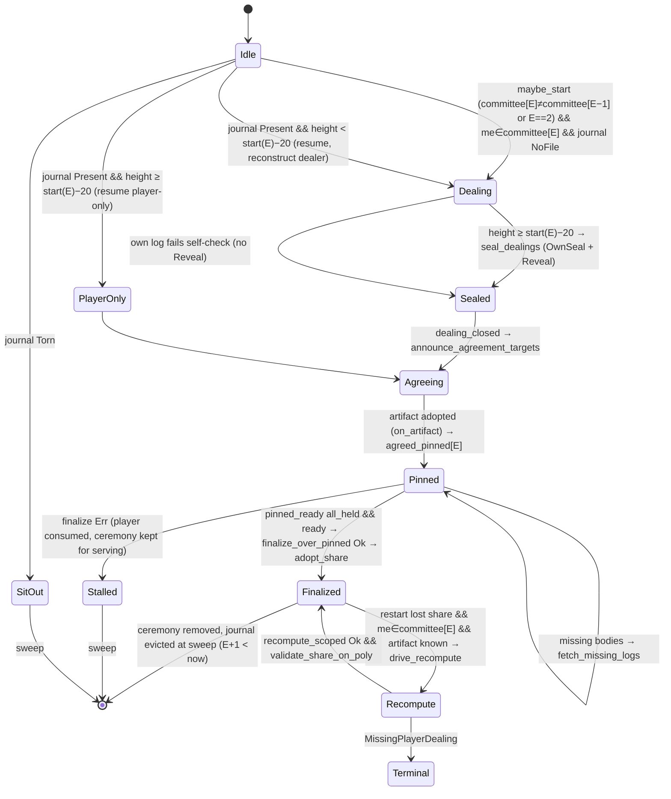

### 5.3 Ключ эпохи `PK_E` в `BeaconKeys` (`keys.rs`)
`absent` → `LocalDkg` (W1 publish при spawn, `surface.rs:1723-1736`, или W3 backfill `:1783-1801`) → `Carried` (`memoise_carry`) → `Agreed` (write-back артефакта `plane.rs:275`, либо ladder `get_pk` `keys.rs:603-638`). Понижение невозможно; удаление только для не-Agreed при `retain_from(frontier−8)`.

### 5.4 Seed σ раунда (`certify.rs`)
Источники σ (точный перечень, [испр. аудит]): на валидаторе — только `Activity::Notarization` собственного движка (`spec_exec.rs:52-107`; `Finalization` игнорируется) и backfill через `UpstreamResolver` при `MarshalResolver::Hybrid` (`cert_inlet.rs:3152`; при резолвере `Plane`, т.е. без upstream, захвата из backfill нет); на follower — `cert_inlet.rs:863`. Финализация, полученная без нотаризации того же view (штатно при догоне — commonware сообщает их независимо, `voter/actor.rs:454-462, 630-654`), σ не даёт, и executor держит блок в `awaiting_seed` без выхода (`executor.rs:1764-1794`). Далее `VerifiedSeed::check`: Valid ⇒ `seeds` (served); NoKey ⇒ `quarantined`; Invalid ⇒ по `on_invalid_seed`. Promote из quarantine при key edge (`plane.rs:801-816`; `follower.rs:379-392`). Вытеснение: `pop_first` при >4096; terminal pin — по эпохе `retain_terminal_from`.

### 5.5 Equivocation charge (`slasher/actor.rs`)

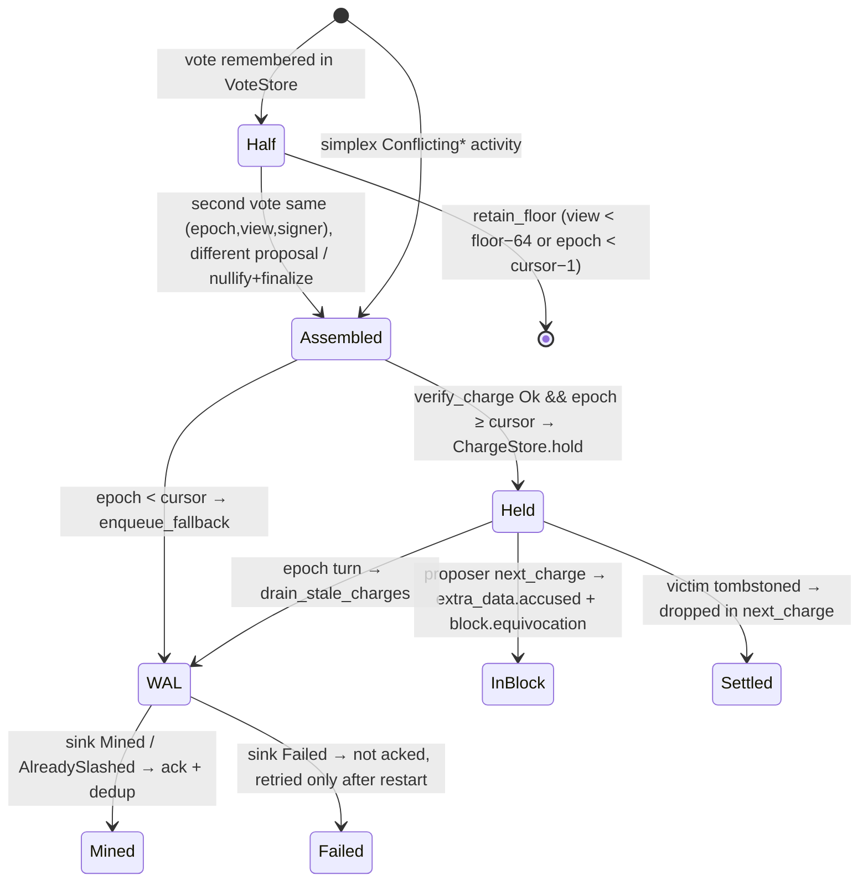

## 6. Потоки исполнения

Запрошенные потоки bond/delegate/undelegate/claim в крейтах отсутствуют (контракт вне `crates/dpos`). Ниже — реальные потоки.

### 6.1 Производство и верификация блока (`application.rs`)

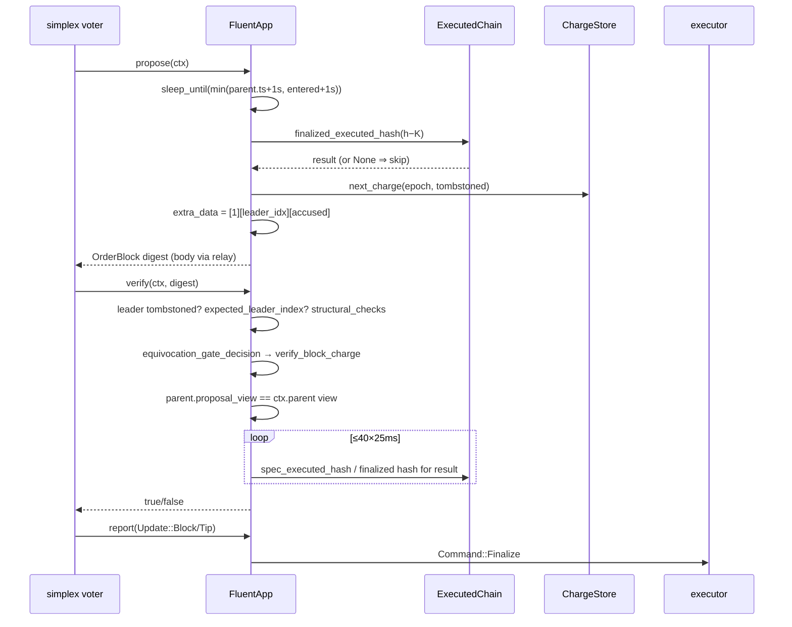

Источник: `application.rs:515-670` (propose), `:817-1010` (verify), `:1020-1050` (report).

### 6.2 Финализация → исполнение (`executor.rs`)

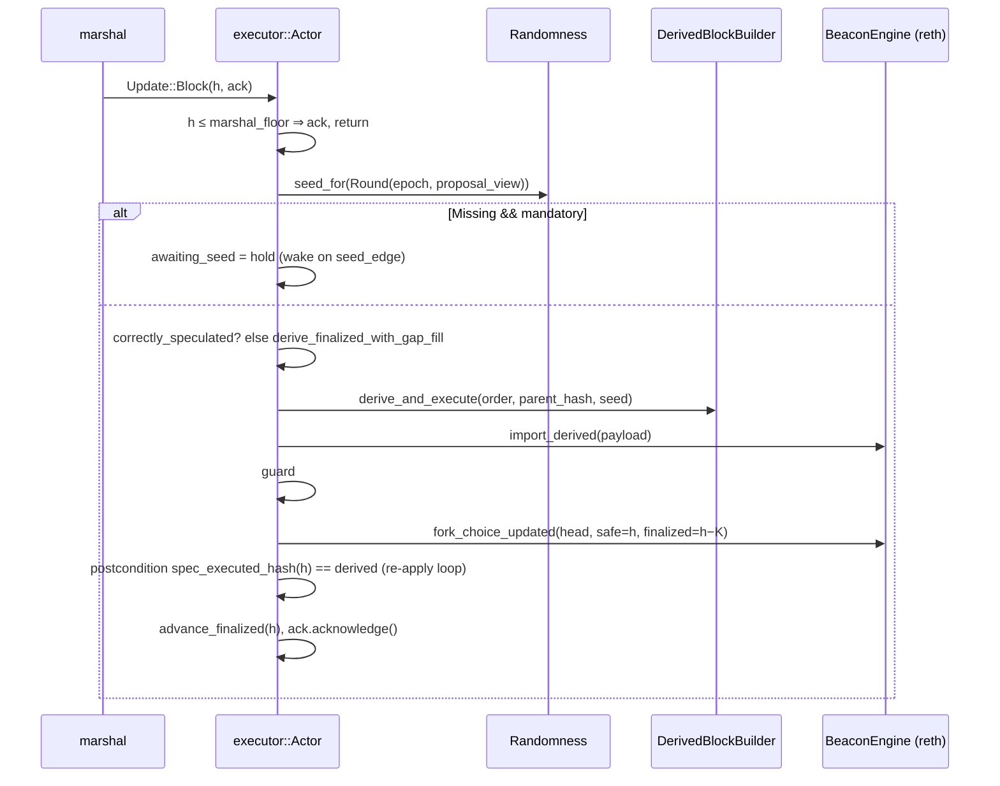

Источник: `executor.rs:1713-1808, 2939-3500, 3545-3831`. Спекуляция: `spec_exec.rs:51-128` → `Command::SpecNotarized` → `spec_execute` (`executor.rs:2542-2744`).

[испр. аудит] Порядок внутри `try_derive`: guard #2 (`:3131-3152`) читает `spec_executed_hash(h)` = каноническую цепь reth (`crates/node/src/ordering.rs:45-47`) ДО FCU целевого блока (`:3289`); `derive_finalized_with_gap_fill` для целевого блока делает только `import_derived` (`:3635-3645`), а `InsertExecutedBlock` в reth каноническую цепь не меняет. Если на высоте h спекулятивно исполнен другой блок, guard #2 видит его и объявляет ForkSafety.

### 6.3 Смена комитета на границе эпохи

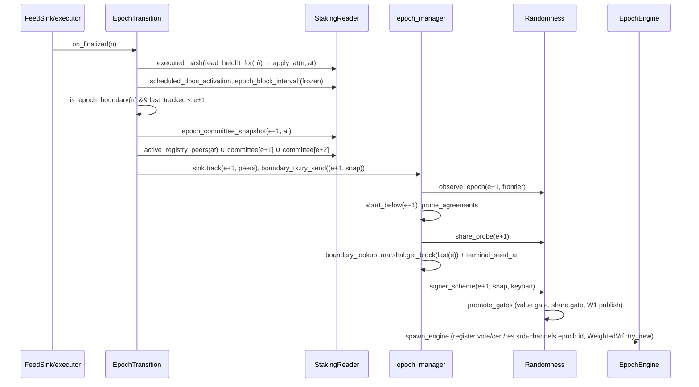

Источник: `epoch_transition.rs:344-675`, `epoch_manager.rs:957-1234, 1411-1503`, `surface.rs:1979-2101`.

### 6.4 DKG и agreement на границе (комитет `E` меняется; во время `E−1`)

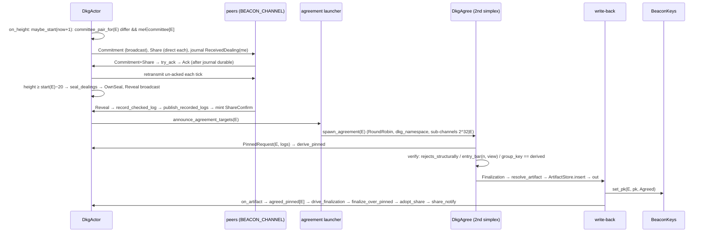

Источник: `actor.rs:1145-1272, 1436-1722`, `dkg_agree.rs:1104-1363`, `dkg_engine.rs:263-438`, `plane.rs:256-287`.

### 6.5 Slashing

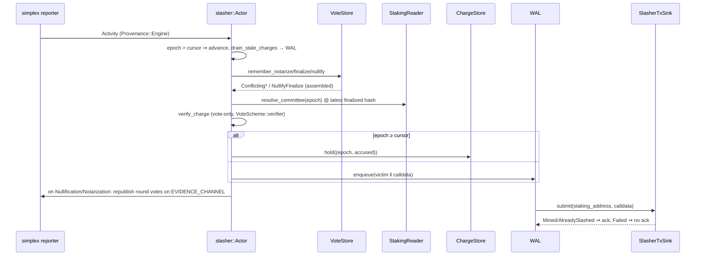

Источник: `slasher/actor.rs:1051-1126, 898-1041, 1131-1191`, `gossip.rs:387-445`.

[испр. аудит] Ветка «Held → InBlock» (charge в `extra_data.accused` + `OrderBlock.equivocation`) на стороне контракта не имеет обработчика: узел вызывает `slashEquivocation(uint64,uint32)` как system call (`crates/node/src/evm.rs:1213-1256`), контракт этот селектор не диспатчит (`evm.rs:1597-1603`), revert складывается в skip. Наказание фактически приходит только через WAL-транзакцию после смены эпохи (`drain_stale_charges`). `next_charge` (`slasher/actor.rs:324-345`) не удаляет charge после включения в блок — тот же charge повторяется в каждом блоке до появления tombstone в снапшоте.

### 6.6 Изменение параметров
Параметры (`epochBlockInterval`, `dposActivationBlock`) читаются из контракта и замораживаются при первом чтении: `freeze_or_warn` (`epoch_transition.rs:44-65`), `read_geometry` (`dpos.rs:71-88`). Изменение on-chain после заморозки только логируется как warn и не применяется. Потока смены параметров в крейте нет. [испр. аудит] Следствие: узел, перезапущенный после изменения, замораживает новое значение (`dpos.rs:1651-1654` читает при `cs_finalized_hash`), работающие узлы держат старое — эпохи, партиции и сабканалы расходятся между двумя группами.

## 7. Математика и экономика

Наград, комиссий и конвертации долей в крейтах нет. Формулы, которые есть:

| Формула | Где | Деление/округление |
|---|---|---|
| `epoch_of_block(n) = (n − activation) / interval` (saturating_sub) | `reader.rs:293-299` | целочисленное вниз; interval=0 ⇒ паника (вызывающие проверяют) |
| `is_epoch_boundary(n) = n ≥ activation && (n + 1 − activation) % interval == 0` | `reader.rs:316-329` | — |
| `epoch_start(E) = origin + E·interval` (checked) | `epocher.rs:53-70`; `actor.rs:739-743` | overflow ⇒ None/u64::MAX |
| `weight = stake_wei / 10^10`, ошибка если ≥ 2^112 | `reader.rs:187-196` | остаток отбрасывается |
| Leader: `rand = Sha256("fluent/leader" ‖ σ)` или `Sha256("fluent/seedless-leader" ‖ fallback ‖ view_be)`; `target = U256(rand) mod Σw`; `idx = partition_point(cum ≤ target)`; нулевая сумма ⇒ все веса 1 | `weighted_vrf.rs:151-245` | mod-bias при `Σw ∤ 2^256` |
| `prev_randao = keccak256(σ)` | `beacon/seed.rs:73-75` | — |
| `constant_fallback_seed = sha256(epoch_be ‖ sorted peer keys)`; `witness_fallback_seed = sha256(σ)` | `seed.rs:93-119` | — |
| `quorum = N3f1::quorum(n)`, `f = max_faults(n)`; threshold seed = quorum | `combined_scheme.rs:388`; `confirmations.rs` | — |
| `entry_bar(n, view) = quorum + (view < 3 ? min(f/2, 2) : 0)` | `dkg_agree.rs:270-303` | `f/2` целочисленное |
| `corroborate threshold = (n−1)/3 + 1` | `epoch_manager.rs:1694-1726` | целочисленное |
| `result_target(h) = h − K` при `h ≥ activation + K`, иначе PreActivation | `order_block.rs:174-180` | — |
| `result_final_height(tip, floor) = max(tip − K, floor)` | `order_block.rs:170-172` | — |
| `gas_limit_within_1_1024: |limit − parent| < max(parent/1024, 1) && limit ≥ 5000`; `step_gas_limit: delta ≤ parent/1024 − 1` | `application.rs:189-247` | целочисленное; `.max(5000)` может нарушить bound при parent < 5000 (недостижимо при anchor ≥ 5000) |
| `TX_BYTE_BUDGET = 4 MiB − 4 KiB − 8 − (1024 + 4)` | `order_block.rs:46-54` | — |
| Seed journal index `epoch << 32 | view`, отказ при > 32 бит | `seed_journal.rs:136-143` | — |
| `read_height_for(n) = max(n − K, anchor)` | `epoch_transition.rs:294-297` | saturating |
| `ceremony_retain_floor = max{k ≤ now − 8}` иначе 0 | `actor.rs:224-227` | — |
| Таймауты: leader = 1s + 750ms; certification = leader + 1000ms + 450ms; agreement: 30s/45s | `timeouts.rs:17-60`; `dkg_engine.rs:120-134` | — |

## 8. Точки входа и авторизация

Внешних (пользовательских) точек входа нет: крейт не принимает транзакции. Входы:

| Вход | Кто вызывает | Аутентификация/проверка | Ссылка |
|---|---|---|---|
| `DposLayer::launch` / `launch_follower` | `crates/node` | — (конфиг) | `dpos.rs:1519, 2901` |
| p2p VOTE/CERT/RESOLVER (simplex) | пиры | BLS multisig `CombinedScheme` над BiMap комитета эпохи; seed partial по `SeedOracle`. [испр. аудит] Кадры с незарегистрированных сабканалов уходят в `vote_backup` без проверки членства и двигают `highest_observed_epoch` (`epoch_manager.rs:1694-1726`) | `bls/combined_scheme.rs:295-445` |
| BROADCAST (тела OrderBlock) | пиры | buffered engine принимает только от peer set; digest сверяется voter'ом | `dkg_transport.rs:109-129` (аналогично для agreement) |
| MARSHAL (backfill) | пиры | сертификаты верифицируются marshal по `EpochSchemeProvider::scoped` | `outer.rs:392-420` |
| BEACON (DKG gossip) | пиры | коммонware DKG проверяет подписи dealer/player; `ceremony_epoch` в конверте **не подписан**, фильтр по live ceremony/буферу. [испр. аудит] `Confirm` с любой эпохой вызывает `committee_for(epoch)` (EVM-чтение) до проверки подписи (`actor.rs:1409-1434`); Commitment/Share буферизуются по отправителю без проверки членства (`ceremony.rs:364-371`, `actor.rs:1916-1933`) | `actor.rs:1832-1934` |
| BEACON_RESOLVER (dealer logs, артефакты) | пиры | `SignedDealerLog::check` + привязка к `key.dealer`; артефакт `verify_artifact` против `committee[epoch]` (agreement namespace) | `actor.rs:2346-2431`; `artifact.rs:246-273` |
| FRONTIER | пиры | `(Cert, OrderBlock)::decode_cfg` + fan-out; верификация сертификата — в потребителе | `plane_upstream.rs:172-218` |
| EVIDENCE | пиры | окно эпох `[cur−1, cur]`, `VoteScheme::verifier` по каждому голосу | `gossip.rs:387-445` |
| Upstream RPC (`CertUpstream`) | follower/validator с upstream | `verify_jump_structural` + `verify_jump_authenticated` (BLS quorum, oracle None) + опц. L1 checkpoint. [испр. аудит] Порядок в `cold_start_jump_with_threshold`: structural → `sync_to` (reth синхронизируется к `latest.block.result`) → authenticated по комитету, прочитанному из синхронизированного состояния (`:805-847`) — аутентификация круговая и поздняя | `cold_start_jump.rs:625-709`; `cert_inlet.rs:606-932` |
| reth engine (`BeaconEngineLike`) | executor | — (локальный) | `application.rs:1056-1090` |
| Стейкинг-контракт (view) | staking-reader | `transact_system_call` от `Address::ZERO` при заданном state hash | `reader.rs:455-471` |
| Слэш-транзакция | slasher consumer через `SlasherTxSink` | контракт верифицирует evidence сам; локально — vote-only verify | `slasher/actor.rs:1154` |

Авторизация «владелец/админ» отсутствует по построению. Файловые секреты требуют mode 0600 (`bls/secret_store.rs:62-77`; `share_state.rs:347-354`).

## 9. Обработка ошибок

**Паника/`expect`/`unwrap` в production-коде:**
- `outer.rs:806-808` `timeouts.validated().expect`; `:431-513` archives init `.expect`; `:1206-1211` slasher WAL `.expect`; `:185-190` `lock().unwrap()` в `retain` предикате.
- `plane_upstream.rs:206, 273, 291` `waiters.lock().unwrap()`; `cert_inlet.rs:3102, 3286, 3291, 3295` `inflight.lock().unwrap()`.
- `epoch_manager.rs:1183-1185` `unreachable!` (Signer без keypair); `:1434-1436` `unreachable!` (muxes None); `surface.rs:2099` `unreachable!` после seat probe; `cert_inlet.rs:3041` `unreachable!` на `Err(Valid)`.
- `executor.rs:3503-3507` `take_inflight_ack().expect`; `:1713` `debug_assert!(awaiting_seed.is_none())`; `dispatch_fault` `unreachable!` после `park_halted` (`:1572-1624`).
- `application.rs:574, 853` `expect("system clock before UNIX_EPOCH")`.
- `actor.rs:583` `NonZeroU64::new(interval).expect`; `:1706` `expect("just started")`; `:1539` `expect("ceremony present")`; `:2237-2241` `expect("adopt gated on Ok")`; `resolve.rs:86` `expect("select returned a stored mint")`; `ceremony.rs:280` `expect("Model B ...")`, `:995` `expect("can_finalize gates this")`.
- `weighted_vrf.rs:152` `assert!(!participants.is_empty())`; `share_state.rs:176` `expect` на AEAD encrypt; `bls/keys.rs:65-66` HKDF `expect`; `keys.rs:343` `debug_assert!` Agreed-vs-Agreed.
- `bls/keystore`, `secret_store`: без panics; `reader.rs:293-299` деление на interval без проверки (паника при 0).

**Восстановление poisoned lock (`unwrap_or_else(into_inner)`):** `ChargeStore`, `TombstoneSet`, `ArtifactStore`, `ArtifactBridge.waiters`, `ArtifactPull.next_allowed`, `ConfirmPool`, `BuiltProposal` (poison ⇒ не предлагать), `AgreementNotes`, `pull_artifact.inflight` (`slasher/actor.rs:329-391`; `tombstone.rs:58-74`; `artifact.rs:492-505, 887-1004`; `dkg_agree.rs:431-435, 731-761`; `plane.rs:215-231`).

**Проглатываемые ошибки (`let _ =` / `.ok()` / только лог):**
- Follower initial FCU `let _ =` (`dpos.rs:3129-3135`); `cold_start_register` на follower пропускает Err чтения (`:3622-3629`); `broadcast_all` игнорирует `send` Err (`actor.rs:2445`); `dealer.receive_player_ack` Err игнорируется (`ceremony.rs:312, 375, 770, 776`); `EvidenceBridge::bind_slasher` `OnceLock::set` результат отброшен (`gossip.rs:498-500`); `FeedSink` send Err (`feed_sink.rs`); `run_fetcher` результат `get_pk` (`follower.rs:321-330`); seal journal append `let _ =` (`actor.rs:1198, 1749`); `submit_finalized_payload` флаг в gap-fill игнорируется для target (`executor.rs:3545-3750`); `EpochTransition::freeze_or_warn` — расхождение геометрии только warn.
- Slasher WAL: `Failed` не ack'ается и повторяется **только после рестарта** (`slasher/actor.rs:1174-1181`); producer дропает evidence после 30 transient ретраев (`:771-777`). [испр. аудит] Пустой снапшот комитета в `resolve_committee` — `Permanent` (`:830-837`), хотя комитет может быть закоммичен позже (EL отстаёт от ordering-плоскости).
- Beacon: ошибки persist/journal — warn, in-memory авторитетно (`actor.rs:762-779, 999-1025`); `load_all`/`load_journal` — skip/truncate с warn (`share_state.rs:330-366, 575-621`).

**Классификация ошибок:**
- `ReadError` (14) → в cert_inlet `committee_read_fault`: `StateNotMaterialized|TransientStorage|BlockNotFound` ⇒ Defer, иначе Corruption (`cert_inlet.rs:93-102`).
- `FaultClass{TransientBounded, TransientConvergent, TransientExternal, Defer, ForkSafety, Corruption}`; `From<eyre::Report>` ⇒ Corruption (`fault.rs:78-197`); `dispatch_fault`: ForkSafety ⇒ `SafetyHalt::engage` + park; Corruption ⇒ Shutdown; прочие ⇒ Continue (`executor.rs:1572-1624`).
- Slasher `HandleError{Transient, Permanent}` (`slasher/actor.rs:202-214`).
- Agreement `Verdict{Accept, Reject, Park}` — `false` только на постоянные дефекты (`dkg_agree.rs:922-936`); `PinnedDerive::Unusable` только когда все тела на руках (`ceremony.rs:943-960`).
- Resolver `deliver → false` навсегда исключает пира (`artifact.rs:764-844`; `actor.rs:2346-2390`).

## 10. Покрытие тестами

| Поток (раздел 6) | Unit | Integration/устройство | Пробелы |
|---|---|---|---|
| 6.1 propose/verify | `application.rs` ~35 тестов: structural_checks, result gate poll/budget, leader index, tombstoned leader, charge stamped/gate binds (6 случаев), pacing, gas step | — (нет multi-node simplex теста в крейте) | верификация `proposal_view` при `ctx.parent.0 == 0`; `Σ gas` overflow |
| 6.2 finalize→execute | `executor.rs` ~110: speculation, gap walk, seed hold, guard#2, re-jump, reseed_forward, halt | `tests/cold_restart_init_arithmetic.rs` (3) | реальный reth не задействован (моки `BeaconEngineLike`); [испр. аудит] `FakeChain` может канонизировать при `import_derived` (`land_on_import`), реальный reth — нет: порядок guard #2 / FCU не проверен с настоящей семантикой |
| 6.3 граница эпохи | `epoch_transition.rs` ~30; `epoch_manager.rs` ~25 (repair sweep, corroborate, catch-up, prune) | — | `spawn_engine` с реальной сетью; `soft_enter` при `InvalidCommittee` |
| 6.4 DKG/agreement | `ceremony.rs` 22, `actor.rs` 50, `dkg_agree.rs` 54, `dkg_engine.rs` ~10 (cohort на simulated network), `artifact.rs` ~8, `keys/carry/resolve/share_state/seed_journal/key_journal/certify/surface/follower` — десятки | — | сеть из 4 участников только в dkg_engine cohort; `committee_pair_for` fallback путь; `nondurable_logs` retry |
| 6.5 slashing | `slasher/actor.rs` 8, `evidence.rs` 11, `gossip.rs` 4, `tombstone.rs` 2 | `tests/slasher_integration.rs` (14: stranded charge → tx, gossip window, dedup, pipelines), `tests/equivocation_evidence_conformance.rs` (селекторы/calldata pins) | consumer после рестарта (re-delivery un-acked); реальный `SlasherTxSink` |
| 6.6 параметры | `freeze_or_warn` покрыт косвенно (`epoch_transition` zero interval, determinism) | — | смена interval on-chain после заморозки |
| p2p | ключ/бутстрапперы/ingress unit; `tests/convergence.rs` 1 живой + 3 `#[ignore]` без тела | — | IP poisoning, clock skew, bootnode failure — заглушки |
| bls | ~40 unit + 6 conformance файлов | — | — |

Нет тестов, поднимающих несколько узлов на настоящем simplex + marshal внутри крейта (это делается devnet-смоуком вне `crates/dpos`).

## 11. Открытые вопросы и подозрения

Каждый пункт — наблюдение по коду без исправления.

1. `check_peer_set_size` считает `tracked.len()` **до** `Set::from_iter_dedup` (`staking-reader/src/epoch_transition.rs:647`): реестр обычно включает членов комитета, так что размер завышен дубликатами; предел 4096 может сработать раньше реального.
2. `getUndelegatePeriod` объявлен в ABI, обёртки нет (`reader.rs:149`) — мёртвое объявление.
3. `EpochEngine::new` регистрирует схему (`register_scheme`) до `WeightedVrf::try_new`, который может вернуть Err (`engine.rs:195` vs `:258`): при `weights: None` схема остаётся зарегистрированной для эпохи без engine.
4. `initial_epoch = epoch_of_block(latest_finalized)` регистрируется как схема (`dpos.rs:2716`), а `EpochTransition::cold_start` на границе трекает `e+1` (`epoch_transition.rs:522`). ГИПОТЕЗА: безвредно, но эпохи разные.
5. Follower: результат начального FCU игнорируется (`dpos.rs:3129-3135`); `soft_enter_committees` читает при `ZERO`-хэше, если finalized ещё нет (`:3230-3233`); `cold_start_register` молча пропускает ошибку чтения комитета (`:3622-3629`).
6. `decode_production_record` не проверяет диапазон `leader_index` (`extra_data.rs:123`); проверка есть только через сравнение с `expected` в `production_record_ok`.
7. `Mutex::lock().unwrap()` в `plane_upstream.rs:206,273,291`, `cert_inlet.rs:3102,3286,3291,3295`, `outer.rs:185-190` — паника при poison, в отличие от остального кода с `into_inner`.
8. `reseed_forward`: in-memory `finalized_height = landing`, а FCU finalized = `floor` (`executor.rs:2283-2308`) — `LastCanonicalized` и reth расходятся до следующего FCU.
9. `decrypt_fixed` не используется на production-пути; длина проверяется через `try_into` (`bls/keys.rs:109-119`).
10. `step_gas_limit(..).max(MIN_GAS_LIMIT)` может вернуть значение вне `gas_limit_within_1_1024` при parent < 5000 (`application.rs:239-247`); недостижимо при anchor ≥ 5000.
11. `p2p/tests/convergence.rs` — 3 `#[ignore]` теста без тела.
12. `epoch_of_block` делит на `interval` без проверки нуля (`reader.rs:293-299`); все вызывающие проверяют, но функция pub.
13. `freeze_or_warn` игнорирует изменение on-chain геометрии (`epoch_transition.rs:44-65`) — если контракт когда-либо меняет `epochBlockInterval`, узел продолжит на старом.
14. `EpochTransition::cold_start` присваивает `anchor_height` безусловно (`:739`), тогда как `raise_anchor_height` монотонный (`:324-326`).
15. Deployed-сети захардкожены в p2p по chain_id `{0x5201, 0x5202, 25363}` (`p2p/config.rs:72-78`) отдельно от chainspec.
16. `DkgMsg.ceremony_epoch` не входит в подписанные данные (`dkg_msg.rs:47-155`); `on_confirm` требует совпадения с подписанным `target_epoch`, но для Commitment/Share/Ack/Reveal фильтр только по наличию live ceremony/буфера (`actor.rs:1846-1934`). Проверено — см. 12.8/12.1: `Info.summary` включает epoch; привязка к эпохе есть у ack/log, но не у самой dealing.
17. `WeightedVrf::elect_index` использует `U256 % total` — смещение ≤ total/2^256, пренебрежимо.
18. Slasher WAL `Failed` не ретраится в сессии (`slasher/actor.rs:1174-1181`); `NoopSlasherSink` у follower всегда `Failed` (`dpos.rs:2864-2880`) — очередь не растёт только потому, что follower slasher не стартует (`outer.rs:1620-1743`).
19. `BeaconKeys::insert` при двух разных `Agreed` — только `debug_assert!` (`keys.rs:343`): в release побеждает первый без сигнала кроме warn+metric.
20. `frozen_dkg_qual` кэш и `chain_key_epoch_memoised` memo без границы (`carry.rs:110-242`) — рост O(эпох) за процесс.
21. `ArtifactStore` без вытеснения (`artifact.rs:418-421`) — рост O(смен комитета).
22. `verify_certificate` принимает `SeedCheck::NoKey` (`combined_scheme.rs:395-445`): сертификат с любым σ принимается, пока ключ эпохи не известен; защита — quarantine + позднейшая promote/refuse, но сам сертификат уже принят marshal'ом.
23. `sweep_epoch_state`: `JOURNAL_RETENTION_EPOCHS = 1`, а recompute-heal и `terminal_recompute` живут на том же окне — демотированный участник имеет одну эпоху на heal (`actor.rs:1060-1143`).
24. `fetch_missing_logs` шлёт `fetch_targeted` для своего же `{e, me}`, если собственный лог не записан (`actor.rs:1994-2012`) — неудовлетворимый запрос каждый тик (ограничен квотой).
25. `announce_agreement_targets` использует `try_send` в канал глубины 16 и повторяет каждый тик (`actor.rs:944-974`) — при 16+ открытых target'ов возможен пропуск; на практике 1–2.
26. `enqueue_fallback` `victim` ищется по `snap.validators` при `signer_peer` (`slasher/actor.rs:1003-1016`): при tombstoned-члене тоже сработает (не фильтруется) — дедуп только по `submitted_this_session`.
27. `ChargeStore::next_charge` вызывается из propose под `write()` lock (`slasher/actor.rs:329`) — proposer и slasher producer конкурируют; блокировка короткая.
28. `EpochCursor::retains` окно `[cur−1, cur]` (`slasher/actor.rs:425-428`), но `VoteStore::retain_floor` держит `epoch >= cur−1` **и** `view >= floor−64` — голоса предыдущей эпохи с view < floor−64 текущей эпохи удаляются (floor сбрасывается в 0 при смене эпохи, так что практически нет).
29. `test_only_mailbox` — `pub` без `cfg(test)` (`slasher/ingress.rs:133-137`).
30. Комментарий `// **** Actor не лучшее название` и `// **** наверное можно перенести` (`slasher/actor.rs:652`, `ingress.rs:165`, `:290`) — следы ревью в коде.

### 11.x Места, где я не уверен в своём понимании
- Точная семантика commonware `Player::resume`/`Logs::select`/`observe` (что именно делает `MissingPlayerDealing` необратимым) — не читал checkout; полагаюсь на использование в `ceremony.rs`. Закрыто — см. 12.1 (необратимость подтверждена; добавлено наблюдение view-first в `Player::finalize`).
- Как marshal (commonware) взаимодействует с `EpochSchemeProvider::scoped` при кросс-эпохальном backfill; `outer.rs:978-1019` только предупреждает. Закрыто — см. 12.8 (marshal сверяет эпоху сертификата с высотой и требует схему; без схемы доставка игнорируется).
- `FluentApp::verify_block` парковка `ctx.parent.0 == 0` (`application.rs:817-1010`): пропуск проверки родителя на первом view эпохи — не проверял, что simplex гарантирует genesis-родителя. Закрыто — см. 12.3 (штатный путь первого блока эпохи; родитель и высота проверены `Inline`).
- Поведение `buffered::Engine` при `peers` без `committee[target]` (`dkg_transport.rs:98-108`) — утверждение из кода-потребителя, не проверено. Закрыто — см. 12.6 (waiters получают тело до проверки primary; теряется только кэш).
- Корректность `verify_jump_authenticated` с `oracle: None` для beacon-active эпох: `verify_certificate` без oracle возвращает true без проверки seed (`combined_scheme.rs:395-445`), т.е. jump-цель аутентифицируется только multisig. Закрыто — см. 12.4 (подтверждено по `Finalization::verify`).
- Взаимодействие `epoch_bind` в `CertInlet` с `epoch_of_block` на границе (`cert_inlet.rs:606-932`) — граница `n` относится к эпохе `e`, а сертификат с `round.epoch = e`; на `n+1` эпоха `e+1`. Не смоделировал off-by-one. Закрыто — см. 12.2 (off-by-one нет; но сертификат re-proposal границы отбрасывается bind'ом как data fault).
- `restart_replay` фильтрует по `journal_epochs` (`artifact.rs:537-549`) — что происходит, если journal уже удалён `reconcile_journals` при старте (`actor.rs:1171-1176` выполняется позже, на первом тике) — порядок вызовов в `plane.rs:583-608` до тика, так что journal ещё на диске; ГИПОТЕЗА. Закрыто — см. 12.5 (порядок задан кодом; replay полезен только для `E == now+1`).
- Смысл `PINS_PER_SENDER=2` и `corroborate_frontier` threshold `(n−1)/3+1` при n < 4 — комитет ≥ 4 по инварианту, не проверял поведение при `committee_size == 0` кроме early return. Закрыто — см. 12.8.
- `EpochTransition` `pending_boundary` single-slot `debug_assert` (`epoch_transition.rs:423-428`) — что происходит в release, если две границы паркуются подряд (вторая перезаписывает первую). Закрыто — см. 12.7 (недостижимо при `interval ≥ 13` из-за `MAX_PENDING_ACKS = 16`; при меньшем — молчаливая потеря).
- Contract-side: все утверждения про `dkgQual`, `tombstoned`, селекторы — только со стороны узла; контракт вне репозитория. Систематизировано — см. 12.X.

## 12. Внешние гарантии

Зависимость commonware в этом дереве — не registry, а git-checkout: `Cargo.lock` даёт `commonware-* 2026.4.0`, `source = git+https://github.com/commonwarexyz/monorepo?tag=v2026.4.0#3c4e02ce…` (`Cargo.lock`, записи `commonware-broadcast/consensus/cryptography/p2p/resolver/runtime/storage/utils`). Исходники: `~/.cargo/git/checkouts/monorepo-27b478c9bb41d208/3c4e02c/`. Ниже `CW:` = этот каталог. Доказательства — только реализация; комментарии зависимости не использовались.

### 12.1 `Player::resume`, `Logs::select`, `observe`, необратимость `MissingPlayerDealing`

Наш вызов: `DkgCeremony::resume` собирает `log_map` из `OwnSeal`/`PeerLog` через `check(info)` и `received` из `ReceivedDealing`, затем `Player::resume::<N3f1>(info, key, &log_map, received)` (`consensus/src/beacon/ceremony.rs:701-733`); финализация — `Player::finalize(rng, scoped_logs, Sequential)` над `scoped_pinned_logs` (`:988-997`); проба — `observe(rng, logs, Sequential)` (`:904-914, 956`); heal — `recompute_scoped` = `Player::resume` + `finalize` над логами только pinned dealers (`:1016-1057`).

Что делает зависимость (`CW:cryptography/src/bls12381/dkg.rs`):
- `Info::new` хэширует `namespace ‖ round ‖ previous ‖ dealers ‖ players` в `summary` (`:712-727`); `Info == Info` ⇔ равные `summary` (`:515-519`). Наш `info_for` подаёт `namespace = seed_namespace(chain)`, `round = epoch`, `previous = None`, `dealers = players = committee` (`ceremony.rs:178-191`) ⇒ все транскрипты (ack, log) привязаны к эпохе и составу.
- `Player::resume` = `Player::new` + `dealer_message` для каждого `msgs`; затем для каждого лога в `logs`: если лог содержит наш `Ack` с валидной подписью под `transcript_for_ack(dealer, log.pub_msg)` и dealer отсутствует в собранных `acks` ⇒ `Err(MissingPlayerDealing)` (`:1726-1758`). Проверяется только по логам, которые мы передали; отсутствие лога у dealer'а, чью dealing мы потеряли, не обнаруживается здесь.
- `dealer_message`: `None` если dealer уже в `view`, не в `dealers`, `check_dealer_pub_msg` (только степень полинома, `:581-594`) или `check_dealer_priv_msg` (share ⇔ commitment, `:597-610`) не проходят (`:1766-1788`). Эпоха в этих проверках не участвует — привязка к эпохе возникает только через подпись ack'а.
- `Logs::record` заменяет лог того же dealer'а (`:1353-1356`); наш `record_checked_log` дедуплицирует по `recorded`, так что локально первый лог побеждает (`ceremony.rs:406-422`).
- `Logs::select`: `pre_verify` (batch-проверка `check_dealer_log`: индекс dealer'а, степень, подписи ack'ов, ≤ `max_reveals` reveal'ов, reveal'ы согласованы с commitment), затем первые `required_commitments = dealers.quorum()` валидных логов в порядке `BTreeMap
` (по байтам ключа); меньше ⇒ `DkgFailed` (`:1425-1443`). Детерминизм: при одинаковом множестве логов выбор одинаков.
- `observe` = `select` + `reckon` (сумма commitments выбранных dealers, `revealed` = игроки с > f reveal'ов) — возвращает только `DkgFailed` (`:1578-1668`).
- `Player::finalize`: `logs.info != self.info` ⇒ `MismatchedLogs`; `select`; если выбранный лог содержит наш `Ack`, а `view` не содержит dealer'а ⇒ `MissingPlayerDealing` (`:1814-1823`); share = Σ по выбранным dealers: **сначала `view[dealer]`, иначе reveal из лога** (`:1830-1846`).

Необратимость. При `MissingPlayerDealing` в выбранном логе наш слот = `Ack` (не `Reveal`), значит точки в логе нет; единственный источник — точечное сообщение `Share`, которое dealer отправляет только пока мы в его `unsent` (`ceremony.rs:482-507`), а после нашего ack он нас оттуда убрал (`:382`); после seal dealer'а нет (`:522`). Резолвер ходит только за `SignedDealerLog` (`log_resolver.rs`). Ничто в коде не может доставить недостающую dealing ⇒ верно, что после `MissingPlayerDealing` share этого узла для этой эпохи не восстановим. Что остаётся возможным: `observe` даёт `Ok` (`:1797-1800` — поведение, `:1817` — путь) ⇒ узел может получить `PK_E` через артефакт и верифицировать; остальные игроки не затронуты. Наш код совпадает с этим: `terminal_recompute` + verify-only (`actor.rs:2214-2231`).

Следствие для нашего кода, не отмеченное раньше: `Player::finalize` берёт share из `view` раньше reveal'а (`dkg.rs:1833-1846`), а `dealer_message` first-wins по dealer'у (`:1772`). Если dealer D прислал нам dealing (A, share_A), получил наш ack, а запечатал лог с другим `pub_msg` B, где наш слот — `Reveal` (ack под A не верифицируется под B, `:1542`, и D обязан раскрыть точку под B), лог валиден (`check_dealer_log` проверяет reveal против B), а наш share берётся из `view` (под A) ⇒ share вне полинома. На live-пути `adopt_share` после `finalize_over_pinned` самопроверки нет (`actor.rs:1530-1557`); есть только на recompute (`validate_share_on_poly`, `:2210-2213`). Достижимо только по инициативе самого D (private-сообщение приходит по аутентифицированному каналу только от D), цена — некорректные seed-partial'ы этого узла ⇒ отклонение его голосов. ГИПОТЕЗА по последствию (не проверял, как `CombinedScheme::verify_attestation` у пиров ведёт себя дальше); сам путь в коде прочитан.

Понимание изменилось: пункт закрыт; добавлено наблюдение про отсутствие самопроверки share на live-пути.

### 12.2 `epoch_bind` в `CertInlet` на граничной высоте

Наш вызов: `epoch_of_block(uf.block.height, interval, activation) != round.epoch` ⇒ data fault (`consensus/src/cert_inlet.rs:631-648`); включается только у follower (`consensus/src/dpos.rs:3880`), у валидатора `epoch_bind = None`.

Что гарантирует зависимость:
- Живые предложения: `Inline::verify` вызывает `precheck_epoch_and_reproposal`, который отвергает блок, если `epocher.containing(block.height).epoch != context.epoch` (`CW:consensus/src/marshal/standard/validation.rs:69-88`, `CW:consensus/src/marshal/application/validation.rs:54-62`). `epocher` — наш `OriginEpocher` (`consensus/src/engine.rs`, `outer.rs`). Родитель: `validate_block` требует `block.parent == parent.digest`, `parent.digest == context.parent.1`, `block.height == parent.height + 1` (`validation.rs:32-50`). Генезис движка эпохи `E>0` = блок `last(E−1)` из marshal (`CW:consensus/src/marshal/standard/inline.rs:208-223`). Значит у честного сертификата эпохи `E` высота ∈ `[start(E), last(E)]`, кроме re-proposal.
- Re-proposal: на границе лидер переизлагает родителя `last(E)` тем же digest (`inline.rs:274-293`), верификация принимает его без нашего `verify_block` (`validation.rs:94-105`). Такой сертификат эпохи `E+1` (round.epoch = E+1) несёт блок высоты `last(E)` ⇒ `epoch_of_block(last(E)) = E ≠ E+1`. Наш bind **отбросит** его как data fault. Это не потеря данных — блок `last(E)` уже финализирован сертификатом эпохи `E` — но каждый такой сертификат считается в `consecutive_faults` (`cert_inlet.rs:942-958`), и три подряд ротируют upstream. Достижимо, если upstream отдаёт по высоте финализацию re-proposal раунда. Проверено (гипотеза снята): у валидатора-upstream `consensus_getFinalization(h)` читает `marshal.get_finalization(h)` (`crates/node/src/consensus_rpc/state.rs:161-178`) → `finalizations_by_height.get(Index(h))` (`CW:consensus/src/marshal/core/actor.rs:1381-1393`); архив — `immutable::Archive` (`consensus/src/outer.rs:422, 474-484`), чей `put` **игнорирует повторный индекс** (`CW:storage/src/archive/immutable/storage.rs:240-244`) ⇒ по высоте отдаётся ПЕРВАЯ сохранённая финализация. Финализация эпохи `E` для `last(E)` записывается раньше re-proposal: движок `E+1` вообще не спавнится, пока `last(E)` нет в marshal (`Inline::genesis`, 12.3; `boundary_lookup`). Повторная (re-proposal, round `E+1`) либо отбрасывается `store_finalization` как `height <= last_processed_height` (`core/actor.rs:1416-1424`), либо игнорируется архивом как дубликат. Единственный путь получить re-proposal первой — блок `last(E)` пришёл backfill'ом `Request::Block` без финализации (`core/actor.rs:943-948`) и финализация `E+1` опередила финализацию `E`; на честном upstream это требует, чтобы его собственная финализация `E` ещё не была сохранена — маловероятно, но кодом не исключено (ГИПОТЕЗА о недостижимости). `Latest` тот же источник: `FeedActor` берёт высоту из `FeedSink` и читает тот же архив (`crates/node/src/consensus_rpc/feed_actor.rs:30-45`). У follower-upstream окно `CertWindow` пишется после `ingest` (`window_tx`, `cert_inlet.rs:400, 586-588`; `crates/node/src/cert_follow/mod.rs:144-165`), т.е. уже после `epoch_bind`, и re-proposal туда не попадает. Итог: `epoch_bind` встретит re-proposal-сертификат только от нечестного или аномально собранного upstream; на штатном пути ложный data fault не возникает.
- Backfill через резолвер: marshal сам проверяет `finalization.epoch() == epocher.containing(height).epoch()` (`core/actor.rs:954-994`).
- Живая финализация, поданная через `Reporter` (наш follower: `marshal.verify_block` → `report_finalization`, `cert_inlet.rs:283-322`): `Message::Finalization` → `store_finalization` **без** проверки высота↔эпоха (`core/actor.rs:567-605, 1404-1463`). Здесь защита лежит на нашем `epoch_bind`. У валидатора (`epoch_bind = None`) сертификаты приходят от собственного движка, где эпоху уже проверил `Inline`.

Off-by-one нет: `is_epoch_boundary(n) ⇔ (n+1−activation) % interval == 0` (`reader.rs:316-329`) и `containing` в `OriginEpocher` дают одну и ту же эпоху для `last(E)`. Понимание изменилось: (а) для follower bind — единственная проверка на этом пути; (б) bind ложно-отрицателен для сертификата re-proposal.

### 12.3 `verify_block` при `ctx.parent.0 == 0`

Наш код: тripwire `parent.proposal_view != ctx.parent.0` пропускается при `ctx.parent.0 == View::zero()` (`consensus/src/application.rs:914-917`).

Что гарантирует зависимость: контекст верификации строится как `parent: (proposal.parent, parent_payload)` (`CW:consensus/src/simplex/actors/voter/state.rs:562-566`); `parent_payload` требует `parent < view`, `parent >= last_finalized`, nullification для каждого view в `(parent, view)`, и `is_certified(parent)` (`:705-744`); для `parent == GENESIS_VIEW (0)` `is_certified` возвращает digest генезиса (`:643-647`). Для предложения контекст — `find_parent`: идёт назад от `view−1`, пропуская nullified, до первого certified, генезис — всегда certified (`:681-698`). Далее `Inline` подставляет как родителя блок с digest `context.parent.1`: если он равен `application.genesis().digest()` — наш anchor, иначе — из marshal (`validation.rs:219-241`), и проверяет `block.parent == parent.digest`, высоты (`:171-182`).

Следствие: `ctx.parent.0 == 0` — **штатный путь первого блока каждой эпохи** (родитель = `last(E−1)`, у которого `proposal_view` — вью в эпохе `E−1`, не 0), а также любого предложения после того, как все view от 1 nullified. Родитель и высота при этом уже проверены `Inline`; пропускается только сравнение `proposal_view`, которое для кросс-эпохального родителя бессмысленно. На cold-start anchor (`anchor_order_block`, `proposal_view = 0`, `order_block.rs:211-239`) тripwire выполнился бы тождественно. Понимание изменилось: ветка не «угол», а норма на границе; пропуск корректен.

Дополнительно установлено: `Inline::genesis(E)` для `E>0` делает `marshal.get_block(last(E−1))` и **паникует `unreachable!`**, если блока нет (`inline.rs:208-223`). Это причина `boundary_lookup` в `epoch_manager` (`epoch_manager.rs:957-1234`, `deferred_spawns`): спавн без блока границы уронил бы процесс. И: наш `build_proposal` не вызывается для re-proposal на границе — `Inline::propose` сам переизлагает родителя (`inline.rs:274-293`); `verify_block` для re-proposal тоже не вызывается (`validation.rs:94-105`). В разделах 6.1 этого не было.

### 12.4 `verify_jump_authenticated` при `oracle: None`

Наш вызов: `committees.scheme_at(epoch, landing_hash, None)` → `finalization.verify(ctx, &scheme, &Sequential)` (`consensus/src/cold_start_jump.rs:673-682`); `scheme_at` строит `build_verifier(namespace, bimap, epoch, None)` (`cert_inlet.rs:213-232`).

Зависимость: `Finalization::verify` = `scheme.verify_certificate(Subject::Finalize{proposal}, certificate)` (`CW:consensus/src/simplex/types.rs:1469-1486`). Наша схема: `CombinedScheme::verify_certificate` проверяет vote-сертификат и `binds` (эпоха раунда == эпоха схемы), затем при `oracle == None` возвращает `true`, не глядя на слот seed (`bls/src/combined_scheme.rs:395-445`, ветка `let Some(o) = &self.oracle else { return true }`).

Аутентифицируется: ≥ quorum(n) подписей BLS участников `committee[E]` (E — эпоха раунда сертификата, комитет прочитан при `landing_hash`) над `(round, parent_view, payload)` в chain-namespace; `payload == block.digest()` (`verify_jump_structural`, `:625-633`). Не аутентифицируется: σ (любой/пустой), соответствие `epoch_of(block.height)` эпохе раунда (в `cold_start_jump` нет такой проверки), и семантика тела (result/txs). Понимание не изменилось, формулировка уточнена: jump доверяет multisig-кворуму, seed-слой на этом пути отсутствует полностью.

### 12.5 `restart_replay` и `reconcile_journals`

Порядок задан кодом, не таймингом: `restart_replay` вычисляется в `beacon::build` **до** спавна актора (`consensus/src/beacon/plane.rs:604-608` vs спавн `:659-705`), а `reconcile_journals` выполняется внутри актора на первом `on_height` (`beacon/actor.rs:1171-1176`), который случится не раньше первого тика `heights` после `actor.run`. Сами артефакты отправляются в write-back после его спавна (`plane.rs:753-762`) и доходят до `on_artifact` асинхронно — порядок относительно первого тика не фиксирован.

Разбор обоих порядков (наш код): `reconcile_journals` удаляет журналы с `epoch + 1 < now` (`share_state.rs:668-674`); `maybe_start` поднимает церемонию только для `target = now + 1` (`actor.rs:1253`); `on_artifact` только кладёт `agreed_pinned[E]` (`:926-932`); `drive_finalization` требует живой церемонии (`:1448-1453`); `sweep_epoch_state` чистит `agreed_pinned` по `e + 1 >= now` (`:1103`).
- `E == now + 1`: журнал не тронут; `maybe_start` возобновляет церемонию из журнала; артефакт из replay финализирует её. Работает в обоих порядках.
- `E <= now`: церемония для `E` никогда не создаётся (`maybe_start` смотрит только `now+1`); артефакт лежит в `agreed_pinned` до sweep. Share для `E` восстанавливает **не** replay, а `drive_recompute` из журнала (`:2084-2163`) — журнал при `E >= now − 1` сохранён. Для `E < now − 1` журнал удалён первым тиком и replay бесполезен в любом порядке.

Гонки нет. Понимание изменилось: `restart_replay` полезен ровно для одной эпохи (`now+1`); остальное — компетенция recompute-heal. Раздел 5.2 это не отражал.

### 12.6 `buffered::Engine` и peer set без `committee[target]`

Реализация (`CW:broadcast/src/buffered/engine.rs`): при получении сообщения `insert_message` **сначала** отдаёт его всем `waiters` по digest (`:313-318`), и только потом проверяет отправителя против `latest_primary_peers`: не в наборе ⇒ `Ineligible`, в кэш не кладётся (`:320-323`). `latest_primary_peers` обновляется из `update.latest.primary` подписки провайдера (`:174-180, 366-377`). `latest` в трекере p2p = набор с наибольшим индексом среди `track(index, …)` (`CW:p2p/src/authenticated/discovery/actors/tracker/directory.rs:301-314`); индексы обязаны строго расти, старые наборы вытесняются при `> max_sets` (`:220-290`).

Наш вызов: `decide` делает `bodies.subscribe(payload).await.await` (`dkg_agree.rs:1306`), `Relay::Forward` — `bodies.get(payload)` (`:1529`). Индекс `track` = эпоха, набор = `active_registry_peers ∪ committee[e] ∪ committee[e+1]`, причём ошибка чтения `committee[e+1]` только логируется (`staking-reader/src/epoch_transition.rs:608-675`); тот же `OracleHandle` отдаётся и `EpochTransition`, и `BeaconConfig.peers` (`crates/node/src/dpos.rs:1564-1566, 1948`).

Следствие: если отправитель тела не в `latest.primary`, тело всё же доходит до `verify`, **если** `subscribe` был зарегистрирован раньше прихода тела; иначе тело теряется (кэша нет, повторной рассылки решённого предложения нет — `dkg_engine.rs`/`dkg_agree.rs` её не делают). Отказ не тотальный, а зависящий от порядка «голос → verify → subscribe» против «тело». В штатной конфигурации `committee[target = e+1]` входит в набор эпохи `e` через `track_and_trigger`, кроме случая ошибки чтения `committee[e+1]` в момент трека — тогда до следующего трека (границы) участники нового комитета вне `primary`. Понимание изменилось: и в сторону смягчения (waiters), и в сторону конкретизации, где предусловие может нарушиться.

### 12.7 Single-slot `pending_boundary` в release

Наш код: парковка второй границы затирает первую под `debug_assert!` (`staking-reader/src/epoch_transition.rs:423-429`); в release — молча. Парковка возможна только когда `executed_hash(read_height_for(n))` = `None`, `read_height_for(n) = max(n − K, anchor)` (`:294-297`); replay припаркованной границы делается в начале каждого `on_finalized` (`:361-382`).

Кто вызывает `on_finalized`: `boundary_hook` из `FluentApp::report(Update::Block)` (`application.rs:1020-1050`) — то есть при **диспетчеризации** блока marshal'ом, и `enter_boundary`/re-poke (`dpos.rs:2149-2283`). Marshal диспетчеризует блоки только пока `pending_acks.has_capacity()` — не более `max_pending_acks` неподтверждённых (`CW:consensus/src/marshal/core/actor.rs:123-126, 1248-1276`); у нас `MAX_PENDING_ACKS = 16` (`outer.rs:221-236`). Executor подтверждает после исполнения (`executor.rs:2939-3500`).

Вывод: чтобы граница `n + interval` была доставлена, должны быть подтверждены все блоки до `n + interval − 16`, т.е. исполнен блок `≥ n + interval − 16 ≥ n − K` при `interval ≥ 16 − K`; тогда replay в начале того же `on_finalized` уже освободит слот от `n`. Для `interval ≤ 13` затирание достижимо. У нас `interval > DKG_MARGIN_BLOCKS = 20` требуется отдельно (`actor.rs:1188`), devnet 32. Затирание недостижимо при действующих параметрах; при малом интервале — молчаливая потеря границы в release. Открытым остаётся: ack блока в `executor` при `deferred`/`awaiting_seed` удерживается (`executor.rs:539-565`), что только уменьшает окно доставки — вывод сохраняется.

### 12.8 Остальные пункты 11.x

- **`DkgMsg.ceremony_epoch` не подписан** (`dkg_msg.rs`): подпись ack'а и лога привязана к `Info.summary`, куда входит `round = epoch` (`dkg.rs:712-727, 1276-1294`); `Commitment`/`Share` сами по себе к эпохе не привязаны (`:581-610`), но чужеэпохальная dealing приводит лишь к ack'у, который её dealer не верифицирует (`:1542`), и к описанному в 12.1 view-first эффекту — воспроизводим только самим dealer'ом. Закрыто.
- **`corroborate_frontier` при `n < 4`**: `committee_size == 0` ⇒ return (`epoch_manager.rs:1694-1726`); `n ≥ 4` обеспечивает `check_committee_ordering` (`reader.rs:375-413`). Закрыто.
- **`Inline` бypass**: как показано в 12.3, для re-proposal на границе наш `verify_block` и `build_proposal` не вызываются. Новое наблюдение.
- **Cross-epoch backfill в marshal** (`outer.rs:978-1019`): резолверный путь `Request::Finalized` сверяет эпоху сертификата с эпохой высоты (`core/actor.rs:988-991`) и требует схему для этой эпохи через `get_scheme_certificate_verifier` — т.е. `EpochSchemeProvider::scoped` (`outer.rs:392-420`); отсутствие схемы ⇒ доставка игнорируется как «stale» (`:964-972`). Раздел 10 предупреждения про cross-epoch range — это про ограничение окна схем (8 эпох), не про корректность. Закрыто.
- Контрактная сторона — 12.X.

### 12.X Предположения о контракте

Контракта в репозитории нет. Таблица: что узел предполагает → где используется → проверяется на стороне узла или принимается на веру (**ВЕРА** = кандидат в аудит).

| Предположение | Где используется | Статус |
|---|---|---|
| Селекторы 7 view-функций (`getEpochCommitteeWithStakes`, `getRegistryWithKeys`, `getDkgQual`, `getEpochBlockInterval`, `getDposActivationBlock`, `getUndelegatePeriod`, `getActiveValidatorsLength`) соответствуют объявленным сигнатурам и семантике | `staking-reader/src/reader.rs:109-151`; вызовы `:568-765` | Селектор пинуется unit-тестом (`:1374-1388`) от собственной `sol!`; revert ⇒ `CallReverted`. Семантика — **ВЕРА** |
| `getEpochCommitteeWithStakes(E)` возвращает 4 массива одинаковой длины; `stakes` может быть пустым | `reader.rs:686-713` | Длины проверяются (`AbiDecode`); пустые `stakes` ⇒ `weights = None` ⇒ `WeightedVrf::try_new` ⇒ `WeightsUnavailable` ⇒ движок эпохи не спавнится (`weighted_vrf.rs:89-99`, `engine.rs:258`). Условие, при котором контракт отдаёт пусто, — **ВЕРА** |
| Порядок членов — строго по возрастанию байтов `peerPubkey`, без дублей | `reader.rs:375-413` (`check_committee_ordering`) | Проверяется: иначе `CommitteeOutOfOrder`/`CommitteeDuplicatePeerKey` и комитет не читается |
| Размер комитета ≥ 4 | `reader.rs:161, 375-413` | Проверяется (`CommitteeTooSmall`) |
| Размер комитета ≤ 51 | `dpos.rs:1959-1973` (`activeValidatorsLength` при запуске); кодеки сертификатов/DKG с cap 51 | Проверяется только при запуске. Рост комитета после запуска — **ВЕРА** (сертификат с >51 подписантами не декодируется у пиров; `u8` индексы) |
| `ConsensusKeys.blsPubkey` — 96 B, точка в подгруппе; `peerPubkey` — валидный ed25519; пустой `blsPubkey` ⇔ «не задан» | `reader.rs:420-442` | Проверяется (`BlsKey`/`PeerKey`/`CommitteeMemberKeyless`) |
| `ConsensusKeys.activationEpoch` | `reader.rs:210, 434` | Декодируется, **не используется** нигде в `crates/dpos` |
| `stakes[i]` в wei, `stake / 1e10 < 2^112` | `reader.rs:187-196` | Проверяется; нарушение ⇒ ошибка чтения всего комитета |
| `tombstoned[i]` — истина ⇔ валидатор навсегда исключён | `application.rs:840` (отказ лидеру), `:635` (charge settled), `slasher/tombstone.rs`, `crates/node/src/dpos.rs:1748` (бан транспорта) | **ВЕРА**: узел не проверяет ни доказательство, ни необратимость; `TombstoneSet` только растёт |
| `getDkgQual(e) == true` ⇔ `committee[e] != committee[e−1]` (смена комитета), бит замораживается после `commitEpochCommittee` | `beacon/carry.rs:110-242`, `actor.rs:224-227` (`ceremony_retain_floor`); зонд `crates/node/src/dpos.rs:1526-1540` | **ВЕРА**. Узел независимо решает «была ли смена» сравнением `committee_pair_for` (`actor.rs:1616-1648`) и **предполагает совпадение** с битом; расхождение ⇒ либо `NoUsableMint`, либо удаление действующего ключа `ceremony_retain_floor` |
| «Комитет закоммичен» ⇔ `getEpochCommitteeWithStakes(e)` непусто | `node/src/dpos.rs:1533-1538`; `epoch_transition.rs:524, 546` | **ВЕРА** (пустой ответ трактуется как «ещё не закоммичен», парковка без предела) |
| Комитет эпохи `e+1` закоммичен до `last(e) − K`; `e+2` — best-effort | `epoch_transition.rs:538-579` (парк при пустом), `:608-675` (трек `e+2`) | **ВЕРА**; нарушение ⇒ бесконечный re-poke границы (warn один раз) |
| Комитет `E` читаем в течение всей `E−1` (для DKG) | `actor.rs:1582-1722` (`maybe_start(now+1)`) | **ВЕРА**; иначе церемония стартует поздно/не стартует, `DKG_MARGIN_BLOCKS` съедается |
| `getEpochBlockInterval()` > 0 и не меняется после первого чтения; `getDposActivationBlock()` = 0 ⇒ «не запланировано» | `epoch_transition.rs:44-65, 457-483`; `dpos.rs:71-88`; `reader.rs:603-624` | Ноль проверяется; неизменность — **ВЕРА** (изменение только warn) |
| Эпоха блока `n` = `(n − activation) / interval`; последний блок эпохи — `(n+1−activation) % interval == 0` | `reader.rs:293-329`; `OriginEpocher` | Собственная арифметика узла; совпадение с представлением контракта об эпохе — **ВЕРА** |
| `getRegistryWithKeys()` — список для peer set; keyless записи допустимы | `reader.rs:753-765` | Проверяется декодом; keyless пропускаются |
| `getActiveValidatorsLength()` отражает размер будущих комитетов | `dpos.rs:1959-1973` | **ВЕРА** (одноразовая проверка) |
| Слэш: `slashEquivocation{Notarize,Finalize,NullifyFinalize}(bytes,bytes,bytes,bytes)`; `evidence` = commonware-кодировка `Conflicting*<VoteScheme>`; ключ/подписи в EIP-2537 | `slasher/actor.rs:169-176, 1246-1274`; `slasher/evidence.rs:285-472` | Селектор/раскладка пинуются тестами от собственного `sol!` (`tests/equivocation_evidence_conformance.rs`); приём контрактом — **ВЕРА** |
| Отказ `AlreadySlashedForEquivocation` при повторном слэше | `slasher/actor.rs:245-254` (`SubmitOutcome::AlreadySlashed`), классификация в `crates/node` | **ВЕРА**, вне крейта |
| Адрес валидатора ↔ `peerPubkey` (жертва для транзакции) | `slasher/actor.rs:1003-1016` | Ищется в снапшоте; несовпадение ⇒ Permanent drop |
| `getUndelegatePeriod()` | `reader.rs:149` | Только объявление, не вызывается |

---

# Рабочие заметки по файлам (черновик, переносятся в разделы выше)

## bls

### CombinedScheme (`bls/src/combined_scheme.rs`)
- `CombinedSignature{vote: BlsSignature, seed: Option<BlsSignature>}`, FixedSize = 48+1+48 = 97 B (`:114-116`). Слот seed: байт-флаг 0/1 + 48 байт (нули при None) (`:67-91`). Флаг ≠0/1 → `CodecError::Invalid` (`:86`).
- `CombinedCertificate{vote: VoteCertificate, seed: Option<BlsSignature>}`; `Read::Cfg = usize` (число участников) (`:165-172`).
- `CombinedScheme{vote: VoteScheme, epoch: u64, oracle: Option<Arc<dyn SeedOracle>>}` (`:181-196`).
- `binds(subject)`: `subject_round(subject).epoch() == self.epoch` (`:228-230`). Round берётся из proposal.round для Notarize/Finalize и из самого Nullify (`:54-59`).
- `sign`: возвращает `None` если не binds; подписывает vote; если oracle есть — `sign_partial(round)?` (нет шары ⇒ **вообще не голосует**) (`:268-293`).
- `verify_attestation`: binds → vote.verify → если oracle: seed обязан быть и `verify_partial`; если oracle нет: seed обязан быть `None` (`:295-357`).
- `assemble`: vote.assemble; seed восстанавливается только если oracle есть И **все** attestations несут seed; `threshold = M::quorum(participants.len())` (`:359-393`). Если `recover` вернул None ⇒ вся сборка сертификата `None` (`:388`).
- `verify_certificate`: vote cert → binds → без oracle `true`; с oracle: `seed=None` ⇒ false; `Some` ⇒ принимается если `verify_seed != Invalid` (т.е. `NoKey` принимается) (`:395-445`).
- `is_attributable = true`, `is_batchable = true` (`:447-453`).

### beacon.rs
- `recover_seed_with_threshold` требует `threshold == sharing.required::<N3f1>()`, иначе `Error::InvalidRecovery` (`bls/src/beacon.rs:147-156`). Т.е. размер vote-комитета должен равняться `sharing.total()`.
- seed message = `round.encode()` (`:76-78`); namespace для seed = base ‖ `_BEACON_SEED` (`:29,39-44`), для DKG-agreement = base ‖ `_DKG_AGREE` (`:32,65-70`).

### keys / secret_store / keystore
- `from_secret_bytes` — `Private::decode` отвергает 0 и вне поля (`bls/src/keys.rs:41-48`; тест `:192-198`).
- Файловые загрузчики требуют `mode & 0o077 == 0` на unix (`bls/src/secret_store.rs:62-77`).
- `write_mode_0600`: staging `<path>.tmp` → set_permissions 0600 → write+sync_all → rename → best-effort fsync каталога (`:110-148`).
- `append_mode_0600`: O_APPEND, set_permissions 0600, write_all, sync_all (`:174-192`).
- Keystore: только v4; kdf scrypt (n — степень двойки, иначе InvalidKeystore) или pbkdf2 (prf=hmac-sha256, dklen≤64); dk.len()<32 → InvalidKeystore; checksum SHA256(dk[16..32]‖cipher.message); cipher только aes-128-ctr, iv 16 B (`bls/src/keystore.rs:138-239`). `decrypt` длинно-нейтрален; `decrypt_fixed::<N>` проверяет длину (`:180-191`). Замечание: `from_backend` в keys.rs использует `decrypt` (через `SecretBackend::open`) и потом `try_into` → `InvalidLength` (`bls/src/keys.rs:109-119`, `secret_store.rs:47-51`), `decrypt_fixed` в production-пути не задействован.
- `derive_share_seal_key`: `expect("HKDF-SHA256 expand of 32 bytes is infallible")` (`bls/src/keys.rs:65-66`) — единственный expect в bls production-коде.

### Тесты bls
- unit: namespace layout, scheme build (member/non-member/empty), combined scheme 11 тестов (seed идентичен для notarize/finalize/nullify, fallback-эпоха, tampered/cleared seed, keyless oracle, epoch binding, beacon_active), pop, encoding, keystore (v4, short dklen, wrong length), secret_store (mode 0600, staging), keys (roundtrip, zero, hex, length, debug leak, HKDF).
- integration (`bls/tests/`): `conformance.rs` happy path; `ed25519_ordering_conformance.rs` (порядок BiMap = лексикографический по байтам); `eip2335_conformance_vectors.rs` (scrypt/pbkdf2 вектора + wrong password); `eip2537_roundtrip.rs` (+proptest); `eip2537_conformance_vectors.rs`, `hash_to_g1_conformance.rs` — сравнение с закоммиченными константами.

## staking-reader

### reader.rs
- ABI (`staking-reader/src/reader.rs:109-151`): `ConsensusKeys{bytes blsPubkey; bytes32 peerPubkey; uint64 activationEpoch}`; views `getEpochCommitteeWithStakes(uint64) -> (address[], ConsensusKeys[], uint256[] stakes, bool[] tombstoned)`, `getRegistryWithKeys() -> (address[], ConsensusKeys[])`, `getDkgQual(uint64) -> bool`, `getEpochBlockInterval() -> uint32`, `getDposActivationBlock() -> uint64`, `getUndelegatePeriod() -> uint32`, `getActiveValidatorsLength() -> uint32`. Селекторы запинены тестом (`:1374-1388`).
- `getUndelegatePeriod` объявлен в ABI, но метода-обёртки в `RethStakingStateReader` нет (grep по крейту: только объявление и тест селектора). Мёртвое объявление.
- Константы: `MIN_COMMITTEE_LENGTH = 4` (`:161`), `BALANCE_COMPACT_PRECISION = 1e10` (`:168`), `MAX_COMPACT_STAKE = 1<<112` (`:180`).
- `compact_stake(wei) = u128(wei / 1e10)`, ошибка если ≥2^112 (`:187-196`). Деление целочисленное; остаток отбрасывается молча.
- `ConsensusKeys{bls_pubkey, peer_pubkey, activation_epoch}` (`:207-211`); `ValidatorWithKeys{address, keys, tombstoned}` (`:215-230`); `ValidatorSetSnapshot{block_hash, block_number, epoch, validators, weights: Option<Vec<u128>>}` (`:235-252`).
- `StakingReaderConfig{staking_address}` — один адрес, без default (`:266-278`).
- `epoch_of_block(n, interval, activation) = n.saturating_sub(activation) / interval` (`:293-299`) — паника при interval=0 (делится u64 на u64 из u32; вызывающие проверяют 0 в `apply_at`).
- `is_epoch_boundary(n, interval, activation)`: `false` если `n < activation`; иначе `(n+1-activation) % interval == 0` (`:316-329`). ГИПОТЕЗА: `n+1` может переполниться при n=u64::MAX — нереалистично.
- `check_peer_set_size(epoch, size, max)` → `PeerSetTooLarge` (`:337-350`).
- `check_committee_ordering`: пустой — Ok; `< MIN_COMMITTEE_LENGTH` — `CommitteeTooSmall`; соседние peer_pubkey должны строго возрастать по сырым байтам, иначе `CommitteeDuplicatePeerKey`/`CommitteeOutOfOrder` (`:375-413`).
- `decode_consensus_keys`: длина blsPubkey == 96 → `BlsPubkey::decode` (subgroup check) → `PeerPubkey::decode` (`:420-436`). `is_unset(k) = blsPubkey.is_empty()` (`:440-442`).
- `exec_view`: `transact_system_call(Address::ZERO, addr, calldata)`; Revert/Halt → `CallReverted` (`:455-471`). `map_evm_call_err` ищет `ProviderError` в цепочке source (`:79-89`).
- Классификация transient: `StateForHashNotFound` → `StateNotMaterialized`; `DatabaseError::Decode` → `TransientStorage`; `ProviderError::Other` со строками из `error.rs` → `TransientStorage` (`:52-69`). Сравнение по строке.
- `RethStakingStateReader{provider, evm_config, cfg}` (`:496-500`); `with_evm(at, f)`: header(at) → `BlockNotFound`; `state_by_block_hash(at)`; `evm_for_block` (`:523-550`).
- Методы: `epoch_block_interval`, `dpos_activation_block`, `scheduled_dpos_activation` (нет кода на аккаунте или 0 → `None`; `:603-624`), `active_validators_length`, `dkg_qual`, `epoch_committee_snapshot`, `active_registry_peers` (`:568-765`).
- `epoch_committee_snapshot`: длины addrs/keys/tombstoned должны совпадать; `stakes` пустой при непустых addrs → `weights=None`; равной длины → `Some`; иначе `AbiDecode` (`:691-713`). Keyless-член → `CommitteeMemberKeyless` (`:720-725`). Затем `check_committee_ordering` (`:733`).
- `active_registry_peers`: keyless-записи пропускаются (`:759-765`).
- trait `StakingStateRead` (`:774-819`): 5 методов, `scheduled_dpos_activation` имеет default `Ok(Some(dpos_activation_block(at)?))` — не сворачивает 0 (мок-семантика).

### error.rs
- `ReadError` 14 вариантов (`staking-reader/src/error.rs:44-129`): BlockNotFound, StateNotMaterialized{hash}, TransientStorage(String), CallReverted, AbiDecode, BlsKey, PeerKey, CommitteeMemberKeyless, PeerSetTooLarge, CommitteeOutOfOrder, CommitteeDuplicatePeerKey, CommitteeTooSmall, Backend(String), ZeroEpochInterval.
- Строковые константы для матчинга reth-ошибок (`:23-41`).

### epoch_transition.rs
- `EpochTransition<R,S>` поля (`staking-reader/src/epoch_transition.rs:142-195`): reader, sink, max_peer_set_size, `last_tracked_epoch: Option<u64>`, `boundary_tx: Option<mpsc::Sender<(u64, ValidatorSetSnapshot)>>`, `frozen_interval: Option<u32>`, `frozen_activation: Option<u64>`, `executed_hash: Arc<dyn Fn(u64)->Result<Option<B256>,ReadError>>`, `result_lag: u64`, `anchor_height: Option<u64>`, `pending_boundary: Option<u64>`, `warned_empty_boundary: Option<u64>`.
- `PENDING_RETRY_BACKOFF = 200ms` (`:140`).
- `freeze_or_warn`: первое наблюдение фиксируется; расхождение — только warn, значение игнорируется (`:44-65`).
- `read_height_for(n) = max(n.saturating_sub(result_lag), anchor_height.unwrap_or(0))` (`:294-297`).
- `raise_anchor_height` — монотонно вверх (`:324-326`); но `cold_start` присваивает `anchor_height` безусловно (`:739`) — может понизить.
- `on_finalized(n)` (`:344-438`): ошибка если геометрия не заморожена; сначала replay `pending_boundary` (если `executed_hash` даёт `Some`); потом для `n`: `executed_hash(read_height_for(n))` → `None` ⇒ парковать только если граница (debug_assert на одиночный слот `:423-428`), вернуть Intra; `Some(at)` ⇒ `apply_at(n, at)`.
- `apply_at(n, at)` (`:443-594`): `scheduled_dpos_activation(at)` None ⇒ Intra; `epoch_block_interval == 0` ⇒ `ZeroEpochInterval`; freeze interval и activation; `epoch_e = epoch_of_block`; `is_boundary`. Cold-start ветка (`last_tracked_epoch.is_none()`): `pending_boundary = None`; `cold_epoch = is_boundary ? e+1 : e`; пустой комитет ⇒ Intra; иначе `track_and_trigger`. Boundary ветка: `is_boundary && last_tracked < Some(e+1)`: snapshot(e+1) пустой ⇒ парковать (warn один раз, затем debug), Intra; иначе `track_and_trigger`; `Full` ⇒ оставить парк.
- `track_and_trigger(epoch, snap, at)` (`:608-675`): `tracked = active_registry_peers(at)?` + committee[epoch] + committee[epoch+1] (ошибка чтения последнего только логируется); `check_peer_set_size(epoch, tracked.len(), max)` — **до** дедупа (`:647`), т.е. считается с дубликатами (registry обычно содержит членов комитета); `sink.track(epoch, Set::from_iter_dedup(tracked))`; `boundary_tx.try_send((epoch, snap))`: Full ⇒ `TriggerResult::Full` без advance; Closed ⇒ `Closed` без advance; Ok ⇒ `last_tracked_epoch = Some(epoch)`.
- `soft_enter_span(from, to, anchor_number, register)` (`:698-727`): читает комитеты по одному хэшу `executed_hash(read_height_for(anchor_number))`, регистрирует непустые подряд, останавливается на первом пустом/ошибке, возвращает последний зарегистрированный или `from-1`. Не меняет состояние.
- `cold_start(head, head_number)`: `anchor_height = Some(head_number)`; `apply_at` (`:734-741`).
- `TransitionOutcome{Intra, EpochAdvanced(u64)}` (`:72-80`); `merge_replay_outcome` — новый advance побеждает, иначе replay-advance (`:88-96`).

### Тесты staking-reader
- reader.rs: epoch_of_block/is_epoch_boundary (в т.ч. pre-activation), decode keys, peer set size, ordering (asc/desc/dup/too small/empty), ABI-вектора для 4-массивного и 2-массивного возврата, arity pin, селекторы, config, классификация ошибок.
- epoch_transition.rs (~30 тестов): registry∪committee∪incoming, incoming empty/failed, boundary once, replay surfaced (bug 11), cold start on boundary, oversize typed error, zero interval, missed-commit, Full/Closed канал, stale park release, lagging execution replay, soft_enter_span prefix/unresolvable, pre-activation bootstrap epoch 0, state-lag park (header-lead RED/GREEN), materialized-but-missing error, 350 re-pokes, no reads while parked, determinism, pruned-node landing clamp, raise_anchor monotone, delivered boundary reads at n−K.

## p2p

### lib.rs
- `read_ed25519_key_from_file`: unix mode-check `& 0o077`, hex (0x-опционально), `PrivateKey::decode` (`p2p/src/lib.rs:42-85`).
- `generate_ephemeral_ed25519_key` — OsRng (`:93-96`).
- `OracleHandle{inner: Oracle<ed25519::PublicKey>}` — реализует `PeerSetSink` (→ `Manager::track`), `Blocker` (warn + делегирует), `Provider` (`:107-109, 301-381`).
- `NoopBlocker` — ничего не делает (`:363-369`).
- `FluentP2P<E>{network}`; `FluentP2PHandles<E>` — 9 пар (sender, receiver): vote, cert, resolver, broadcast, marshal, beacon, beacon_resolver, frontier, evidence + `oracle` (`:141-189`).
- `FluentP2P::build(ctx, cfg)`: `Network::new` + 9× `register(channel, quota, backlog)` (`:199-281`); `start(self) -> Handle<()>` (`:286-288`).

### config.rs
- `FluentP2PConfig{crypto: PrivateKey, chain_id, listen: SocketAddr, dialable: Ingress, bootstrappers}` (`p2p/src/config.rs:23-47`).
- `into_commonware_config`: `deployed_public_network = chain_id ∈ {0x5201, 0x5202, 25363}` (`:72-78`); cooldown/gossip: (60s, 50s) для deployed, иначе (1s, 5s) (`:79-83`); `allow_private_ips = !deployed` (`:89`); `allow_dns = ALLOW_DNS`, `max_peer_set_size = MAX_REGISTRY_PEER_SET`; остальное `Config::recommended(...)` с `MAX_MESSAGE_SIZE` (`:90-107`). Chain ID мейннета захардкожен в p2p отдельно от chainspec.

### constants.rs
- Каналы 0..8: VOTE, CERT, RESOLVER, BROADCAST, MARSHAL, BEACON, BEACON_RESOLVER, FRONTIER, EVIDENCE (`p2p/src/constants.rs:28-70`).
- `DKG_SUBCHANNEL_BASE = 1<<32`; `epoch_from_subchannel(id) = id < BASE ? Some(id) : None` (`:93-107`).
- Квоты: VOTE/CERT/RESOLVER/BEACON 128/s; BROADCAST 8/s; MARSHAL/BEACON_RESOLVER/FRONTIER/EVIDENCE 16/s (`:123-143`). Backlogs 256/256/64/32/128/256/128/64/64 (`:146-154`).
- `MAX_MESSAGE_SIZE = 4 MiB` (`:161`); `MAX_COMMITTEE_SIZE = 51` (`:175`); `MAX_REGISTRY_PEER_SET = 4096` (`:186`); `ALLOW_DNS = true` (`:207`); `DEFAULT_LISTEN_PORT = 9000`, env `FLUENT_DPOS_P2P_PORT` (`:213-214`).

### ingress.rs / bootstrappers.rs
- `parse_ingress`: SocketAddr → `Ingress::Socket`; иначе rsplit ':' → host/port; all-numeric host отвергается; `Hostname::new` → `Ingress::Dns` (`p2p/src/ingress.rs:25-56`).
- `classify_spec`: префикс `dns:` → Dns, иначе JsonPath (`p2p/src/bootstrappers.rs:35-40`).
- `load_from_dns`: system resolver, cache_size=0, retry 2s→30s, окно 120s; на исходе окна возвращает пустой список без ошибки (`:102-167`).
- `load_from_json_path`: `[{peer_pubkey, socket}]`; любая некорректная запись — ошибка всего файла (`:235-254`).

### Тесты p2p
- unit: key file (roundtrip/invalid/short/missing), build handles; bootstrappers json/txt/retry/classify; ingress парсер (ipv4/ipv6/dns/порт/пустой/overlong/malformed IP/unbracketed v6).
- `tests/convergence.rs`: 5-node convergence на deterministic runtime; 3 теста `#[ignore]` (заглушки без тела: IP poisoning, clock skew, bootnode failure).

## consensus — малые модули

### lib.rs
- `SCHEME_RETENTION_EPOCHS = 8` (`consensus/src/lib.rs:26`); `REPLAY_BUFFER = 8 MiB`, `WRITE_BUFFER = 1 MiB` (`:98-102`).
- `byzantine` собирается только под `cfg(any(test, feature="dpos-devnet-byzantine"))` (`:34-35`). `weighted_vrf` — приватный модуль (`:63`).
- Реэкспорты (`:65-93`) — публичный API крейта.

### digest.rs
- `Digest(pub B256)`, `EMPTY = ZERO`, SIZE 32; `Random` impl для тестов (`consensus/src/digest.rs:16-80`).

### timeouts.rs
- `LEADER_MARGIN = 750ms`, `VOTE_MARGIN = 450ms` (`consensus/src/timeouts.rs:17,20`). `fluent_1s()`: leader = BLOCK_INTERVAL+750ms; certification = leader + VERIFY_EXEC_BUDGET + 450ms; timeout_retry 1000ms; fetch 1000ms; activity 64 views; skip 4 views (`:50-60`).
- `validated()`: все >0, leader ≤ certification, skip ≤ activity, certification ≥ leader+VERIFY_EXEC_BUDGET, leader > BLOCK_INTERVAL (`:66-105`).

### scheme.rs
- `epoch_committee_from_snapshot(snap) -> Result<EpochCommittee, OrderedError>` (dup-ключи → Err) (`consensus/src/scheme.rs:32-41`); `soft_enter_verifier(snap, chain_id, oracle) -> Option<BlsScheme>` (warn и None при dup) (`:57-78`).

### epocher.rs
- `OriginEpocher{origin, length}` (`consensus/src/epocher.rs:16-19`). `containing(h)`: `rel = h - origin` (checked_sub → None ниже origin), epoch = rel/length; bounds с checked_mul/add (`:53-70`). `terminal_at_or_below(floor)` (`:44-50`).

### executed.rs
- `executed_state_hash(provider, height)`: `height > best_block_number()` ⇒ `Ok(None)`; иначе `block_hash(height)`: `Some` ⇒ Ok(Some); `None`/Err ⇒ `Err(Backend)` (`consensus/src/executed.rs:45-63`).

### extra_data.rs
- Production record `[version u8][leader_index u8][accused u8]`, ровно 3 байта; `PRODUCTION_RECORD_VERSION = 1`; `NO_CHARGE = 0xFF` (`consensus/src/extra_data.rs:43-56`).
- `decode_production_record`: пустой → `Ok(None)`; длина ≠ 3 → WrongLength; версия ≠1 → UnknownVersion; accused ∉ {0xFF} ∪ [0, MAX_COMMITTEE_SIZE) → AccusedOutOfRange (`:104-126`). `leader_index` НЕ проверяется на диапазон при декоде (`:123`).

### fault.rs
- `DeferReason{CommitteeNotCommitted, StateNotMaterialized, NeedAttestation, SpecDeriveFailed, SpecFcuRejected}` (`consensus/src/fault.rs:27-47`).
- `FaultClass{TransientBounded, TransientConvergent, TransientExternal(SyncReason), Defer(DeferReason), ForkSafety(SyncReason), Corruption}` (`:78-99`).
- `Fault{class, cause: eyre::Report}`; `From<eyre::Report> for Fault` ⇒ `Corruption` (`:137-197`).
- `EngineError{class, message}`: `transport(..)` ⇒ TransientExternal(EngineRetry); `anchor_inconsistent(..)` ⇒ Corruption (`:216-250`).

### feed_sink.rs
- `FeedSink{tx: UnboundedSender<Height>}`: Reporter; на `Update::Block` шлёт height и `ack.acknowledge()` немедленно; на `Update::Tip` шлёт height (`consensus/src/feed_sink.rs:20-50`). Ошибка send игнорируется.

### spec_exec.rs
- `Mailbox{executor, randomness}`; Reporter только для `Activity::Notarization`: seed = `cert.seed()`→`Seed{target_round: proposal.round, signature}`; если есть oracle для эпохи: `VerifiedSeed::check` → `record_seed` / `NoKey` → `quarantine_seed` / иначе `error!`; затем `Command::SpecNotarized{digest, seed}` в executor (`consensus/src/spec_exec.rs:51-128`).

### engine.rs
- `FETCH_CONCURRENT = 4` (`consensus/src/engine.rs:38`).
- `EpochEngineConfig{blocker, snapshot, epoch, fallback_seed: [u8;32], epocher, app, timeouts, mailbox_size, register_scheme, scheme, byzantine?}` (`:72-104`).
- `EpochEngine::new`: `epoch_committee_from_snapshot` (Err ⇒ eyre); `register_scheme(epoch, scheme.clone())`; byzantine-ветка; `app.with_committee_index(Arc<BiMap>)`; `Inline::new(app, marshal_mailbox, epocher)`; `simplex::Engine::new` с `WeightedVrf::try_new(&snapshot, fallback_seed)?`, reporters = ((marshal, slasher), spec_exec), `partition = "consensus_epoch_{E}"`, `ForwardingPolicy::SilentLeader` (`:153-288`). Замечание: `register_scheme` вызывается ДО `WeightedVrf::try_new`, т.е. схема регистрируется даже если конструктор потом вернёт Err (`:195` vs `:258`).
- `start(vote, cert, resolver) -> Handle<()>` (`:293-326`).

### order_block.rs
- `K = 3` (`consensus/src/order_block.rs:20`); `MIN_GAS_LIMIT = 5000` (`:25`); `MAX_ORDER_BLOCK_SIZE = 4 MiB` (`:31`); `TX_BYTE_BUDGET = MAX − MAX_EXTRA_DATA_SIZE(4 KiB) − 8 − EQUIVOCATION_FRAMING` (`:46-47`); `EQUIVOCATION_FRAMING = MAX_EQUIVOCATION_SIZE + 4` (`:54`).
- `OrderBlock{parent: Digest, height, proposal_view, timestamp, fee_recipient, gas_limit, extra_data: Bytes, result: B256, txs: Vec<TransactionSigned>, equivocation: Option<Bytes>}` (`:73-146`). `digest() = keccak256(encode())` (`:150-152`).
- `result_final_height(tip, floor) = max(tip − K, floor)` (`:170-172`); `result_target(h, anchor)`: `h < anchor+K` ⇒ PreActivation, иначе `Height(h−K)` (`:174-180`); `result_matches` (`:188-198`).
- `anchor_order_block(anchor)`: ensure gas_limit ≥ MIN_GAS_LIMIT; parent ZERO, proposal_view 0, fee_recipient ZERO, extra_data пусто, result = anchor.hash(), txs пусто (`:211-239`).
- Wire: parent‖height‖proposal_view‖timestamp‖fee_recipient(20)‖gas_limit‖result(32)‖extra_len(u32)+bytes‖RLP txs‖flags(u8)‖[equiv_len(u32)+bytes]; flags: только бит 2; биты 0,1,3 — decode отвергает (`:276-435`). Decode проверяет: extra_len ≤ 4 KiB; RLP header ≤ MAX; equiv ≤ MAX_EQUIVOCATION_SIZE и ≠0; `encode_size() > MAX` ⇒ reject (`:427-432`). Использует `buf.chunk()` для RLP header — требует contiguous буфер (`:357`).

### cert_follow.rs
- `UpstreamFinalized{finalization: Finalization<BlsScheme, Digest>, block: OrderBlock}` (`consensus/src/cert_follow.rs:43-50`).
- trait `CertUpstream`: `get_finalization(h)`, `get_finalization_everywhere(h)` (default = get_finalization), `get_latest()`, `get_epoch_artifact(epoch)` (default None), `rotate()`, `rotate_callback()` (`:55-132`).
- `BoundaryFetchFn = Arc<dyn Fn(u64, B256) -> BoxFuture<Option<UpstreamFinalized>>>` (`:142-143`).
- `fetch_verified_boundary(upstream, committees, ctx, metrics, at_hash, height)`: `_everywhere` → height match → `verify_jump_structural` → `verify_jump_authenticated(.., None)` (без l1_checkpoint) (`:166-212`); любая ошибка → `None` + метрика + warn.

### byzantine.rs (devnet/test)
- `ByzantineMode::Equivocate`; `VoteEquivocator{context, scheme}` — на каждый Notarize/Finalize шлёт два голоса (random proposal + received) (`consensus/src/byzantine.rs:51-236`). `forge_outcome_same_committee` — только test.

### plane_upstream.rs
- `FrontierKey{Latest, Finalized{height}}` codec tag 0/1 (`consensus/src/plane_upstream.rs:79-139`). `FRONTIER_FETCH_TIMEOUT = 8s` (`:70`).
- `serve(marshal, key)`: Latest → `get_info(Latest)` → `get_finalization(h)` → `get_block(h)` (`:144-164`).
- `decode_frontier`: `(Cert, OrderBlock)::decode_cfg(value, &(MAX_COMMITTEE_SIZE, ()))` (`:172-179`).
- `FrontierHandler{waiters, marshal_slot: Arc<OnceLock<MarshalMailbox>>}`: Consumer::deliver — undecodable ⇒ false; иначе fan-out всем waiters по ключу ⇒ true (`:193-218`); Producer::produce — читает локальный marshal (`:220-235`).
- `PlaneUpstreamHandle{mailbox, waiters}`: `fetch_one`: регистрирует waiter, `mailbox.fetch(key)`, timeout 8s; на таймаут чистит закрытые waiters и `cancel(key)` если пусто (`:270-310`). `rotate` = `cancel(Latest)` (`:332-341`).
- Мьютекс `waiters.lock().unwrap()` — паника при poison (`:206, 273, 291`).

### weighted_vrf.rs
- `LEADER_DOMAIN = b"fluent/leader"`, `LEADER_FALLBACK_DOMAIN = b"fluent/seedless-leader"` (`consensus/src/weighted_vrf.rs:40,54`).
- `WeightedVrf{weights: BTreeMap<PeerPubkey,u128>, fallback_seed}`; `try_new(snap, fallback)`: `weights: None` ⇒ `WeightsUnavailable`; длина ≠ ⇒ Err (`:86-113`).
- `build(participants)`: `assert!(!participants.is_empty())` (`:152`); веса по ключу, отсутствующий ⇒ 0; сумма 0 ⇒ все 1; `cum` = saturating prefix sums; `total = acc` (`:151-188`).
- `randomness_bytes(round, seed, fallback)`: `Sha256(LEADER_DOMAIN ‖ σ.encode())` или `Sha256(FALLBACK_DOMAIN ‖ fallback ‖ view.to_be_bytes())` (`:207-225`).
- `elect_index`: `target = U256(rand) % total` (u128); `partition_point(|c| c <= target)` (`:237-245`). Деление по модулю: смещение при total, не делящем 2^256 — пренебрежимо мало, но есть.
- `elect(round, cert)` использует `cert.seed()` (σ предыдущего view) (`:260-269`).
- Тесты: absent/mismatched weights fail, determinism, CDF pick, proportional Monte-Carlo (30k), zero total uniform, view 2 без паники, σ vs fallback, domain tag pinned, sequence moves with witness; xlang vector 16 значений для 7-пирового devnet-комитета.

### sync_metrics.rs
- `SyncReason` 12 вариантов с snake_case лейблами и `from_label` (`consensus/src/sync_metrics.rs:35-101`).
- `SyncMetrics{degraded: Family<reason, Gauge>, engine_transient_retry, crash_recover_*, jump_boundary_refetched/_failed, el_sync_stalled_with_peers, safety_halt_engaged}` (`:119-166`); `register(ctx)` (`:171-233`); `degrade/recover` (`:236-247`).
- `PlaneClock{ordering, dkg, lag(-1 пока не обе), seen: AtomicU8, drops}` (`:277-391`).
- `SafetyHalt{engaged: AtomicBool, reason: OnceLock<SyncReason>, marker: Option<PathBuf>, notify, metrics}` (`:427-440`). `restoring(metrics, marker)`: файл есть → engage (или latch без reason, если нечитаем/неизвестен) (`:469-527`). `engage(reason)`: degrade + первый reason + latch + persist marker (`std::fs::write`, best-effort) (`:542-580`). Нет `disengage`. `engaged_edge()` — Notify (`:602-604`).

### outer.rs
- `MarshalResolver{Plane(p2p mailbox), Hybrid{plane, upstream: UpstreamResolver}}`; `is_finalized(key)` маршрутизирует `Finalized{..}` в upstream, остальное в plane (`consensus/src/outer.rs:64-193`). В `retain` Hybrid предикат заворачивается в `Arc<Mutex<_>>` и `lock().unwrap()` (`:185-190`).
- Константы: PAGE_CACHE 4096×8192; IMMUTABLE_ITEMS_PER_SECTION 262144; PRUNABLE 4096; `MAX_REPAIR = 20`; `MAX_PENDING_ACKS = 16`; freezer resize 4 / 65536; value target 1 GiB; compression Some(3) (`:221-236`).
- `EpochSchemeProvider{map: Arc<Mutex<BTreeMap<Epoch, Arc<BlsScheme>>>>}` (`:257-259`). `register(epoch, scheme)`: Vacant → insert; Occupied: разные participants → отказ (error!); signer→verifier → отказ; beacon_active→не active → отказ + `metrics::counter!(ORACLE_DROP_REFUSED)`; иначе замена; после — `while map.len() > SCHEME_RETENTION_EPOCHS { pop_first }` (`:332-376`). `verifier_epochs()`, `latest_scheme()`, `CertProvider::scoped` (`:392-420`).
- Архивы: `init_finalized_blocks_archive` (партиции `{prefix}-v2-finalized-blocks-*`) и `init_finalizations_archive` (`{prefix}-v3-finalizations-by-height-*`, codec unbounded) — оба `.expect(..)` при init (`:431-513`).
- `OuterBuilder` — ~50 полей (`:521-690`). `build(ctx)`: `timeouts.validated().expect(..)` (`:806-808`); `assert!(MAX_COMMITTEE_SIZE ≤ 255)` (`:816-822`); buffered engine; archives; `EpochSchemeProvider::new()`; `OriginEpocher::new(activation, length)`; boundary_seed_heights = terminal_at_or_below(floor) если не в архиве (`:867-892`); `MarshalActor::init` (view_retention = activity×10) (`:894-917`); seed boundary через `boundary_fetch` (all-or-nothing) → `inject.verified(round, block)` + `Reporter::report(Finalization)` (`:932-966`); `set_floor` (`:968-970`); backfill range cross-epoch → только warn (`:978-1019`); initial_head из `canonical_state.chain_info()` если `last_consensus_finalized > activation` (`:1036-1061`); `peers_for_finalization` из `latest_scheme` (`:1067-1075`); `executor::Actor::init` (`:1078-1109`); `spec_exec::Mailbox`; `ChargeStore::default()`; `FluentApp::new(...)` + plane_clock + dkg_heights + randomness (`:1128-1146`); `register_scheme` closure; `soft_enter_span` closure (oracle_for → soft_enter_verifier → register) (`:1165-1196`); slasher WAL init `.expect(..)` (`:1206-1211`); `slasher::Actor::init`; `epoch_manager::Actor::new` (`:1234-1260`).
- `OuterEngine::run`: register broadcast mux sub 0; marshal resolver Plane или Hybrid (форвардер plane_rx → marshal_tx); старт: epoch_manager → buffered → executor → marshal (Reporters(app, feed)) → slasher; `select!` на первом завершении; `supervisor_action`: halt engaged ⇒ `park_supervisor` (pending forever), иначе abort всех (`:1377-1583`).
- `run_follower`: broadcast sub 0; `FollowerResolver::{Upstream, Noop}`; parked senders; `epoch_manager.start(None, ..)`; slasher дропается не стартуя (`:1620-1743`).
- Тесты: park_supervisor не re-poll'ит; halt ⇒ Park, иначе AbortAll; scheme provider (downgrade/upgrade/other committee; oracle drop refused); is_finalized routing.

### epoch_manager.rs
- `Role{Signer, Verifier}` (`consensus/src/epoch_manager.rs:82-87`); `BoundaryLookup{NotApplicable, Missing(BoundaryBlock|TerminalSeed), Present{seed: Option<[u8;32]>}}` (`:93-123`); `SeedlessBase{Witness, Constant}` (`:129-136`).
- `boundary_base(randomness, prev, terminal_view)`: `!mandatory_at(prev)` ⇒ `Present{None}`; иначе `terminal_seed_at(Round(prev, view))` → `Present{Some(witness_fallback_seed)}` / `Missing(TerminalSeed)` (`:158-169`). `seedless_base` (`:175-188`).
- `EpochEngineMetrics{engine_demoted_rotated_out, engine_spawn_deferred, fallback_seed_constant, engine_respawned}` (`:205-239`).
- Константы: `BOUNDARY_BUFFER = 64` (`:290`), `AGREEMENT_SWEEP_SPAN = 8` (`:308`), `PINS_PER_SENDER = 2` (`:398`), `CATCHUP_SPAN_CAP = 6` (`:407`).
- `prune_agreements(ctx, agreements, cutoff)`: abort+await всех `< cutoff`; затем `context.remove(agreement_partition(e))` для `e ∈ [cutoff−8, cutoff)` кроме живых (`:318-362`).
- `Actor` поля (`:410-491`): active_epochs, dkg_agreements, agreement_intake, boundary_rx, highest_entered_epoch, highest_observed_epoch, observed_reporters, sender_pins, committee_size, roles, deferred_spawns, latest_live, catchup_no_progress, cfg.
- `Config` (`:494-572`): me, blocker, chain_id, epocher, signer_keypair, app, timeouts, mailbox_size, randomness, spawn_unblocked, safety_halt, marshal_mailbox, peers_for_finalization, slasher_mailbox, spec_exec_mailbox, epoch_metrics, page_cache, register_scheme, scheme_pins, soft_enter_span, byzantine?.
- `run` (`:638-874`): `select!` по 6 веткам: halt edge (abort всех engines и agreements, roles→Verifier); boundary_rx (latest_live, `reconcile_roles`, wake sweep); vote_backup (`handle_msg_for_unregistered_epoch`, reconcile_live при смене frontier); share edge (`reconcile_live`); spawn_unblocked (только если deferred_spawns не пуст); key edge (wake sweep + reconcile_live); agreement_intake (halted ⇒ abort; иначе insert, старый abort). Выход при закрытии boundary_rx или vote_backup.
- `handle_msg_for_unregistered_epoch`: `corroborate_frontier` + `pipeline_catchup_span` с hint через `marshal_mailbox.hint_finalized(boundary, [from])` (`:889-930`).
- `is_live_epoch(e) = e >= highest_observed_epoch` (`:947-949`).
- `reconcile_roles(epoch, snap, muxes)` (`:957-1234`): обновить highest_entered/committee_size; `randomness.observe_epoch`; `prune_resolved`; `abort_below(epoch)`; не live ⇒ `soft_enter`; `is_member = !halt && keypair.is_some() && me ∈ snap`; живой engine: если `share_probe == Withheld` — abort engine и soft_enter; мёртвый handle ⇒ respawn; Verifier ⇒ soft_enter (+метрика rotated_out); Signer: share_probe Withheld ⇒ soft_enter; `boundary_lookup` (marshal `get_block(last(E-1))`) ⇒ None ⇒ deferred_spawns + soft_enter; `signer_scheme(epoch, snap, keypair)` → Signs/RotatedKey (всё равно spawn)/Withheld/InvalidCommittee; `spawn_engine`.
- `soft_enter`: не понижает Signer; `register_soft_entered` → `oracle_for(epoch)` → `soft_enter_verifier` → register (`:1243-1257, 1526-1542`).
- `spawn_repair_sweep` — отдельная task, watch-канал; `run_repair_sweep` → `repair_keyless_schemes(provider, randomness, hinted, observed, entered)`: frontier = max; для verifier_epochs < frontier: `ensure_key(Local) || ensure_key(Thorough)`; hinted memo (`:1277-1310, 1563-1683`).
- `abort_below(current)`: abort engines `< cutoff` (roles→Verifier); `prune_agreements`; deferred_spawns retain ≥ cutoff; roles retain ≥ cutoff−8 (`:1369-1395`).
- `spawn_engine`: `muxes == None` ⇒ `unreachable!` (`:1434-1436`); `EpochEngine::new` Err ⇒ false; register vote/cert/res sub-channels (epoch как id) — любой Err ⇒ false (уже зарегистрированные сабканалы не освобождаются явно; ГИПОТЕЗА: SubReceiver дропается и авто-дерегистрируется); `engine.start` (`:1411-1503`).
- `corroborate_frontier`: `committee_size == 0 || their_epoch <= highest` ⇒ return; `threshold = (n−1)/3 + 1`; квота PINS_PER_SENDER; при достижении threshold advance + `prune_resolved` (`:1694-1726`).
- `pipeline_catchup_span`: `their_epoch <= entered` ⇒ return; memo no_progress; span `[entered+1, min(observed, entered+6)]`; `registered_to`; hint `last(registered_to)` (`:1745-1794`).
- `engine_handle_dead(handle)` — poll с noop waker (`:1820-1824`).
- `unreachable!` в `reconcile_roles` при отсутствии keypair у Signer (`:1183-1185`).
- Тесты (~25): repair sweep (soft-entered swept, scheme starts refusing foreign seed, held keys no network, all unpinned, below bootstrap, signer untouched, span-registered, follower frontier, hint once, refuses LocalDkg store key, parked sweep does not hold driver); seedless base; boundary seed miss defers; agreed key answers rung; corroborate (single peer, f+1, no committee, decoy flood, quota, entering frees pins); catchup pipeline (deep, cap, memo); engine_handle_dead; prune_agreements abort+await; partitions reclaimed.

### application.rs
- Константы: `VERIFY_EXEC_BUDGET = 1000ms`, `VERIFY_EXEC_POLL = 25ms`, `BLOCK_INTERVAL = 1s`, `TIMESTAMP_FUTURE_TOLERANCE_SECS = 1` (`consensus/src/application.rs:65-88`).
- trait `ExecutedChain{executed_tip, spec_executed_hash, finalized_executed_hash, advance_finalized(default no-op)}` (`:94-137`). `FinalizedCursor{cursor: Arc<AtomicU64>}`: `resolve(h, canonical)` = `h <= cursor` ? canonical(h) : None; `advance` = fetch_max (`:151-171`).
- trait `OrderingAssembler{assemble(height, gas_limit, byte_budget), observe_finalized(&block)}` (`:175-183`).
- `gas_limit_within_1_1024(parent, limit) = limit >= MIN_GAS_LIMIT && |limit−parent| < max(parent/1024, 1)` (`:189-191`). `step_gas_limit(parent, target)`: `max_delta = parent/1024 − 1` (saturating); шаг к target; `.max(MIN_GAS_LIMIT)` (`:239-247`). Замечание: при `parent/1024 == 0` (parent < 1024) max_delta = 0, шаг = 0; при parent < 5000 результат `.max(5000)` может нарушить `gas_limit_within_1_1024` (skew > parent/1024) — но `anchor_order_block` требует ≥5000, так что достижимо только если gas_limit просел ниже — недостижимо при монотонности правил.
- `production_record_ok(extra, expected)`: `None` ⇒ true; `Some(i)` ⇒ `decode == Ok(Some(rec)) && rec.leader_index == i` (`:227-235`).
- `FluentApp<XC,A>` поля (`:252-331`): randomness, genesis, executor mailbox, boundary_hook, verify_gate_last_logged_height, executed, assembler, fee_recipient, target_gas_limit, dpos_activation_block, committee_index: Option<Arc<BiMap>>, chain_id, charges: Option<ChargeStore>, tombstones, plane_clock, dkg_height_tx.
- `expected_leader_index(leader) -> Result<Option<u8>, LeaderIndexError>`: нет карты ⇒ Ok(None); нет в карте ⇒ Err(LeaderNotInCommittee); idx > 255 ⇒ Err (`:461-477`).
- `structural_checks(block, parent, now, round, expected_idx)`: `proposal_view == round.view` && `timestamp > parent.timestamp` && `timestamp <= now + 1` && gas_limit bound && production_record_ok && `Σ tx.gas_limit <= gas_limit` (checked_add) (`:496-509`).
- `build_proposal` (`:515-670`): pace `sleep_until(min(parent.ts + 1s, view_entered + 1s))`; result = `result_target(height, activation)`: PreActivation ⇒ ZERO; иначе `finalized_executed_hash(h−K)` или skip (None, метрика); `gas_limit = step_gas_limit`; `timestamp = max(now_secs, parent.ts+1)`; `assemble(height, gas_limit, TX_BYTE_BUDGET)`; `leader_index = expected_leader_index(ctx.leader)` иначе skip; charge = `charges.next_charge(round.epoch, |accused| tombstoned?)` — один charge на блок; `extra_data = encode(leader_index, accused)`; `proposal_view = ctx.round.view`.
- `equivocation_gate_decision(block, epoch, committee_index, chain_id)`: accused из extra_data (Err/None ⇒ None); (None, None) ⇒ true; несовпадение присутствия ⇒ false; без карты ⇒ true; `verify_block_charge(evidence, accused, epoch, bimap, chain_id)` Err ⇒ false (`:703-749`).
- `verify_block` (`:817-1010`): tombstoned leader ⇒ false; `expected_leader_index` Err ⇒ false; `structural_checks`; `equivocation_gate_decision`; `ctx.parent.0 != 0 && parent.proposal_view != ctx.parent.0` ⇒ false; result-gate poll: до 40 тиков по 25ms: `result_matches(...)` `Some(false)` ⇒ false; `Some(true)` ⇒ true; `None` ⇒ ждать; исчерпание бюджета ⇒ false.
- `Reporter::report(Update)`: на Block — `assembler.observe_finalized` + `boundary_hook(block)`; на Tip — `plane_clock.record_ordering_tip` + `dkg_height_tx.try_send` (drop → метрика); затем `executor.send(Command::Finalize(Box(update)))`, ошибка — `error!` (`:1020-1050`).
- traits `BeaconEngineLike{fork_choice_updated -> Result<ForkchoiceUpdated, EngineError>, import_derived -> Result<PayloadStatus, EngineError>}` (`:1056-1090`), `DerivedBlock{evm_hash, number, beacon_active}` (`:1097-1109`), `DerivedBlockBuilder{derive_and_execute(order, parent_evm_hash, seed)}` (`:1195-1205`).
- `ParentHeaderMissing(B256)`, `PrefixSeedMissing{height, proposal_view}` (`:1128, 1140-1143`). `derive_with_visibility_retry`: retry каждые 100ms до 10s только на `ParentHeaderMissing` (`:1159-1187`).
- `expect("system clock before UNIX_EPOCH")` в build_proposal и verify_block (`:574, 853`).
- Тесты (~35): FinalizedCursor; leader index 3 состояния; production record arms; honest path zero budget; armed voter accepts/rejects; tombstoned leader refused (только лидер); refusal rearms from snapshot; leader outside committee rejects + metric; lying proposal_view; result gate polls / budget out; anchor link; parent view mismatch; proposal stamps record; charge stamped + evidence; settled charge dropped; gate binds verdict/evidence (6 случаев); leader outside committee declines propose; SA; gas limit bound; step converges; pacing (3 теста); structural_checks each violation; future bound; report Block/Tip; ordering clock tracks tip; tip feeds dkg channel + drops.

### cold_start_jump.rs (первая половина)
- `JUMP_THRESHOLD = 1024` (`consensus/src/cold_start_jump.rs:69`). `JumpOutcome{Landed{landing, hash, floor}, Lagging, Stalled, BadTarget, InvalidTarget, StalledWithPeers, AuthFailed, L1Fork}` (`:74-148`).
- `EL_SYNC_TICK = 2s`, `EL_SYNC_BACKSTOP_CEILING = 6h`, `EL_SYNC_NO_PEERS_GRACE = 90s`, `EL_SYNC_STALL_ESCAPE = 300s` (`:155-211`). `SyncWatchdog::on_tick(peers, latest_block)`: stall_ticks при peers>0 и head неизменен; no_peer_ticks при peers==0; ceiling (`:265-288`).
- `SyncFailure{Invalid, Stalled, StalledWithPeers}`; `From<eyre::Report>` ⇒ Stalled (`:312-350`).
- `RethElSync{ctx, provider, beacon_engine, activation, peer_count}`; `local_landing()` = `max(best_block_number, activation)` + hash (`:415-426`). `sync_to(latest)`: `tip_hash = block.result`, `tip_height = height − K`; ZERO ⇒ local_landing; `best >= tip_height` ⇒ local_landing; FCU {head=safe=finalized=tip_hash} в цикле каждые 2s: Valid с latest_valid_hash==tip ⇒ done; Invalid ⇒ `SyncFailure::Invalid`; watchdog (`:434-605`). `holds(hash) = block_number(hash).is_some()` (`:607-613`).
- `verify_jump_structural`: `cert.proposal.payload == block.digest()` (`:625-633`). `verify_jump_authenticated(latest, committees, landing_hash, l1_checkpoint, ctx)`: `committees.scheme_at(epoch, landing_hash, None)` → `finalization.verify` (oracle None ⇒ vote-only); Err чтения комитета: с l1_checkpoint ⇒ warn+Ok, без ⇒ Err (`:662-709`).
- `cold_start_jump_with_threshold(anchor, upstream, committees, el, l1, activation, threshold, ctx)`: `get_latest` None ⇒ Lagging; `height <= anchor + threshold` ⇒ Lagging; structural ⇒ BadTarget; `sync_to` → Invalid/StalledWithPeers/Stalled; `landing <= anchor` ⇒ Lagging; authenticated ⇒ AuthFailed; l1 holds: false ⇒ L1Fork, Err ⇒ AuthFailed; `floor = max(landing − K, activation)` ⇒ Landed (`:790-886`).
- `assert_l1_checkpoint(provider, hash)` (`:901-923`).

### cold_start_jump.rs (тесты)
- `prune_config_pin`: destructure `PruneModes::all()` без `..`; все `PruneSegment::variants()` — ни один не удаляет `HeaderNumbers`/`CanonicalHeaders`/`Headers`; `swept == 7` (`consensus/src/cold_start_jump.rs:959-1029`). Неклассифицированный сегмент — `panic!` в тесте (`:978`).
- watchdog_tests: backstop, no-peers grace/reset, interleaved, stall-with-peers, progress resets stall, stall requires peers (`:1032-1130`).
- jump tests: Landed reseeds anchor (committee read at landing hash), shallow gap Lagging, no latest Lagging, L1 holds false ⇒ L1Fork, structural ⇒ BadTarget без sync, forged committee ⇒ AuthFailed после sync, unreadable committee без L1 ⇒ AuthFailed, с L1 ⇒ Landed, stale landing ⇒ Lagging, Stalled/InvalidTarget/StalledWithPeers классификация; `fetch_verified_boundary`: pins height, wrong height rejected, unreadable committee fails даже с L1, missing ⇒ None (`:1133-1997`).

### cert_inlet.rs
- Метрики/константы: `DEFER_STATE_NOT_MATERIALIZED`, `DEFER_COMMITTEE_NOT_COMMITTED`, `DEFER_PROBE_INCONSISTENCY` (`consensus/src/cert_inlet.rs:64-75`); `MAX_UPSTREAM_FAULTS = 3` (`:121`); `CERT_VOTE_ONLY_ADMISSIONS` (`:128`).
- `committee_read_fault(err)`: `StateNotMaterialized | TransientStorage | BlockNotFound` ⇒ `Defer(StateNotMaterialized)`, иначе `Corruption` (`:93-102`).
- trait `CommitteeSource{scheme_at(epoch, at_hash, oracle) -> Result<Scheme>, scheme_at_finalized_tip(epoch, oracle) -> Result<Option<Scheme>>}` (`:148-177`). `RethCommitteeSource{reader, namespace, finalized_hash: Arc<dyn Fn() -> Option<B256>>}` (`:183-191`): `build_at` — snapshot непустой (`ensure!`) → `epoch_committee_from_snapshot` → `build_verifier` (`:213-232`); `scheme_at_finalized_tip`: hash None ⇒ Ok(None); пустой snapshot ⇒ Ok(None) (`:250-272`).
- trait `MarshalSink{verify_block(round, block), report_finalization(fin)}`; impl для `MarshalMailbox`: `verified(round, block)`, `report(Activity::Finalization)` (`:283-322`).
- `LiveFrontierTee{live_height: Arc<AtomicU64>, upstream_frontier: Arc<AtomicU64>, dkg_height_tx: mpsc::Sender<u64>, plane_clock}` (`:343-367`).
- `CertInlet<C,E,M>{marshal, committees, tee, window_tx, schemes: BTreeMap<u64, CachedScheme>, randomness, ctx, rotate, consecutive_faults, conn_gen, last_seen_conn_gen, epoch_bind: Option<(u64,u32)>, committee_read_deferred, carry_forward_verify_failed, state_not_materialized_warned, committee_not_committed_warned}` (`:384-486`). Builder-методы `with_*` (`:524-599`).
- `ingest(uf)` (`:606-932`): conn_gen смена ⇒ сброс streak; `epoch_bind`: `epoch_of_block(height) != round.epoch` ⇒ data fault, return Ok; `tee.upstream_frontier.fetch_max(height)`; `payload != digest` ⇒ data fault; `key_known = ensure_key(epoch, Local)`; scheme: cached или `scheme_at_finalized_tip(epoch, oracle_for(epoch))`: Ok(Some) ⇒ cache; Ok(None) ⇒ метрика + warn once, если cached есть — использовать его, иначе return Ok; Err Defer ⇒ то же; Err иначе ⇒ `return Err(e)` (фатально); `!key_known && mandatory_at` ⇒ метрика; `finalization.verify` fail ⇒ evict cache, метрика, data fault, return Ok; `capture_certificate_seed`; сброс streak/warn; `schemes.retain(>= epoch−1)`; `randomness.observe_cert(epoch)`; tee `live_height.fetch_max`, `dkg_height_tx.try_send`; `marshal.verify_block` → window → `report_finalization`.
- `record_data_fault`: `+=1`; `>= 3` ⇒ `rotate()` (если есть) и сброс в 0 (`:942-958`).
- `NoopResolver<K,P>` — всё пусто (`:2889-2930`). `InflightGuard` — RAII remove из `inflight` с восстановлением poisoned lock (`:2974-2989`).
- `capture_certificate_seed(randomness, round, fin)`: seed None ⇒ return; oracle None ⇒ return; `VerifiedSeed::check` Ok ⇒ `record_seed`; NoKey ⇒ `quarantine_seed`; Invalid ⇒ по `on_invalid_seed(epoch)`: Quarantine / RefuseLoud (error!) / RefuseQuiet; `Err(Valid)` ⇒ `unreachable!` (`:3010-3041`).
- `UpstreamResolver<E,U>{ctx, upstream, handler, inflight: Arc<Mutex<BTreeSet<u64>>>, randomness}` (`:3043-3059`); `spawn_finalized(height)`: dedup через inflight; spawn task: `get_finalization(height)` → `handler.deliver(Finalized{height}, (fin, block).encode())` → при true `capture_certificate_seed` (`:3100-3157`). Resolver impl: только `Finalized{..}` обрабатывается, остальное no-op (`:3236-3301`). `inflight.lock().unwrap()` в нескольких местах (`:3102, 3286, 3291, 3295`) — паника при poison (guard в drop poison-safe, а эти — нет).
- `FollowerResolver{Upstream, Noop}` (`:3166-3234`).
- Тесты (28, `:961-2884`): committee_read_fault классификация; ingress не тратит network rung; порядок verify→report; cross-epoch cert data fault; epoch bind pass; boundary cert reads at live frontier / defers when uncommitted; wrong signature skip; tampered body skip; committee not committed skip non-fatal; state not materialized defer + counter; corrupt committee fatal; 3 data faults rotate / lag не считается / success сбрасывает; connection change reset; lag never counts; verified pair feeds marshal + window; live frontier tee; inflight guard on panic; seed capture (own round / NoKey held / Invalid neither); plane by-height pull captures seed; boundary pin genuine/tampered; non-change stretch pins from ladder; pre-boundary epoch not pinned; repins after dropped boundary cert; cached scheme starts checking seed when key resolves; artifact rung consulted once.

### dpos.rs (лончер)
- Константы: `PARKED_BOUNDARY_WARN_EVERY = 150` (`consensus/src/dpos.rs:93`); `MARSHAL_PARTITION_PREFIX = "consensus_marshal"` (`:99`); `SEED_JOURNAL_PARTITION = "beacon-seed-ordinal"` (`:116`); `KEY_JOURNAL_PARTITION = "beacon-key-ordinal"` (`:119`); `ARTIFACT_JOURNAL_PARTITION = "beacon-artifact-metadata"` (`:125`).
- `read_geometry(reader, at) -> Option<(activation, interval)>`; interval 0 ⇒ Err (`:71-88`).
- `RethHandle{provider, evm_config, beacon_engine_handle, chain_id, peer_count, canonical_state, genesis_hash}` (`:134-157`). `derive_cold_start_heights` — finalized из `canonical_state.get_finalized_num_hash()` или `(0, genesis)`; head из `chain_info()` (`:167-181`).
- `wait_for_activation_block`: poll 2s навсегда, метрика ActivationWait (`:192-232`).
- `read_consensus_archive_last_finalized`: `Metadata<U64,Height>` из `{prefix}-application-metadata`, ключ `U64(0xFF)`, default 0 (`:245-267`).
- Crash-survivor recovery (`:272-913`): `recover_reconnect_point` (walk вниз до `MAX_COLD_RECOVER = 64`); `crash_recover_defer_or_fatal` (без upstream ⇒ Err); `refetch_verified_archive_hole` (upstream `_everywhere` + height pin + structural + authenticated(l1)); `recover_walk_block`; `replay_seed_source` (predicate `mandatory_at` first; stray seed counted); `seed_from_cert` (round pin); `recover_replay_seed` (store → local cert → upstream → Unavailable); `recover_finalized_tail_into_reth`: replay `[lowest..=target]`: derive_with_visibility_retry → `import_derived` (ensure valid||syncing) → per-block FCU (head=safe=finalized=hash). Открывает архивы standalone и дропает.
- `DposLayerConfig` (`:920-986`), `PlaneMux` (`:1001-1008`), `VoteBackupItem = (Epoch, (PeerPubkey, IoBuf))` (`:1019`), `ResettableForward<T>{slot: Arc<Mutex<Option<Sender>>>, capacity}` (`:1028-1055`), `SharedBeaconPlane{oracle, randomness, 5 mux, vote_backup, tombstones, plane_clock, dkg_height_tx}` (`:1068-1104`).
- `ColdStartKind{FreshMigration, Restart}`; `resolve_cold_start_kind(archive_fin, activation, interval, cs_fin, has_upstream)`: `activation == 0` ⇒ Err; `archive_fin > activation` ⇒ Restart; `cs_fin >= activation + interval` ⇒ требует upstream, Restart; иначе FreshMigration (`:1119-1157`). `cold_start_jump_eligible = kind != Fresh && has_upstream` (`:1167-1169`).
- `JumpDisposition{RetryStalled, RotateAuth, Done}`; `classify_jump_outcome`: Landed⇒Done(Some); Lagging/BadTarget/InvalidTarget⇒Done(None); Stalled/StalledWithPeers⇒RetryStalled; AuthFailed/L1Fork⇒RotateAuth (`:1205-1245`). `cold_start_jump_self_heal` — цикл навсегда (`:1257-1323`).
- `read_with_visibility_belt`: 100ms retry, 10s deadline (`:1335-1369`).
- `DposLayerHandle{consensus_handle, cert_mailbox, supervised, drain_on_shutdown, artifact_bytes}` (`:1382-1427`).
- `enter_finalized_epoch` (follower boundary): `epoch_of_block(fin)`; `last_delivered >= epoch` ⇒ skip; `committee_at(epoch)` None ⇒ skip; deliver; advance (`:1483-1504`).
- `DposLayer::launch` (`:1519-2788`): distructure config/plane/reth; SyncMetrics register; SafetyHalt (restoring если marker); reader ×2; `derive_cold_start_heights`; `dpos_activation_block`, `interval` (Err на 0) читаются при `cs_finalized_hash`; `archive_finalized`; `resolve_cold_start_kind`; Fresh ⇒ `wait_for_activation_block`; Restart ⇒ `block_hash(archive_fin)` или crash-recovery; jump eligible ⇒ `cold_start_jump_self_heal` в цикле (для empty-archive Restart — до landing, `AwaitingUpstream`); Fresh: `ensure!(head_hash == latest_finalized_hash)` (`:1940-1948`); `initial_epoch = epoch_of_block(latest_finalized)`; `active_validators_length > MAX_COMMITTEE_SIZE` ⇒ Err (`:1959-1973`); `initial_snapshot` пустой ⇒ bail (`:1988-2005`); bridge channel 64; `EpochTransition::new(reader, oracle, MAX_REGISTRY_PEER_SET, bridge_tx, executed_state_hash closure, K)`; `cold_start`; genesis = `anchor_order_block(block_by_number(latest_finalized))`; `enter_boundary` closure — spawn re-poke loop (без give-up, `catch_unwind`, счётчик panics) (`:2149-2283`); `read_floor_boundary` → `raise_anchor_height`; committee watchdog (60s, warn если finalized stagnant 2 тика и не в комитете) (`:2323-2394`); `soft_enter_committees` (anchor из `canonical.get_finalized_num_hash()` или 0) (`:2423-2441`); `re_jump` (threshold `min(1024, interval)`, rotate, frontier_probe) (`:2458-2553`); `boundary_fetch` (`:2562-2606`); `OuterBuilder{.. blocker: NoopBlocker, provider: oracle, mailbox 256, deque 64, resolver 1s/2s/100ms, fcu_heartbeat 8s, fcu_pace 20ms, marshal_floor = jumped или latest_finalized, slasher_wal "slasher-wal" ..}.build` (`:2619-2703`); `cold_start_register(initial_epoch, build_verifier(.., None))` (`:2707-2716`); `epoch_bridge` forwarder (на ошибку send — `shutdown.cancel()`) (`:2730-2742`); `outer.start(...)`.
- Замечание: `initial_epoch_u64 = epoch_of_block(latest_finalized)`, а `EpochTransition::cold_start` на границе трекает `e+1` (`epoch_transition.rs:522`); `cold_start_register` регистрирует схему для `e` (`dpos.rs:2716`). Расхождение эпох между зарегистрированной схемой и tracked-эпохой на границе — ГИПОТЕЗА, что безвредно (marshal всё равно нуждается в схеме e).
- `FollowerRethHandle`, `FollowerLayerConfig` (`:2794-2858`); `NoopSlasherSink` — `SubmitOutcome::Failed` (`:2864-2880`).
- `launch_follower` (`:2901-3952`): `read_geometry(rf_hash)`: Some ⇒ `sync_to(get_latest)` или `wait_for_activation_block`; None ⇒ требует upstream, `sync_to` с activation=0, потом `read_geometry(hash)`, clamp `max(activation)`; `assert_l1_checkpoint` если задан; `cold_start_jump_self_heal` с l1; `finalized_floor = max(anchor − K, activation)`; FCU {head=anchor, safe=finalized=floor} — результат игнорируется `let _ =` (`:3129-3135`); genesis anchor; `soft_enter_committees` (читает при `get_finalized_num_hash().hash` или `default()` = ZERO hash при None (`:3230-3233`)); `re_jump` без probe; `boundary_fetch`; `boundary_hook` = fetch_max + notify; `follower_dkg_qual` через `frozen_dkg_qual`; `follower_committee_source`; `artifact_fetch` через `get_epoch_artifact`; `beacon::for_follower(...)` → randomness; `OuterBuilder{signer_keypair: None, blocker NoopBlocker, tombstones default, plane_clock default, dkg_height_tx None, boundary_enter no-op, slasher_sink Noop, slasher_evidence None}`; `cold_start_register(scheme_at(initial_epoch, anchor_hash, None))` — ошибка чтения молча пропускается (`:3622-3629`); follower_boundary task; `start_follower(broadcast_mux, ctx, upstream)`; cert_inlet task: `CertInlet::new(...).with_epoch_math(...).with_tee(LiveFrontierTee{dkg_height_tx с дропнутым rx})`, loop `finalized_rx.recv()` → `ingest`; Err ⇒ break; конец ⇒ `shutdown.cancel()` (`:3856-3932`). `inlet_committees.finalized_hash` closure: `read_at = max(fin, live)`, `executed_state_hash(read_at)` с fallback на `fin`, probe Err ⇒ метрика `probe_inconsistency` + error once (`:3751-3829`).
- Тесты dpos.rs (`:3955-5117`, ~30): cold_start_kind (9), plane mux re-register, visibility retry (3), self-heal belt/activation (3), crash recover (4), replay seed (4), refetch hole (4), follower boundary (3).

### executor.rs (production `:1-3832`; тесты `:3834-12187`)
- Типы: `Message{cause: Span, command}`, `Command{Finalize(Box<Update<OrderBlock>>), SpecNotarized(Box<Notarized{digest, seed}>)}` (`consensus/src/executor.rs:92-116`); `SpecExecuted{digest, seed_round, parent_hash}` (`:139-143`); `ParkedSpec{digest, seed}` (`:178-181`); `Mailbox{tx: UnboundedSender}` (`:184-208`).
- `LastCanonicalized{forkchoice, head_height, safe_height, finalized_height}`: `update_finalized` (finalized строго растёт; head если `height >= head`), `update_safe` (`>=`), `update_head` (`height > finalized || hash == finalized_hash`) (`:213-281`).
- trait `BlockFetcher{fetch_block_by_height, fetch_block_by_digest, hint_finalization, set_floor, store_verified_finalization}` + impl для `marshal::core::Mailbox` (`:285-366`).
- Константы: `FRONTIER_PROBE_INTERVAL 1s`, `_FAST 200ms`, `FAST_BURST 15`, `ENGINE_TRANSPORT_RETRY_BACKOFF 200ms`, `REAPPLY_PARENT_VISIBILITY_RETRIES 50`, `FINALIZED_TIER_VISIBILITY_RETRIES 50`, `SEED_HOLD_STALL_THRESHOLD 60s` (`:373-413, 581`).
- `ReJump{call: ReJumpFn, upstream_frontier: Arc<AtomicU64>, threshold, rotate, probe}` (`:472-528`). `Deferred{cause, order, ack: Exact, seed}` (`:539-546`); `HeldForSeed{cause, order, ack, since, reported}` (`:551-565`); `OwnRoundSeed{Present, Inactive, Missing}` (`:584-592`); `DeriveOutcome{Done, NeedAttestation, NeedParentVisible, NeedPrefixSeed}` (`:595-619`); `Disposition{Continue, Shutdown}` (`:625-630`).
- `Config` (`:648-727`); `ExecutorMetrics{seed_active, digest_fallback}` (`:738-767`).
- `Actor` поля (`:769-965`): beacon_engine, deriver, executed, marshal, mailbox, metrics, sync_metrics, safety_halt, spawn_unblocked, re_jump, rejump_fault_streak, jump_done: OptionFuture<oneshot>, jump_handle, last_tip_height, marshal_floor, boundary_fetch/enter/read_floor, last_canonicalized, ordering_finalized, anchor_finalized, dpos_activation_block, fcu heartbeat/pace, frontier probe state, finalized_heights_to_backfill: RangeInclusive, pending_backfill, pending_finalizations: FuturesOrdered<Ready<..>>, gauges, has_advanced_since_init, spec_head, spec_executed: BTreeMap, parked_spec: BTreeMap, peers_for_finalization, deferred, awaiting_seed, randomness, epocher, inflight_ack.
- `init` (`:975-1114`): backfill range `(last_exec+1)..=last_consensus`; `executed.advance_finalized(last_consensus)`; last_canonicalized: head=initial_head, safe=finalized=initial_finalized; `ordering_finalized = last_consensus`; `spec_head = initial_head`.
- `run` (`:1138-1543`): при `safety_halt.is_engaged()` — `park_halted` до начала; feed backfill если ничего не парковано/держится/jump нет; `select! biased`: pending_backfill (None ⇒ Corruption fault "hole"), jump_done (Landed⇒reseed_forward; Lagging; BadTarget/InvalidTarget⇒rotate; Stalled⇒streak, ≥3 rotate; StalledWithPeers⇒метрика, no rotate; AuthFailed⇒degrade+rotate; L1Fork⇒ForkSafety fault), pending_finalizations (gated: !deferred, !awaiting_seed, !backfill, backfill range empty, !jump), mailbox recv (None ⇒ park если halted, иначе break), seed_notify (если awaiting_seed && !deferred && !jump ⇒ eager derive), fcu heartbeat (heartbeat FCU, `maybe_re_jump(last_tip)`, `repoke_deferred`, `detect_stalled_seed_hold`), frontier probe timer.
- `dispatch_fault(stage, fault) -> Disposition` (`:1572-1624`): метрика; ForkSafety ⇒ `engage`; engaged ⇒ `park_halted` (never returns, `unreachable!` после); Corruption ⇒ Shutdown; остальные ⇒ Continue.
- `park_halted` (`:1655-1701`): собирает все acks (inflight, deferred, awaiting_seed, pending_finalizations, и далее из mailbox) и держит навсегда; при закрытии mailbox — `pending()`.
- `on_finalized_block` (`:1713-1732`): `debug_assert!(awaiting_seed.is_none())`, помещает в `awaiting_seed`, `try_eager_finalized_derive(Delivery)`.
- `try_eager_finalized_derive` (`:1760-1808`): пропуск если deferred/jump; `seed_at_own_round`: Present/Inactive ⇒ `try_derive`; Missing ⇒ вернуть в hold.
- `defer_if_needed` (`:1816-1857`): NeedAttestation ⇒ gauge + `hint_finalization(h+K)`; другие ⇒ gauge только.
- `repoke_deferred` (`:1867-1885`); `probe_frontier` (`:1904-1934`): если tip не продвинулся или burst — `probe()` → `upstream_frontier.fetch_max` → `hint_finalization(frontier)`; `fcu_retrying_transport` — TransientExternal ретраится вечно с 200ms (`:1962-1997`); `send_forkchoice_update_heartbeat` — подавлен при jump или `!has_advanced_since_init` (`:2004-2055`).
- `handle_message` (`:2057-2133`): Tip ⇒ `last_tip_height`, `maybe_re_jump`, `repoke_deferred`; Block ⇒ `height <= marshal_floor` ⇒ ack без derive (метрика); иначе push в pending; `repoke_deferred`; SpecNotarized ⇒ `spec_execute` + `try_drain_parked`.
- `maybe_re_jump(height)` (`:2160-2207`): gate `max(height, upstream_frontier) − ordering_finalized <= threshold` или backfill в полёте ⇒ no-op; spawn waiter → `jump_done`.
- `seed_boundary_below_floor(floor, at_hash)` (`:2226-2281`): `terminal_at_or_below(floor)` → `[b, b+1]` если ≤ floor и отсутствуют — fetch all-or-nothing → `store_verified_finalization`.
- `reseed_forward(landing, hash, floor)` (`:2283-2535`): `anchor_finalized = landing`; `update_finalized(landing).update_safe(landing)` (in-memory finalized = landing, FCU finalized = floor_hash); FCU {head=safe=landing, finalized=floor} если `spec_executed_hash(floor)` есть (ошибка — warn); `ordering_finalized = max(.., landing)`; `advance_finalized(landing)`; `spec_head = max`, `spec_executed/parked_spec.split_off(landing+1)`; fast-forward backfill range; `has_advanced_since_init = true`; deferred/awaiting_seed acks ⇒ `acknowledge()`; prune pending ≤ landing (ack); `seed_boundary_below_floor`; `marshal_floor = floor`; `set_floor(floor)`; `boundary_read_floor(floor)`; `boundary_enter(terminal_at_or_below(landing))`; `try_drain_parked`.
- `spec_execute(cause, digest, seed)` (`:2542-2744`): пропуск если deferred/jump; body из marshal по digest или пропуск; `height != spec_head+1` ⇒ парк если выше, иначе drop; parent hash `spec_executed_hash(h−1)` иначе парк; re-canonicalize seed round к `Round(epoch, order.proposal_view)` — при mismatch берёт из `randomness.seed_for(canonical)` или пропуск; derive (ошибка ⇒ Defer(SpecDeriveFailed)); `submit_finalized_payload`; `update_head`; FCU (Err ⇒ по классу); `!valid && !syncing` ⇒ Defer(SpecFcuRejected); запись spec_executed.
- `try_drain_parked` (`:2767-2809`): prune ≤ spec_head; цикл по `spec_head+1`.
- `seed_at_own_round(height, view)` (`:2896-2919`): epocher.containing None ⇒ Inactive; `!mandatory_at(epoch)` ⇒ Inactive (+ stray metric если seed есть); `seed_for(round)` ⇒ Present/Missing.
- `try_derive(cause, order, ack, seed)` (`:2939-3500`): inflight_ack; `correctly_speculated = spec_round == Some(fin_round) && spec_parent == spec_executed_hash(h−1) && spec_executed_hash(h).is_some()`; иначе `derive_finalized_with_gap_fill` (ParentHeaderMissing ⇒ NeedParentVisible если gap, PrefixSeedMissing ⇒ NeedPrefixSeed); guard #2 при `last_tip >= h+K`: `result_matches(block_{h+K}.result, h+K, activation, spec_executed_hash)` `Some(false)` ⇒ ForkSafety(ResultDivergence); body None ⇒ NeedAttestation; spec_head/spec_executed update (rollback ⇒ `spec_executed.clear()`); `ordering_finalized = max`; backward cross-check `result_matches(order.result, h, ..)` `Some(false)` ⇒ ForkSafety; `spawn_unblocked.notify_one()`; result_final → `update_finalized` если hash есть; `update_safe(h)`; `update_head(h)` если не speculated; `fcu_retrying_transport` → !valid&&!syncing ⇒ ForkSafety(ElInvalid); postcondition: `el_holds = spec_executed_hash(h)`; если None и `h <= finalized_height` — до 50 re-reads по 200ms; `el_holds != Some(derived) && h <= finalized_height` ⇒ Some(other) ⇒ ForkSafety, None ⇒ Corruption; while `spec_executed_hash(h) != Some(derived)`: re-apply loop (degrade FinalizeApply, sleep 200ms, refetch, re-walk; parent-visible/prefix-seed до 50 попыток, потом Corruption; hash mismatch ⇒ Corruption); `advance_finalized(h)`; `take_inflight_ack().acknowledge()`; `try_drain_parked`.
- `take_inflight_ack` — `expect("inflight ack set at try_derive entry")` (`:3503-3507`).
- `derive_finalized_with_gap_fill(delivered, seed)` (`:3545-3750`): first_missing назад до executed ancestor (0 ⇒ Corruption); для каждого h: prefix — fetch из marshal (None ⇒ eyre ⇒ Corruption через From), seed через `seed_at_own_round` (Missing ⇒ Corruption с причиной PrefixSeedMissing); derive; target ⇒ `submit_finalized_payload` (флаг игнорируется) и break; prefix ⇒ `submit` false ⇒ Corruption; FCU {head=safe=derived, finalized=текущий}; cross-check result ⇒ ForkSafety.
- `submit_finalized_payload(derived) -> Result<bool, Fault>` (`:3766-3831`): метрики beacon_active; import: Ok ⇒ status; TransientExternal ⇒ degrade + `Ok(false)`; иной класс ⇒ Err; `!valid && !syncing` ⇒ ForkSafety(ElInvalid).
- Тесты (~110, `:3834-12187`): LastCanonicalized (5), FCU transport/invalid/halt (8), spec seed mismatch/same round, reapply bounds, finalized tier absent/heal/dies, sibling reorg, cross-check, backfill, gap walk (10), speculation (10), seed hold/notify (8), parked spec (7), guard2 (3), shutdown/restart, re-jump (20), reseed_forward (8), init seeds, stale dispatch, fault router, halt marker, mailbox close.

## beacon (часть 1: базовые модули)

### mod.rs
- Все подмодули `pub(crate)`; `dkg_oracle` только `cfg(test)` (`consensus/src/beacon/mod.rs:48-78`). `JOURNAL_RETENTION_EPOCHS = 1` (`:106`). Реэкспорты pub: `CommitteePairFor`, `for_follower`, `ArtifactFetch`, `FollowerBeacon`, `FollowerRandomnessConfig`, `AgreedKeys`, `BeaconKeys`, `build`, `ArtifactSource`, `Beacon`, `BeaconConfig`, `constant_fallback_seed`, `prev_randao_from_seed`, `witness_fallback_seed`, `Seed`, `absent`, `for_keys`, `for_seeds`, `BeaconResolve`, `BeaconResolver`, `PinEffort`, `Randomness`, `ShareProbe`, `SignerVerdict`, `WithheldReason` (`:108-116`); pub(crate): `CommitteeSource`, `frozen_dkg_qual`, `agreement_partition`, `absent_unregistered` (`:120-123`).

### seed.rs
- `Seed{target_round: Round, signature: BlsSignature}` — codec без длины (`beacon/seed.rs:25-55`). `parse_share` (trailing bytes ⇒ Err) (`:59-69`). `prev_randao_from_seed = keccak256(signature.encode())` (`:73-75`). `constant_fallback_seed(snap) = sha256(epoch_be ‖ sorted peer pubkeys)` (`:93-106`). `witness_fallback_seed(seed) = sha256(signature.encode())` (`:115-119`).

### verified_seed.rs
- `VerifiedSeed{round, seed}` приватные поля; `check(oracle, round, seed)` → Ok только при `SeedCheck::Valid`; `from_journal` — pub(crate) без проверки (`beacon/verified_seed.rs:27-86`).

### wire.rs / dkg_msg.rs
- `BeaconMessage::Dkg(Bytes)`, tag 0, cap `MAX_DKG_MSG_SIZE = 64 KiB` (`beacon/wire.rs:14-76`).
- `DkgMsg{ceremony_epoch: u64, body: DkgBody}`; `DkgBody{Commitment(Box<DealerPubMsg>), Share(DealerPrivMsg), Ack(PlayerAck), Reveal(Box<SignedDealerLog>), Confirm(ShareConfirm)}` теги 0..4; `Read::Cfg = NonZeroU32` (committee size bound) (`beacon/dkg_msg.rs:47-155`). `ceremony_epoch` не подписан.

### outcome.rs
- `DkgOutcome = Output<MinSig, PeerPubkey>`; `MAX_BEACON_OUTCOME_SIZE = 64 KiB`; `parse_outcome` (cfg `(MAX_COMMITTEE_SIZE, ModeVersion::v0())`, trailing ⇒ Err), `encode_outcome`, `group_public_key`, `validate_share_on_poly(outcome, committee, share)`: `players == committee && total == len && partial_public(share.index) == share.public()` (`beacon/outcome.rs:25-112`).

### confirmations.rs
- `ConfirmTrigger{AnyGrowth, Decisive}`; `Confirmations{me_key, committee_for, pool: Option<ConfirmPool>, recorded: Option<DkgLogIndex>, confirmed_len: BTreeMap<u64, usize>}` (`beacon/confirmations.rs:60-105`). `mint(trigger)`: для каждого epoch в recorded index: roster из committee_for; idx = позиция me; отфильтровать индексы `< n`; `< N3f1::quorum(n)` ⇒ skip; `previous >= len` ⇒ skip; Decisive && previous.is_some() && len != n ⇒ skip; sign `ShareConfirm`, `pool.record`, broadcast `DkgBody::Confirm` (`:153-203`). `retain(floor)` (`:211-216`).

### metrics.rs
- `BeaconMetrics` — 21 counter (`beacon/metrics.rs:28-167`), `register` (`:172-305`).

### keys.rs
- `InvalidSeed{Quarantine, RefuseLoud, RefuseQuiet}` (`beacon/keys.rs:61-69`). `KeySource{LocalDkg < Carried < Agreed}` (Ord) (`:78-102`). `pk_prefix` (`:107-111`).
- `BeaconKeys{map: Arc<RwLock<BTreeMap<u64,(GroupPublic, KeySource)>>>, notify, extra_notifiers, reported_invalid_seed, persist: Option<UnboundedSender>}` (`:153-175`). `cached_only`, `cached_at_least(min)`, `attested` (только Agreed) (`:224-263`). `set_pk`: insert + notify_one всем + persist (`:280-298`). `insert`: пусто ⇒ вставить; тот же pk ⇒ поднять provenance; отличный pk ⇒ warn + метрика `dpos_group_key_conflict_total`, побеждает сильнее; `debug_assert!(!(Agreed && Agreed))` (`:300-343`). `retain_from(oldest)` — `Agreed` никогда не удаляется (`:374-378`). `on_invalid_seed(epoch)`: нет Agreed ⇒ Quarantine; иначе первый раз RefuseLoud, потом Quiet (`:416-431`). `subscribe()` — новый Notify (`:433-439`).
- `AgreedKeys{at: AgreedKeyAt, dkg_qual, carry_memo}`; `key_for(epoch)`: `chain_key_epoch_memoised(epoch)??` → `at(minted_at)` (`:466-506`).
- `KeySources{held, pull, store_floor}` (`:515-530`). `get_pk(epoch, sources)`: store (с floor) → held → pull; результат `set_pk(minted_at, Agreed)` + `memoise_carry(epoch, minted_at)` (Carried если epoch != minted_at) (`:603-638`).

### key_journal.rs
- `KeyRecord{pk, source}` tags 0/1/3 (2 reserved), `SIZE = 96+1` (`beacon/key_journal.rs:97-142`). `KeyJournal` над `Ordinal<E, KeyRecord>` (ITEMS_PER_BLOB 65536, write 4 KiB, replay 64 KiB, MAX_BATCH 64) (`:70-80, 146-162`). `append` — только `Agreed` пишется, иначе `Ok(false)` (`:170-181`). `replay` — все записи (`:195-218`). `open(journal_ctx, writer_ctx, partition)` — пустая партиция ⇒ RAM-only (`:230-258`). `spawn_writer` — батч ≤64, sync (`:262-300`). Retention отсутствует.

### oracle.rs
- `BeaconOracle{epoch, ceremony: CeremonyStore, keys, dkg_qual, namespace, me: Option<Participant>, minted_at: Arc<Mutex<Option<u64>>>, warned_threshold_mismatch, warned_seat_mismatch, metrics}` (`beacon/oracle.rs:63-100`). `minted_at_for(held)`: memo либо `select_carry_scheme(epoch, has_mint, dkg_qual)` только Serve ⇒ memo (`:115-132`). `with_material(f)`: `ceremony.read()` → minted_at → `held.get(minted_at)` → `mint_diverges_from_attested(keys, minted_at, pk)` ⇒ None + метрика (`:153-168`).
- `SeedOracle` impl: `sign_partial` — `me != share.index` ⇒ None (warn once); `verify_partial`; `recover` — `recover_seed_with_threshold` Err ⇒ error once; `verify_seed` — `keys.cached_only(self.epoch)`: Some+verify ⇒ Valid (+метрика); Some ⇒ Invalid; None ⇒ NoKey (+метрика) (`:171-274`). Материал ищется по `minted_at`, а ключ для verify_seed — по `self.epoch` (live).
- `KeyOnlyOracle{epoch, keys, namespace, metrics}` — sign/verify_partial/recover всегда отрицательные; `verify_seed` как выше (`:296-339`).

### certify.rs (SeedStore)
- `SEED_RETENTION = 4096` (`beacon/certify.rs:40`). `SeedStore{seeds: BTreeMap<Round, BlsSignature>, notify, persist, quarantined, waiters: HashMap<Round, Vec<oneshot::Sender>>, terminal: BTreeMap<u64,(Round, sig)>}` (`:71-112`).
- `with_persistence(rehydrated, terminals) -> (Self, UnboundedReceiver)` (`:149-171`). `record(verified)` → `insert(.., persist=true)`; `insert`: `pin_terminal`; differing value для round ⇒ error + keep first; `pop_first` пока > 4096; wake per-round waiters; `notify_one`; persist если fresh (`:179-242`). `lookup(round)` (`:246-248`). `quarantine(round, seed)` — bounded 4096 pop_first (`:255-279`). `promote_epoch(epoch, oracle) -> (promoted, refused)`: Valid ⇒ record; Invalid ⇒ drop + error; NoKey ⇒ оставить (`:288-327`). `quarantined_epochs` (dedup по соседним — `epochs.dedup()` на Vec из BTreeMap в порядке round, что корректно) (`:331-338`). `retain_quarantine_from`, `pin_terminal` (highest round per epoch), `terminal_at(round)` только точное совпадение, `retain_terminal_from`, `prune_waiters`, `wait_for(round)`, `notifier` (`:344-443`).

### seed_journal.rs
- `VIEW_BITS = 32`, `ITEMS_PER_BLOB = 2^32` (static assert), write buf 4 KiB, replay 64 KiB, `MAX_BATCH = 256` (`beacon/seed_journal.rs:74-103`). `index_of(round) = epoch<<32 | view`, Err если любая половина > 32 бит (`:136-143`). `SeedJournal{store: Ordinal<E, BlsSignature>, newest_epoch}`: `append -> rolled`, `sync`, `replay_window(retention)` (newest-first по ranges), `prune_to_window(retention)` (по эпохам), `terminal_per_epoch` (`:153-321`). `open(..)` — нет пустой-партиции ветки (`:351-383`). `spawn_writer` — batch ≤256, sync, prune при `rolled` (`:410-456`).

### share_state.rs
- `ShareState{Plaintext, Encrypted(ShareSealKey)}`; теги 0/1 (v1), 2/3 (v2); `ENVELOPE_VERSION = 1`; nonce 24; файлы `beacon-share-e<E>.bin`, `beacon-dkgjournal-e<E>.bin` (`beacon/share_state.rs:64-86, 368`).
- v2 inner: `len(output)‖output‖len(share)‖share‖len(artifact)‖artifact`; trailing ⇒ Err (`:94-150`). `seal_envelope`/`open_envelope` XChaCha20-Poly1305, `aad = tag ‖ version ‖ epoch_be` (`:170-219`). `encode` всегда v2 (`:227-249`); `decode` по тегу (`:258-281`). `persist` (`write_mode_0600`), `load_all` (reject_insecure_mode → read → decode; ошибки warn+skip) (`:307-366`).
- `JournalRecord{ReceivedDealing, OwnSeal, PeerLog, OwnDealerAck}` теги 0..3 (`:377-398`); journal AAD `tag^0x80` (`:433-437`); `append_journal` (append_mode_0600) (`:533-543`); `JournalLoad{NoFile, Present(records), Torn}`; `load_journal`: пустой файл ⇒ NoFile; первый нечитаемый ⇒ Torn; остальные — truncate (`:552-621`). `evict_journal`, `evict_share`, `reconcile_journals(dir, now)`: journals с `epoch + 1 < now` удаляются; shares строго ниже `max{e <= now}` удаляются (`:625-684`). `journal_epochs`, `scan_beacon_dir` (`:692-722`).

### carry.rs
- `DkgQualFor = Arc<dyn Fn(u64) -> Option<bool>>` (`beacon/carry.rs:40`). `CarryVerdict{Serve{minted_at}, NoUsableMint, ReadFailed}` (`:44-55`). `chain_key_epoch_memoised(epoch, dkg_qual, memo) -> Option<Option<u64>>`: `epoch < BOOTSTRAP` ⇒ `Some(None)`; memo hit; scan `(BOOTSTRAP+1..=epoch).rev()`: memo hit ⇒ inherit; `Some(true)` ⇒ answer; `Some(false)` ⇒ continue; `None` ⇒ return None (не мемоизируется); default BOOTSTRAP; memo insert (`:110-153`). `select_carry_scheme` (`:158-174`). `frozen_dkg_qual(at_finalized, probe)`: cache; `!(bit || committed)` ⇒ None; кэш без границы (`:223-242`).

### resolve.rs
- `mint_diverges_from_attested(keys, minted_at, local) = attested(minted_at).is_some_and(!= local)` (`beacon/resolve.rs:41-49`). `beacon_share_resolver(store, dkg_qual, namespace, keys) -> BeaconResolver`: пусто ≤ epoch ⇒ Absent; Serve ⇒ `m.get(minted_at).expect(..)`; divergence ⇒ Absent + метрика; иначе `Key((sharing, Some(share), ns))`; NoUsableMint ⇒ Absent + метрика; ReadFailed ⇒ Absent (`:69-134`).

### log_store.rs
- `DealerLogStore{namespace, committee_for, share_dir: Option<PathBuf>, share_state, cache: BTreeMap<u64, ServeMap>}` (`beacon/log_store.rs:74-89`). `get(epoch, dealer)`: cache или `parse_journal` (+ `cache_positive`); `seed`; `parse_journal` — `load_journal` Present ⇒ `checked_serve_map(ns, epoch, committee, records)` (committee None ⇒ пусто); `warm_from_journal`; `retain(floor) -> dropped`; `cache_positive` — пустое не кэшируется (`:113-186`).

### log_resolver.rs
- `DkgLogKey{epoch, dealer}` codec (`beacon/log_resolver.rs:50-94`). `BeaconFetchKey{Log(DkgLogKey), Artifact{epoch}}` теги 0/1; тег 2 (retired seed) ⇒ Err (`:111-205`). `LogFetcher<R>` — адаптер, `clear`/`retain` не трогают Artifact (`:215-279`). `BeaconFetchHandler{logs: LogHandler, artifacts: ArtifactBridge}` — Consumer/Producer диспетчер; Artifact produce всегда отвечает (`:290-341`). `LogMessage{Produce{key, response}, Deliver{key, value, response}}` (`:346-365`); `LogHandler{sender}`: deliver → actor → `receiver.await.unwrap_or(false)`; produce → actor (`:370-428`).

### dkg_transport.rs
- `BODY_MAILBOX_SIZE = 256` (`beacon/dkg_transport.rs:32`). `TransportError{EpochOutOfRange, Register}` (`:40-58`). `dkg_subchannel(e) = BASE | e`, Err если `e >= BASE` (`:66-71`). `register_dkg_subchannel(mux, e)` (`:74-88`). `build_body_engine(ctx, me, peers)`: buffered::Engine deque_size = MAX_COMMITTEE_SIZE, priority true (`:109-129`).

## beacon (часть 2: surface / plane / follower / artifact / dkg_engine)

### surface.rs (production `:1-290`, `:561-694`, `:1572-2195`; тесты `:291-560`, `:695-1570`)
- `BeaconKey = (Sharing<MinSig>, Option<Share>, Vec<u8>)` pub(crate) (`beacon/surface.rs:43`). `WithheldReason{NoUsableShare, KeyDivergence, BadShare}` (`:48-52`); `ShareProbe{Ready, Withheld}` (`:62-65`); `SignerVerdict{Signs(BlsScheme), RotatedKey(BlsScheme), InvalidCommittee(OrderedError), Withheld}` (`:68-82`); `PinEffort{Local, Thorough}` (`:89-95`).
- trait `Randomness: Send+Sync`: `record_seed(VerifiedSeed)`, `quarantine_seed(round, sig)`, `on_invalid_seed(epoch) -> InvalidSeed`, `seed_for(round) -> Option<Seed>`, `terminal_seed_at(round)`, `seed_edge() -> Arc<Notify>`, `mandatory_at(epoch) = epoch >= DETERMINISTIC_BOOTSTRAP_EPOCH` (default body), `share_probe(epoch)`, `signer_scheme(epoch, snap, keypair)`, `participation_edge()`, `oracle_for(epoch) -> Option<Arc<dyn SeedOracle>>`, `ensure_key(epoch, effort) -> BoxFuture<bool>`, `key_edge()`, `observe_epoch(reconciled, entered_frontier)`, `observe_cert(epoch)` (`:98-233`).
- `absent(ctx)` регистрирует метрики и возвращает `Absent{idle}`; `absent_unregistered()` (`:252-268`). `Absent`: всё отрицательно, `on_invalid_seed → Quarantine`, `oracle_for → None`, `ensure_key → false` (`:632-693`).
- `for_seeds(seeds)` и `for_keys(keys, held)` — pub конструкторы `PlaneRandomness` с Absent-резолвером, пустой ceremony, `dkg_qual = |_| Some(false)` (`:563-624`).
- `BeaconResolve{Key(BeaconKey), Absent}`; `BeaconResolver = Arc<dyn Fn(u64) -> BeaconResolve>` (`:1573-1591`).
- `OwnKeyPublication{Publish, DeferAgreeing, DeferDiverging(pk)}`; `own_key_publication(agreed, resolved)` (`:1603-1618, 1803-1809`).
- `promote_gates(keys, metrics, beacon: Option<&BeaconKey>, epoch) -> Result<(), WithheldReason>`: один `attested = keys.attested(epoch)`; если material и attested отличаются ⇒ `KeyDivergence` (+метрика); share-probe: подписать partial round(epoch, view 1) и проверить `verify_seed_partial` ⇒ иначе `BadShare`; W1: `Publish` ⇒ `set_pk(epoch, pk, LocalDkg)`; DeferDiverging — недостижимо после value-gate (`:1626-1771`).
- `w3_backfill(keys, resolver, epoch)`: если `cached_only(epoch-1)` пусто и resolver(prev) = Key ⇒ `set_pk(prev, pk, LocalDkg)` (`:1783-1801`).
- `PlaneRandomness{seeds, keys, resolver, ceremony, dkg_qual, held, pull, participation, metrics, chain_id}` (`:1817-1832`); `build(cfg)` (`:1854-1879`); `material(epoch)` = resolver → Option (`:1887-1892`); `oracle_at(epoch, me)` → `BeaconOracle` с seed namespace (`:1896-1909`).
- impl Randomness: `record_seed → seeds.record`; `quarantine_seed`; `on_invalid_seed → keys`; `seed_for → seeds.lookup`; `terminal_seed_at → seeds.terminal_at` (`:1913-1941`). `share_probe`: `mandatory && material.is_none()` ⇒ Withheld(NoUsableShare) (+`engine_demoted_no_polynomial`); attested != pk ⇒ KeyDivergence; иначе Ready (`:1947-1977`). `signer_scheme`: повторный share-gate по свежей выборке; `promote_gates`; `epoch_committee_from_snapshot` ⇒ Err → InvalidCommittee; seat через `build_signer(.., None).me()`; нет seat ⇒ `RotatedKey(build_verifier(.., oracle_for(epoch)))`; иначе oracle = `material.is_some().then(oracle_at(epoch, Some(seat)))`; `build_signer` None ⇒ `unreachable!` (`:1979-2101`). `oracle_for` = `mandatory_at.then(oracle_at(epoch, None))` (`:2107-2117`). `ensure_key`: `!mandatory ⇒ false`; `KeySources{held, pull: Local⇒None / Thorough⇒pull, store_floor: Some(Carried)}` → `keys.get_pk(..).is_some()` (`:2119-2167`). `observe_epoch(reconciled, frontier)`: `w3_backfill`; `oldest = frontier − SCHEME_RETENTION_EPOCHS`; `keys.retain_from`, `seeds.retain_quarantine_from`, `seeds.retain_terminal_from` (`:2173-2187`). `observe_cert(epoch)` — то же без w3 (`:2189-2194`).

### plane.rs
- `BeaconResolver` (тип) = `resolver::p2p::Mailbox<BeaconFetchKey, PeerPubkey>`; `BeaconLogs = LogFetcher<..>` (`beacon/plane.rs:61-65`). Константы: `RESOLVER_INITIAL 100ms`, `RESOLVER_TIMEOUT 5s`, `RESOLVER_RETRY 500ms`, `RESOLVER_MAILBOX 256`, `PINNED_MAILBOX 256`, `AGREEMENT_MAILBOX 256`, `EDGE_MAILBOX 16` (`:69-88`).
- `open_artifact_seam(..) -> ArtifactSeam{resolver_handle, logs, held_keys, pull_keys, pull_artifact}`: `ArtifactBridge::new`; `BeaconFetchHandler`; `ResolverEngine::new` с `NoopBlocker`, `me: Some(me)`; `held_keys = AgreedKeys(store.get(epoch) → pk)`; `pull = ArtifactPull::new`; `pull_keys = AgreedKeys(pull.pull(..) Have ⇒ pk, иначе None)`; `pull_artifact` — fire-and-forget с `inflight: BTreeSet` дедупликацией (`:124-243`).
- `spawn_write_back(ctx, agreed_rx, adopt_tx, beacon_keys)`: на каждый артефакт `set_pk(target_epoch, pk, Agreed)`, forward в `adopt_tx`; после закрытия канала `pending()` (`:256-287`).
- `BeaconConfig{chain_id, peer_keypair, bls_keypair, share_dir, share_seal_key, peers, beacon_channel, resolver_channel, vote_mux, cert_mux, resolver_mux, bodies_mux, committee_for, committee_pair_for, committee_source, dkg_qual_at, dkg_qual_probe, heights: mpsc::Receiver<u64>, plane_clock, geometry: BoxFuture<Option<(u64,u64)>>}` (`:294-356`). `ArtifactSource = Arc<dyn Fn(u64) -> Option<Vec<u8>>>` (`:366`).
- `Beacon{dkg_handle, resolver_handle, seed_promoter_handle, agreement_launcher_handle, artifact_writer_handle: Option, agreement_intake: Receiver<(Epoch, Handle)>, write_back_handle, key_writer_handle: Option, seed_writer_handle: Option, randomness, artifact_bytes}` (`:370-406`).
- `build(ctx, cfg)` порядок: `frozen_dkg_qual`; `ShareState` из seal key; `load_all(share_dir)` → ceremony_store + reloaded_artifacts; `recorded_dkg_logs`; `BeaconMetrics::register`; `ConfirmPool::new(dkg_namespace)`; каналы; `key_journal::open(KEY_JOURNAL_PARTITION)`; `seed_journal::open(SEED_JOURNAL_PARTITION, SEED_RETENTION)`; `artifact::open(ARTIFACT_JOURNAL_PARTITION)`; артефакты из share-файлов → `artifact_store.insert` (first-wins); `restart_replay(store, share_dir, held_shares)`; `open_artifact_seam`; `outcome_at` closure; `artifact_bytes`; `dkg_actor` spawn: `geometry.await` None ⇒ error + return (актор не стартует); `DkgActor::new(..).with_*`; `actor.run(heights, c)`; `spawn_agreement_launcher(AgreementTimeouts::coarse())`; `spawn_write_back`; replay → `agreed_tx.send`; `PlaneRandomness::build` с `beacon_share_resolver`; `seed_promoter` task: на `beacon_keys.subscribe()` → для quarantined_epochs → `oracle_for` → `promote_epoch` (`:415-831`).
- Namespace seed = `seed_namespace(fluent_namespace(chain_id))` вычисляется дважды (`:491, 768`) — одинаково.

### follower.rs
- `WANT_MAILBOX = 16` (`beacon/follower.rs:72`). `ArtifactFetch = Arc<dyn Fn(u64) -> BoxFuture<Option<Vec<u8>>>>` (`:80`). `FollowerRandomnessConfig{chain_id, committees: CommitteeSource, dkg_qual, fetch}` (`:84-96`). `FollowerBeacon{randomness, artifact_bytes, fetch_handle}` (`:99-113`).
- `for_follower(ctx, cfg)`: регистрирует метрики; `ArtifactStore::new()` RAM; `BeaconKeys::new()`; `held = AgreedKeys(store)`; `pull = AgreedKeys(fetch_and_verify(..))`; want-канал; `key_edge = keys.subscribe()`; `FollowerRandomness{keys, seed_namespace, held, want_tx, seeds: SeedStore::new(), idle, metrics}`; spawn `run_fetcher` с `Weak` на randomness (`:120-191`).
- `fetch_and_verify`: fetch None ⇒ miss-метрика; decode Err ⇒ rejected; `verify_artifact_for_epoch` — `CommitteeUnreadable` ⇒ unverifiable, None; другой Err ⇒ rejected; Ok ⇒ `store.insert`, `Some(pk)` (`:200-264`).
- `run_fetcher`: select want / key_edge; на key_edge ⇒ `promoter.upgrade()` None ⇒ break, иначе `promote_quarantined`; throttle `next_allowed` (PULL_MIN_INTERVAL); `keys.get_pk(epoch, {held, pull, floor Carried})` результат игнорируется; после выхода `pending()` (`:284-337`).
- `FollowerRandomness` impl: `record_seed`/`quarantine`/`seed_for`/`terminal_seed_at`/`seed_edge` — реальный store; `share_probe`/`signer_scheme` — Withheld(NoUsableShare) всегда; `oracle_for = mandatory.then(KeyOnlyOracle)`; `ensure_key` — оба effort одинаковы: `held` only, floor Carried; `observe_epoch` → retain; `observe_cert(epoch)`: `cached_only(epoch).is_none()` ⇒ `want_tx.try_send` (drop при полном), retain (`:395-519`).

### artifact.rs (production `:1-1011`; тесты `:1013-1645`)
- `Cert = Finalization<BlsScheme, Digest>` (`beacon/artifact.rs:142`). `MAX_ARTIFACT_SIZE = 256 KiB` (`:161`); `PULL_MIN_INTERVAL = 5s`, `PULL_TIMEOUT = 8s` (`:171, 178`). `CommitteeSource = Arc<dyn Fn(u64) -> Option<EpochCommittee>>` (`:189`).
- `ArtifactError{EpochMismatch{committee, proposal, certificate}, PayloadMismatch, Certificate(u64), CommitteeUnreadable(u64), Committee (test), Decode, TooLarge}` (`:197-229`).
- `verify_artifact(rng, chain_id, committee, artifact)`: `committee.epoch == proposal.target_epoch == cert.round.epoch`; `cert.proposal.payload == proposal.digest()`; `build_verifier(dkg_namespace, bimap, epoch, None)`; `certificate.verify(rng, verifier, Sequential)` (`:246-273`). `verify_artifact_for_epoch` — committee None ⇒ `CommitteeUnreadable` (`:301-310`). `encode_artifact`, `decode_artifact` (cap size, `decode_cfg(&((), MAX_COMMITTEE_SIZE))`) (`:313-330`).
- `ArtifactResponse{Have(Box<AgreedArtifact>), NotYet{epoch}}` теги 0/1 (`:338-393`).
- `ArtifactStore{ram: Arc<RwLock<BTreeMap<u64, Arc<AgreedArtifact>>>>, durable: Option<UnboundedSender<(u64, Vec<u8>)>>}`; `insert` first-wins, persist encoded; `get`, `epochs`; lock — `unwrap_or_else(into_inner)` (`:418-506`). Retention отсутствует.
- `restart_replay(store, share_dir, held_shares)`: артефакты с epoch ∉ held_shares и epoch ∈ `journal_epochs(share_dir)` (`:537-549`).
- `ArtifactJournal` над `Metadata<E, U64, Vec<u8>>` (codec cfg `0..=MAX_ARTIFACT_SIZE`); `append` (put), `sync`, `replay` (skip undecodable) (`:565-617`). `open(..)` — пустая партиция ⇒ RAM-only; `spawn_writer` — sync после каждой записи (`:626-681`).
- `PullAnswer{Have(Arc), NotYet}` (`:692-697`). `ArtifactBridge{chain_id, store, committee, waiters, adopt_tx, metrics}`; `produce(epoch)` → Have или NotYet, всегда ответ (`:742-754`); `deliver(epoch, bytes) -> bool`: decode Err ⇒ false; NotYet с другим epoch ⇒ false; NotYet ⇒ wake + true; Have: verify — CommitteeUnreadable ⇒ true (drop); Err ⇒ false; Ok ⇒ `store.insert`; если held digest != served ⇒ warn; если stored ⇒ `adopt` (try_send в write-back); wake Have(held) (`:764-844`). `adopt` — `try_send`, Full/Closed ⇒ warn (`:868-885`).
- `ArtifactPull{context, bridge, next_allowed}`; `pull(resolver, epoch)`: store hit ⇒ Have; `throttle`; waiter; `resolver.fetch(Artifact{epoch})`; select rx / sleep PULL_TIMEOUT ⇒ None (+метрика); очистка waiters; если пусто и None ⇒ `resolver.cancel` (`:932-988`). `throttle`: `next_allowed.retain(>now)`; wait до слота; слот = `max(at, now) + 5s` (`:991-1010`).

### dkg_engine.rs (production `:1-733`; тесты `:735-1588`)
- `FETCH_CONCURRENT = 4` (`beacon/dkg_engine.rs:78`). `AgreementTimeouts{leader, certification, timeout_retry, fetch, activity, skip}`; `LEADER_TIMEOUT 30s`, `CERTIFICATION_TIMEOUT 45s`, `TIMEOUT_RETRY 5s`, `FETCH_TIMEOUT 2s`; `coarse()` activity 64, skip 4; `validated()` — ненулевые, leader ≤ certification, skip ≤ activity (`:88-183`).
- `AgreementError{NotAMember(u64), Timeouts(&str)}` (`:188-196`). `AgreementConfig{target_epoch, chain_id, committee: BiMap, keypair, me, peers, logs, recorded, pinned, confirms, metrics, artifacts, mailbox_size, timeouts, page_cache}` (`:199-237`). `AgreementNetworks{vote, cert, resolver, bodies}` (`:241-246`). `agreement_partition(e) = "dkg_epoch_{e}"` (`:252-254`).
- `spawn_agreement(ctx, cfg, networks, out) -> Result<Handle, AgreementError>`: `validated`; namespace = `dkg_namespace(fluent_namespace(chain_id))`; `build_signer(.., None)` ⇒ None ⇒ NotAMember; spawn supervisor: `build_body_engine`; `DkgAgree::new`; `DkgReporter::new(target, verdict_tx)` канал 1; `simplex::Engine::new` с `RoundRobin::<Sha256>`, `NoopBlocker`, `ForwardingPolicy::SilentLeader`, partition `dkg_epoch_{e}`; ждать `verdict_rx.recv()`; `engine_handle.abort()` + await; `resolve_artifact(..)` (None ⇒ `dkg_agree_body_lost`); `bodies_handle.abort`; `ctx.remove(partition)`; `artifacts.insert(target, artifact)`; `note_omissions`; `out.send` (`:263-438`).
- `resolve_artifact(ctx, bodies, artifacts, certificate, wait)`: store hit с совпавшим digest ⇒ Some; иначе `bodies.subscribe(payload)` select sleep(wait) ⇒ None (`:465-483`).
- `AgreementMuxes{vote, cert, resolver, bodies}` (`:491-500`). `AgreementPlaneConfig{chain_id, keypair, me, peers, logs, recorded, pinned_requests, confirms, metrics, artifacts, committee: CommitteeSource, mailbox_size, timeouts}` (`:505-531`).
- `spawn_agreement_launcher(ctx, cfg, muxes, requests, out, adopted)`: `page_cache` свой; `started: BTreeSet`; на каждый target: dedup; `committee(target)` None ⇒ warn + continue; `start_one` → Running ⇒ started.insert + `adopted.send` (Err ⇒ return); NotAMember ⇒ started.insert; Failed ⇒ retry; `started.retain(>= target − SCHEME_RETENTION_EPOCHS)` (`:551-634`).
- `start_one`: 4 × `register_dkg_subchannel` (Err ⇒ Failed); `spawn_agreement` с `PinnedMailbox::new(target, pinned_requests)` (`:647-733`).

## beacon (часть 3: dkg_agree / ceremony)

### dkg_agree.rs (production `:1-1649`; тесты `:1650-3180`)
- `MAX_SET_LEN = MAX_COMMITTEE_SIZE`, `LEN_PREFIX = 4`, `LOG_ENTRY_SIZE = 33` (`beacon/dkg_agree.rs:99-105`).
- `ShareConfirm{idx: u8, target_epoch, recorded: Vec<(u8, B256)>, sig: ed25519 Signature}` (`:121-132`); `CONFIRM_SUFFIX = b"_DKG_CONFIRM"` (`:142`); `confirm_message(epoch, recorded) = epoch_be ‖ keccak256(canonical(recorded))` 40 байт (`:156-163`); `sign`, `verify`, `covers(logs)` — merge-walk, hash-sensitive (`:169-218`). `confirm_is_countable(confirm, ns, committee, target)`: epoch совпадает, `committee.get(idx)` существует и подпись верна (`:231-241`).
- `MARGIN_RELEASE_VIEW = 3` (`:260`); `margin(f) = min(f/2, 2)` (`:270-276`); `entry_bar(n, view)`: n=0 ⇒ 0; view ≥ 3 ⇒ quorum; иначе quorum + margin(max_faults(n)) (`:293-303`).
- `ConfirmPool{namespace: Arc<Vec<u8>>, confirms: Arc<Mutex<BTreeMap<epoch, BTreeMap<idx, ShareConfirm>>>>, inputs: watch::Sender<u64>}` (`:321-328`); `new(base)` = base ‖ suffix; `subscribe`, `note_inputs_grew`; `record(committee, confirm) -> bool` — countable, widest-wins по `recorded.len()`; `covering(epoch, logs)`; `retain(keep)`; lock с `into_inner` (`:332-435`).
- `DkgProposal{target_epoch, logs: Vec<(u8, B256)>, group_key: DkgOutcome, confirms: Vec<ShareConfirm>}`; `digest = keccak256(encode)` (`:447-460`). `read_log_set`: count ≤ MAX, idx < MAX, строго возрастающие (`:481-512`). Codec ShareConfirm (`:516-552`), DkgProposal (group_key длина ≤ `MAX_BEACON_OUTCOME_SIZE`, confirms строго возрастающие по idx) (`:558-636`). `Committable`/`Digestible` (`:638-652`). `AgreedArtifact = (DkgProposal, Finalization<BlsScheme, Digest>)` (`:656`).
- `PinnedDerive{Derived(Box<DkgOutcome>), Missing(Vec<u8>), Unavailable, Unusable}` (`:666-682`); trait `PinnedLogs::derive(pinned: BTreeMap<u8,B256>) -> Future<PinnedDerive>` (`:699-701`).
- `BuiltProposal(Arc<Mutex<Option<Armed{round, proposal: Option}>>>)`; `arm(round, proposal)` — отказ если held.round > round; `take()` (`:719-762`).
- `DkgAgree{context, target_epoch, committee: Vec<PeerPubkey>, bodies, logs, recorded, pinned, confirms, last_built, notes}` (`:770-794`); `DkgAgreeConfig` (`:817-830`). `agreement_genesis(epoch) = keccak256("FLUENT_DKG_AGREE_GENESIS" ‖ epoch_be)` (`:866-873`). `certified_value(parent) = (view != 0).then(digest)` (`:894-900`).
- `Decision{Resolve, Park}`, `Verdict{Accept, Reject, Park}` (`:909-946`). `drive(tx, decision)`: select `tx.closed()` / decision; Park ⇒ ждёт closed (`:959-969`). `local_set(recorded, epoch, n)` (`:973-982`).
- `AgreementNotes{reported: BTreeSet<(epoch, reason)>, metrics}`; `refuse`, `bar_unmet` (quorum vs margin) (`:999-1070`).
- `build_proposal(view)`: пустой committee ⇒ None; `grew = confirms.subscribe()`; loop `attempt_proposal` / `grew.changed()` (`:1104-1129`). `attempt_proposal`: `local.len() < quorum` ⇒ None; `confirms.covering(..)`; `< entry_bar` ⇒ None; `pinned.derive(local)` Derived ⇒ Some (`:1141-1182`).
- `rejects_structurally(proposal, target, committee, ns, view)`: epoch ≠; idx ≥ n; logs < quorum; любой confirm не countable или не covers; confirms < entry_bar (`:1194-1280`).
- `decide(parent, view, payload) -> Verdict`: certified_value ≠ payload ⇒ Reject; `bodies.subscribe(payload).await.await` Err ⇒ Park; пустой committee ⇒ Park; structural ⇒ Reject; `pinned.derive(set)`: Derived == group_key ⇒ Accept, ≠ ⇒ Reject; Unusable ⇒ Reject; Missing ⇒ `fetch_bodies` + Park; Unavailable ⇒ Park (`:1295-1363`). `fetch_bodies` — `fetch_all_targeted` по всему committee (`:1366-1389`).
- `Automaton`: `genesis`, `propose` (spawn task: certified ⇒ re-propose body из buffered; иначе build; `last_built.arm`; drive) (`:1400-1450`); `verify` (spawn decide → drive) (`:1452-1467`). `CertifiableAutomaton::certify` всегда true (`:1481-1489`). `Relay::broadcast`: Propose ⇒ `last_built.take()`, digest должен совпасть; Forward ⇒ `bodies.get(payload)` (`:1502-1543`). `note_omissions` — метрика + warn (`:1555-1579`).
- `DkgReporter{target_epoch, verdict: mpsc::Sender<Finalization>, delivered: AtomicBool}`; `report` — только Finalization, один раз (`:1600-1648`).

### ceremony.rs (production `:1-1058`; тесты `:1059-2088`)
- `CeremonyOutput = Output<MinSig, PeerPubkey>` (`beacon/ceremony.rs:50`). `Target{Broadcast, Direct(pk)}`, `Outgoing{target, msg}`, `Step{outgoing, journal, recorded_dealer}`; `recorded_a_log()` (`:54-102`). `Resumed{ceremony, outgoing}` (`:127-130`).
- `DkgCeremony{epoch, info, dealer: Option<Dealer>, player: Option<Player>, logs: Logs, pending_pub, pending_priv, recorded: BTreeSet, signed_logs: BTreeMap<pk, DealerReveal>, own_pub_msg, unsent: BTreeMap<pk, DealerPrivMsg>, emitted_acks}` (`:133-170`).
- `info_for(ns, epoch, committee)`: `Info::new::<N3f1>(ns, epoch, None, Mode::NonZeroCounter, committee, committee)` (`:178-191`). `checked_serve_map` (`:202-220`).
- `DEALER_SEED_NS = b"FLUENT_DPOS_DKG_DEALER_SEED_V1"`; `dealer_seed_rng(me_key, epoch)`: `sig = sign(NS, epoch_be)`; Transcript commit → `noise(b"dealer-rng")` (`:226-240`). `init_dealer` → `Dealer::start` с seeded rng; `unsent` = все кроме me; `self_priv.expect(..)` (`:251-282`).
- `start(ns, epoch, committee, me_key)`: Player::new; init_dealer; self-dealing: `player.dealer_message(me, pub, self_priv)` → `dealer.receive_player_ack` (результат игнорируется); Step: broadcast Commitment, journal `ReceivedDealing(me)`, Direct Share каждому (`:293-356`).
- `handle(from, body)`: Commitment/Share ⇒ buffer + `try_ack`; Ack ⇒ `dealer.receive_player_ack` (игнор Err), `unsent.remove(from)` ⇒ journal `OwnDealerAck`; Reveal ⇒ `check(info)` ⇒ `record_checked_log`; Confirm ⇒ пусто (`:362-397`). `record_checked_log` — dedup по `recorded` (`:406-422`). `try_ack`: оба буфера ⇒ `player.dealer_message`; Some ⇒ ack + journal ReceivedDealing; None ⇒ re-emit cached ack (`:434-473`). `retransmit` — Commitment+Share для каждого в `unsent`, пока dealer жив (`:482-507`). `seal_dealings`: `dealer.take()`; `finalize`; `check` ok ⇒ record + `OwnSeal` + Reveal broadcast; иначе warn без записи (`:521-557`).
- `recorded_log_count`, `recorded_dealers`, `dealing_closed = dealer.is_none()`, `own_log_recorded(me)`, `signed_log`, `take_signed_logs`, `ingest_signed_log(expected, signed) -> (bool, Step)` (pk ≠ expected ⇒ false) (`:563-646`).
- `resume(ns, epoch, committee, me_key, records, reconstruct_dealer) -> Result<Resumed>`: разбор записей (OwnSeal/PeerLog через check), `Player::resume(info, key, log_map, received)?` → acks; outgoing = ack каждому dealer ≠ me; reconstruct_dealer ⇒ `init_dealer` (Err ⇒ player-only), replay OwnDealerAck, self-ack; иначе player-only + re-broadcast own log если own_seal (`:680-828`).
- `can_finalize = player.is_some()`; `signed_log_hash = keccak256(encode)` (`:837-846`). `scoped_pinned_logs(committee, pinned) -> (Logs, missing)`: idx вне committee — skip; hash mismatch/absent ⇒ missing (`:870-895`). `pinned_ready(rng, committee, pinned) -> (ready, all_held)` через `observe` (`:904-914`). `derive_pinned`: idx ≥ len ⇒ Unavailable; missing ⇒ Missing; observe Ok ⇒ Derived, Err ⇒ Unusable (`:943-960`). `finalize_over_pinned`: `player.take().expect("can_finalize gates this")`; `player.finalize(rng, logs)` (`:988-997`).
- `recompute_scoped(rng, ns, epoch, committee, me_key, dealers, records)`: логи только из `dealers`; `Player::resume` → `finalize` (`:1016-1057`).

### actor.rs (production `:1-2448`; тесты `:2450-8076`, 50 `#[test]`)
- `DKG_MARGIN_BLOCKS = 20` (`beacon/actor.rs:115`); `DETERMINISTIC_BOOTSTRAP_EPOCH = 2` (`:123`). Типы: `AgreedOutcomeAt` (`:137-138`), `PullArtifact` (`:150`), `RecomputeState{outcome, want}` (`:158-161`), `CeremonyStore = Arc<RwLock<BTreeMap<u64,(CeremonyOutput, Share)>>>` (`:169`), `DkgLogIndex = Arc<RwLock<BTreeMap<u64, BTreeMap<u8,B256>>>>` (`:178`), `CommitteeFor` (`:231`), `CommitteePairFor` (`:251-252`).
- `ceremony_retain_floor(keys, now, window) = max{k <= now-window} else 0` (`:224-227`). `recv_or_never` (`:257-262`). `PinnedRequest{epoch, pinned, response}` (`:271-275`); `PinnedMailbox` impl `PinnedLogs` — любая ошибка канала ⇒ Unavailable (`:286-320`). `PendingDealings{commitment, share}` (`:326-329`).
- `DkgActor<Se,Re,R>` поля (`:335-521`): namespace, me_key, sender, receiver, resolver: Option, resolver_rx, committee_for, committee_pair_for: Option, store, share_notify, epocher: OriginEpocher, metrics, share_dir: Option, share_state: Arc, ceremonies: BTreeMap<u64, DkgCeremony>, deferred_reported, log_store, reconciled_journals, pending: BTreeMap<epoch, BTreeMap<pk, PendingDealings>>, last_height, nondurable_logs, plane_clock, eval_logged, torn_warned, outcome_at, recompute_pending, pull_artifact, terminal_recompute, recorded_dkg_logs, confirmations, pinned_rx, agreement_tx, agreement_announced, artifacts_rx, agreed_pinned: BTreeMap<u64, AgreedSet{pinned, encoded_artifact}>.
- `new(..)`: `OriginEpocher::new(activation, NonZeroU64::new(interval).expect(..))` (`:581-584`). Builder: `with_pinned_requests`, `with_artifact_pull`, `with_plane_clock`, `with_agreement_plane`, `with_committee_pair`, `with_recorded_logs`, `with_share_confirms` (`:617-725`). `epoch_of(height)` = `epocher.containing` или 0; `epoch_start(e)` = `first` или `u64::MAX` (`:729-743`). `append_journal(epoch, records) -> bool` (нет share_dir ⇒ true) (`:762-779`).
- `run(heights, rng)`: select heights / receiver / resolver_rx / pinned_rx / artifacts_rx; `heights` None ⇒ break; receiver Err ⇒ break; resolver_rx None ⇒ `self.resolver = None` (`:791-854`).
- `derive_pinned(req)`: нет committee или ceremony ⇒ Unavailable (`:869-877`). `on_artifact`: store уже содержит ⇒ return; pinned пуст ⇒ warn; `agreed_pinned` first-wins; `drive_finalization` + `fetch_missing_logs` (`:890-935`). `announce_agreement_targets` — try_send каждый tick для `dealing_closed` (`:944-974`). `adopt_share(epoch, outcome, share, artifact)`: persist → store.insert → `share_notify.notify_one` → метрика (`:999-1025`).
- `sweep_epoch_state(now)`: floor = now − 1; evict journals для `e + 1 < now` (из log_store.retain, ceremonies, recompute_pending); retain ceremonies/deferred/confirmations/nondurable/recorded_dkg_logs/agreed_pinned/terminal_recompute/eval_logged/torn_warned по `e + 1 >= now`; `agreement_announced` по живым ceremonies; store retain по `ceremony_retain_floor(.., SCHEME_RETENTION_EPOCHS)` (`:1060-1143`).
- `on_height(height)`: `last_height = max`; `plane_clock.record_dkg_clock`; `now = epoch_of`; первый tick ⇒ `reconcile_journals(dir, now)`; (1) seal ceremonies с `!dealing_closed && height >= epoch_start(e) − 20`; (1b) `pending.retain`; (2) `drive_finalization`; (2a) `confirmations.mint(AnyGrowth)`; (2a') announce; (2b) sweep; (3c) retransmit; `maybe_start(now + 1)`; broadcast; (3b) `drive_recompute`; (4) `fetch_missing_logs` (`:1145-1272`).
- `retry_nondurable_journals` (`:1325-1353`); `publish_recorded_logs`: retry → для каждой ceremony и committee idx → `map[e][idx] = hash` (кроме nondurable); grew ⇒ `pool.note_inputs_grew` (`:1361-1400`). `on_confirm(envelope_epoch, from, confirm)`: epoch mismatch ⇒ drop; `pool.record(members, confirm)` (`:1409-1434`).
- `drive_finalization(rng)`: publish; для ceremonies с `dealing_closed && can_finalize` и `agreed_pinned[e]`: `pinned_ready` ⇒ `all_held && ready` иначе deferral (reason below_quorum/missing_body; unmappable ⇒ error!); `finalize_over_pinned` Ok ⇒ remove ceremony, `log_store.seed`, `adopt_share(.., artifact)`, `agreed_pinned.remove`; Err ⇒ `dkg_ceremony_fail` warn (`:1436-1577`).
- `maybe_start(target, out)`: target 0 / ceremony exists / store has / torn_warned ⇒ return; `(cur, next)` через pair или два чтения; eval_logged one-shot info; `next == cur && target != 2` ⇒ carry-forward return; me ∉ next ⇒ return; `load_journal(target)`: NoFile ⇒ `start_fresh`; Present ⇒ `resume_from_journal(.., reconstruct_dealer = last_height < epoch_start(target) − 20)`; Torn ⇒ warn once, false; не started ⇒ `pending.remove`; иначе drain pending через `handle`, ack только при durable journal (`:1582-1722`).
- `load_journal` (`:1728-1735`), `start_fresh` (`:1742-1758`), `resume_from_journal` (`:1766-1804`). `is_bufferable(epoch, body)`: только Commitment/Share; ceremony closed ⇒ false; `epoch <= now || epoch > now + 2` ⇒ false; store has ⇒ false (`:1812-1830`).
- `on_message(from, buf)`: `BeaconMessage::read` → `DkgMsg::read_cfg(max=51)`; Confirm ⇒ `on_confirm`; live ceremony ⇒ `handle`; `append_journal` не durable ⇒ `nondurable_logs.insert(recorded_dealer)`; durable ⇒ broadcast outgoing; `recorded_a_log` ⇒ `drive_finalization` + `mint(Decisive)`; иначе bufferable ⇒ per-sender slot (`:1832-1934`).
- `fetch_missing_logs`: для ceremonies с `recorded_log_count < n` — DkgLogKey для каждого dealer ∉ recorded, targets = roster; для recompute_pending — `want`; `resolver.retain(wanted ∪ unreadable epochs)`; `fetch_targeted` (`:1951-2065`).
- `drive_recompute(now)`: нужны `outcome_at` и `share_dir`; age-out; для `e ∈ [max(2, now−1) ..= now]`: skip pending/terminal/store has/not member; `outcome_at(e).await` None ⇒ `pull_artifact(e)`; `outcome.players() != committee` ⇒ skip; `want = dealers − held(parse_journal)`; insert (`:2084-2163`). `try_recompute_pending`: `want.is_empty()` ⇒ `load_journal` Present ⇒ `recompute_scoped`; Ok ⇒ `validate_share_on_poly`; `Err(MissingPlayerDealing)` ⇒ terminal; adopt ⇒ `adopt_share(.., None)`, `warm_from_journal`, `evict_journal` (`:2178-2266`).
- `on_resolver_message`: Produce ⇒ `serve_log` (None ⇒ drop responder); Deliver ⇒ `ingest_log` → response, valid ⇒ `mint(AnyGrowth)` (`:2271-2305`). `serve_log`: live ceremony → log_store (`:2315-2324`). `ingest_log`: decode Err ⇒ false; live ceremony ⇒ `ingest_signed_log(key.dealer)`; нет ceremony: recompute_pending ⇒ `ingest_recompute_log`; иначе true (`:2346-2390`). `ingest_recompute_log`: committee None ⇒ false; check pk == key.dealer ⇒ journal, durable ⇒ `want.remove` + try (`:2400-2431`). `broadcast_all` — `sender.send(.., false)` результат игнорируется (`:2434-2447`).

## slasher

### slasher/mod.rs, ingress.rs, tombstone.rs, gossip.rs
- Реэкспорт: `Actor, ChargeStore, Config, StakingStateRead, EvidenceBridge, EvidenceCommitteeFor, Mailbox, Message, TombstoneSet` (`slasher/mod.rs:13-17`).
- `Message = Activity<BlsScheme, Digest>` (`slasher/ingress.rs:17`). `Provenance{Engine, Gossip}` (`:35-42`); `Envelope{activity, provenance}` (`:46-49`). `Mailbox{tx: UnboundedSender<Envelope>}` — `Reporter::report` штампует Engine, ошибка канала ⇒ `error!` (`:58-95`). `GossipSink::report_gossiped` — Gossip (`:103-126`). `test_only_mailbox` — pub без cfg(test) (`:133-137`).
- `TombstoneSet(Arc<RwLock<HashSet<PeerPubkey>>>)`; `contains`, `observe(snapshot) -> Vec<newly added>` (только рост) (`slasher/tombstone.rs:25-58`).
- `EvidenceBatch = Vec<Vote<BlsScheme, Digest>>` (`slasher/gossip.rs:41`); `EvidenceCommitteeFor` (`:45`); `batch_cfg` длина ≤ 2·51 (`:49-51`); `encode_batch`/`decode_batch` (`:53-59`); `verify_vote` = `verify_pre_submit_vote_only` (`:76-78`). `ingest_batch(bytes, chain_id, committee_for, bridge)`: decode Err ⇒ drop; пустой ⇒ return; все голоса одного round иначе drop; `!cursor.retains(epoch)` ⇒ drop; `gossip_sink()` None ⇒ return; committee None ⇒ drop; каждый vote verify ⇒ `report_gossiped` (`:93-151`). `EvidenceBridge{publisher: UnboundedSender<Bytes>, sink: Arc<OnceLock<GossipSink>>, cursor: EpochCursor}`; `new() -> (Self, rx)`; `bind_slasher` — `OnceLock::set` результат игнорируется; `publish` (`:167-213`).

### slasher/evidence.rs (production `:1-641`; тесты `:642-1116`)
- `SlashKind{ConflictingNotarize, ConflictingFinalize, NullifyFinalize}` (`slasher/evidence.rs:69-73`); `MAX_EQUIVOCATION_SIZE = 1024` (`:83`); `ChargeError{Undecodable, TrailingBytes, NotAttributable, EpochMismatch, SignerMismatch, BadSignature}` (`:91-104`).
- `verify_block_charge(evidence, accused, epoch, committee, chain_id)`: `Activity::read_cfg(.., MAX_COMMITTEE_SIZE)`; trailing ⇒ Err; `from_activity` None ⇒ NotAttributable; epoch ≠ ⇒ EpochMismatch; signer ≠ accused ⇒ SignerMismatch; `verify_pre_submit_vote_only` ⇒ BadSignature (`:121-157`). `attributable_signer_idx` (`:164-175`). `SlashKind::from_activity` (`:188-199`).
- `SlashCallArgs{kind, evidence, pk_uncompressed: [u8;256], sig1/sig2_uncompressed: [u8;128]}` (`:213-219`). `sig_compressed` — vote half 48 B (`:226-232`); `vote_attestation` — `att.signature.get()` None ⇒ InvalidSignature (`:240-246`); `pk_compressed(idx, bimap)` (`:250-266`); `check_epoch_match` (`:272-281`).
- `extract_from_conflicting_notarize/finalize/nullify_finalize(ev, committee)`: epoch check; `ev.encode()` → re-decode двух голосов; структурный инвариант (signer/round равны, proposal различны — для NullifyFinalize без проверки proposal); `signature.get()`; re-encode над `VoteScheme`; EIP-2537 (`:285-472`).
- `verify_pre_submit(activity, scheme, rng)` — полный `Activity::verify` (`:486-500`); `verify_pre_submit_vote_only` — `project_activity_to_vote` + verify над `VoteScheme` (`:527-542`); `project_activity_to_vote` — 6 вариантов, сертификаты ⇒ `NonConflictingEvidence` (`:554-640`).

### slasher/actor.rs (production `:1-1295`; тесты `:1296-1526`)
- `sol!` три функции `slashEquivocation{Notarize,Finalize,NullifyFinalize}(bytes,bytes,bytes,bytes)` (`slasher/actor.rs:169-176`). `LatestFinalizedHash` (`:186`). `SLASHER_RETRY_BACKOFF = 2s`, `SLASHER_MAX_RETRIES = 30` (`:189-194`). `HandleError{Transient, Permanent}` (`:202-214`). trait `SlasherTxSink::submit(target, calldata) -> Future<SubmitOutcome>` (`:224-230`); `SubmitOutcome{Mined{tx_hash}, AlreadySlashed, Failed(String)}` (`:245-254`).
- `Config<R,E>{staking_address, chain_id, reader, latest_finalized_hash, sink, wal_writer, wal_reader, evidence: Option<EvidenceBridge>, charges: ChargeStore}` (`:260-288`).
- `ChargeStore(Arc<RwLock<BTreeMap<(u64, u8), Message>>>)`; `next_charge(epoch, tombstoned)`: идёт по `(epoch, 0..=255)`, tombstoned ⇒ удаляет (settled), иначе возвращает первый (`:305-345`); `contains`, `stale(epoch)` (все ключи `< (epoch, 0)`), `release`, `hold` (vacant only) (`:349-384`).
- `EpochCursor(Arc<AtomicU64>)`: `get`, `retains(epoch) = epoch <= cur && epoch >= cur−1`, `advance = fetch_max` (`:409-439`). `RETAIN_VIEWS = 64` (`:444`). `VoteKey = (epoch, view, signer_idx)` (`:450`).
- `VoteStore{notarizes, finalizes, nullifies, floor, floor_epoch}` (`:474-483`): `remember_notarize` (Occupied с другим proposal ⇒ ConflictingNotarize), `remember_finalize` (nullify для того же key ⇒ NullifyFinalize; иначе как notarize), `remember_nullify` (finalize ⇒ NullifyFinalize; иначе `or_insert`) (`:486-538`); `round_votes(round)` (notarize+finalize), `votes_against(proposal)` (`:546-575`); `note_finalized(epoch, view)` только для `floor_epoch`; `retain_floor(current)`: смена эпохи ⇒ floor=0; keep = floor − 64; oldest = current − 1; удаляет `epoch < oldest || view < keep` (`:579-610`).
- `verify_charge(charge, committee, chain_id)` = `VoteScheme::verifier` + `verify_pre_submit_vote_only` (`:632-639`). `accused_index(u32) -> u8` Permanent если > 255 (`:644-650`).
- `Actor{context, mailbox_rx, staking_address, chain_id, reader, latest_finalized_hash, sink, wal_writer, wal_reader: Option, submitted_this_session: Arc<TokioMutex<HashSet<Address>>>, votes, charges, epoch_cursor, evidence}` (`:653-683`). `init(ctx, cfg) -> (Self, Mailbox)`: `bridge.bind_slasher(&mailbox)`; cursor из bridge либо default (`:690-726`). `start()`: spawn consumer (handle detached `_consumer_handle`), `spawn_cell!(run_producer)` (`:728-747`).
- `run_producer`: retry buffer одна запись; Transient ⇒ backoff 2s, до 30 попыток, потом drop + метрика; Permanent ⇒ warn drop (`:749-808`). `resolve_committee(epoch)`: нет finalized hash ⇒ Transient; snapshot пустой ⇒ Permanent; Err ⇒ Transient; `epoch_committee_from_snapshot` Err ⇒ Permanent (`:822-849`). `republish(epoch, votes)`: bridge None ⇒ return; committee Err ⇒ return; фильтр `verify_vote`; `bridge.publish(encode_batch)` (`:860-893`).
- `hold_charge(charge)`: signer idx → accused u8; `charges.contains` ⇒ Ok; `resolve_committee`; `verify_charge` Err ⇒ Permanent; `epoch < cursor` ⇒ `enqueue_fallback`; иначе `hold_verified_charge` (`:898-922`). `drain_stale_charges(epoch)`: для `charges.stale(epoch)` — resolve + enqueue; Ok/Permanent ⇒ release; Transient ⇒ оставить (`:932-960`). `enqueue_fallback(charge, snap, committee)`: `SlashKind` + `extract_from_*`; victim = snapshot validator с peer_pubkey = `bimap.get(signer_idx)`; dedup по `submitted_this_session`; `encode_calldata`; `encode_wal_payload(victim ‖ calldata)`; `wal_writer.enqueue` Err ⇒ Transient (`:968-1041`).
- `handle(entry)`: `provenance == Engine && epoch > cursor` ⇒ advance + `drain_stale_charges`; `remember_*` по Activity (Finalization ⇒ `note_finalized`); `retain_floor(cursor)`; assembled ⇒ `hold_charge`; republish на Nullification (`round_votes`) / Notarization (`votes_against`); `from_activity` None ⇒ Ok; иначе `hold_charge(activity)` (`:1051-1126`).
- `run_consumer(reader, sink, staking_address, submitted)`: `recv` → decode payload (Err ⇒ ack + skip) → `sink.submit`: Mined/AlreadySlashed ⇒ insert dedup + ack; Failed ⇒ не ack (`:1131-1191`). `init_wal_queue(ctx, partition)`: `items_per_section 256`, `page_cache 4096×64`, `write_buffer 64 KiB` (`:1196-1231`). `kind_label`, `encode_calldata` (abi_encode по kind), `encode_wal_payload`/`decode_wal_payload` (20 B + calldata) (`:1233-1294`).

## tests/ (интеграционные)
- `cold_restart_init_arithmetic.rs` — 3 теста `derive_cold_start_heights`: pristine ⇒ (0, genesis, 0, chain_info hash); graceful ⇒ fin == head; warm ⇒ head > fin (`tests/cold_restart_init_arithmetic.rs:49-98`).
- `equivocation_evidence_conformance.rs` — константы `C_MAIN 20994, N 4, OFFENDER 0, EPOCH 7, VIEW 42` (`:41-45`); пины: `conformance_corpus_matches_committed_constants` (`:481`), `helper_extract_args_matches_pinned_corpus` (`:512`), `slash_abi_signatures_and_selectors_are_pinned` (`:599`), `slash_calldata_layout_is_pinned_literally` (`:662`), `helper_extract_then_abi_encode_matches_pinned_calldata` (`:726`), `print_corpus` (`:826`, ignored-style генератор).
- `slasher_integration.rs` — `StubReader`, `RecordingSink`, `CountingReporter` (`:194-288`); тесты: `reporter_multiplex_routes_conflicting_notarize_to_slasher` (`:291`), `a_charge_stranded_by_the_epoch_boundary_lands_by_transaction` (`:438`), `a_charge_assembled_after_the_boundary_goes_straight_to_the_sink` (`:510`), `a_gossiped_vote_naming_a_future_epoch_neither_moves_the_cursor_nor_flushes_the_store` (`:600`), `a_gossiped_vote_inside_the_window_still_assembles_a_charge` (`:667`), `slasher_drops_evidence_for_an_uncommitted_epoch` (`:728`), `slasher_rejects_tampered_evidence_at_verify_pre_submit` (`:762`), `slash_abi_selectors_are_pinned` (`:836`), `slasher_dedup_skips_already_submitted_victim` (`:967`), `slasher_already_slashed_dedups_victim` (`:977`), `slasher_failed_outcome_does_not_dedup_victim` (`:987`), `slasher_pipeline_handles_conflicting_finalize` (`:997`), `slasher_pipeline_handles_nullify_finalize` (`:1038`).

---

## Исправлено по итогам аудита (2026-09-03)

Правки помечены `[испр. аудит]` в разделах 3, 4, 5.4, 6.2, 6.5, 6.6, 8, 9, 10 (15 пометок). Все они — ошибки чтения или пропуски первого прохода, не изменения кода (исходники `crates/dpos` не менялись с 27 августа). Основания и следствия — `.dpos-study/AUDIT.md`, часть E. Разделы 11–12 не правились: п. 11.22 занижает последствие (follower останавливается, см. AUDIT A-3), п. 11.28 не учитывает рост по далёким view (AUDIT A-36), п. 12.4 не отмечает порядок `sync_to` → аутентификация (AUDIT A-1).
