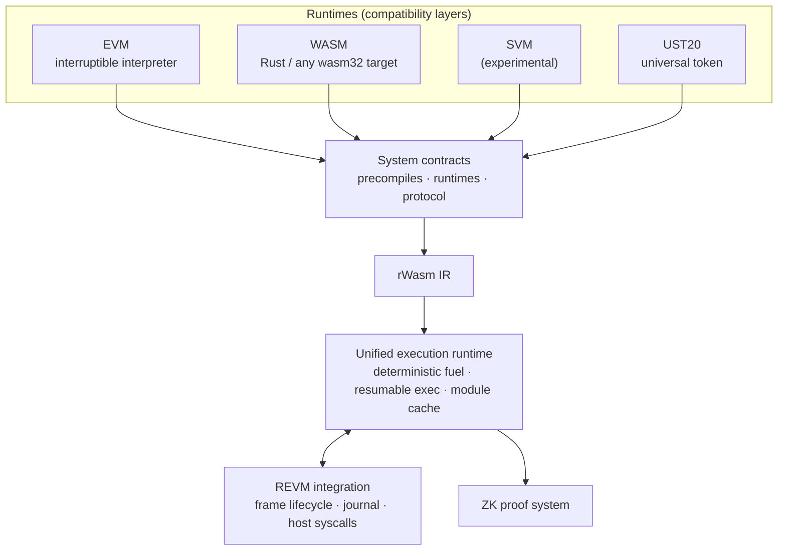

<p align="center">
  
</p>

<p align="center">
  <strong>One runtime. Every VM. A single provable state transition.</strong>
</p>

<p align="center">
  <a href="https://github.com/fluentlabs-xyz/fluentbase/actions/workflows/ci.yml"></a>
  <a href="https://github.com/fluentlabs-xyz/fluentbase/actions/workflows/clippy.yml"></a>
  <a href="https://codecov.io/github/fluentlabs-xyz/fluentbase"></a>
  <a href="https://crates.io/crates/fluentbase-sdk"></a>
  <a href="./LICENSE"></a>
</p>

<p align="center">
  Fluentbase is the execution stack behind <a href="https://fluent.xyz">Fluent</a>, the blended L2.
  EVM, WASM and SVM contracts compile down to <strong>rWasm IR</strong>, run in one deterministic runtime,
  share one account space, and are proven by one ZK circuit.
</p>

<p align="center">
  <a href="#quick-start">Quick start</a> ·
  <a href="#write-a-contract">Write a contract</a> ·
  <a href="#run-a-node">Run a node</a> ·
  <a href="#how-it-works">Architecture</a> ·
  <a href="#repository-map">Repository map</a> ·
  <a href="#documentation">Docs</a>
</p>

---

## Why Fluentbase

Most multi-VM chains bolt VMs together side by side. Each VM gets its own execution semantics,
its own state model and its own proving surface, and cross-VM calls become bridges in disguise.

Fluentbase takes the opposite route. The VMs are **compatibility layers**, not execution engines.
Every one of them lowers to the same intermediate representation and runs through the same
state transition function.

| | Traditional multi-VM | Fluentbase blended execution |
|---|---|---|
| Execution engines | one per VM | **one** (rWasm) |
| Proving surface | one circuit per VM | **one** STF over rWasm IR |
| Cross-VM calls | adapters and bridges | native, same call stack |
| Account space | fragmented | shared |
| Token model | per-VM | unified (UST20) |
| Ahead-of-time compilation | varies | yes, via wasmtime |

The practical payoff: a Solidity contract can call a Rust contract that calls a Solana program,
in one transaction, with one gas model, and the whole thing is provable as a single trace.

> **SVM status.** The Solana runtime is still under heavy development. It is excluded from the
> workspace build, absent from the genesis files, and hidden behind a feature flag until it settles.

---

## How it works



A call enters the REVM layer, which decides which **runtime owner** should execute it. The
runtime runs the rWasm module with a fuel budget and either returns a final result or an
**interruption**: a request for a privileged host action such as a storage write or a nested
call. The host performs the action, resumes the module, and commits journal updates by REVM
rules. Execution and state commitment are deliberately split so the same trace can be re-run
and proven.

The full mechanism, invariants and gas model are written up in [`docs/`](docs/README.md).

---

## Quick start

**Prerequisites.** Rust is pinned by [`rust-toolchain`](rust-toolchain) and installs
automatically. You also need the wasm target, `cargo-nextest` and `make`.

```bash
rustup target add wasm32-unknown-unknown
cargo install cargo-nextest --locked
```

**Build, lint, test.**

```bash
git clone https://github.com/fluentlabs-xyz/fluentbase.git
cd fluentbase

make build     # workspace build, contracts and genesis artifacts
make clippy    # clippy with -D warnings across root, contracts and examples
make test      # unit, contract and end-to-end suites (rwasm and wasmtime)
make pr        # what CI runs before a merge: clippy + test
```

Other targets worth knowing:

| Target | What it does |
|---|---|
| `make install` | Build and install the `fluent` node binary into `$CARGO_HOME/bin` |
| `make build-fluent` | Build the `fluent` binary into `target/` |
| `make coverage` | Full `llvm-cov` run producing `coverage-*.lcov` |
| `make run-codec-conformance` | Codec against the external Solidity ABI corpus (network, slow) |
| `make wasm2wat` | Dump built contracts as `.wat` for inspection |
| `make maxperf` | Most aggressive optimisation profile for the node |
| `make help` | Every documented target |

---

## Write a contract

Contracts are ordinary `no_std` Rust crates built on `fluentbase-sdk`. The router macro gives
you Solidity ABI compatibility for free, so the contract below is callable from any EVM tool with
the selector `greeting(string)`.

```rust
#![cfg_attr(not(feature = "std"), no_std, no_main)]
extern crate alloc;
extern crate fluentbase_sdk;

use alloc::string::String;
use fluentbase_sdk::{basic_entrypoint, derive::{router, Contract}, SharedAPI};

#[derive(Contract)]
struct Greeter<SDK> {
    sdk: SDK,
}

pub trait GreeterAPI {
    fn greeting(&self, name: String) -> String;
}

#[router(mode = "solidity")]
impl<SDK: SharedAPI> GreeterAPI for Greeter<SDK> {
    #[function_id("greeting(string)")]
    fn greeting(&self, name: String) -> String {
        name
    }
}

impl<SDK: SharedAPI> Greeter<SDK> {
    pub fn deploy(&self) {}
}

basic_entrypoint!(Greeter);
```

Unit tests run the contract in-process against an embedded runtime, no node required:

```rust
#[cfg(test)]
mod tests {
    use super::*;
    use fluentbase_testing::TestingContextImpl;

    #[test]
    fn greets() {
        let sdk = TestingContextImpl::default();
        // encode calldata with alloy-sol-types, run the entrypoint, inspect sdk.take_output()
    }
}
```

`Cargo.toml` for a contract crate:

```toml
[package]
name = "greeter"
version = "0.1.0"
edition = "2021"

[lib]
crate-type = ["cdylib"]

[dependencies]
fluentbase-sdk = { version = "1.4", default-features = false }

[dev-dependencies]
# not on crates.io: it embeds the node's forked revm, so pull it from the release tag
fluentbase-testing = { git = "https://github.com/fluentlabs-xyz/fluentbase", tag = "v1.4.2" }

[features]
default = ["std"]
std = ["fluentbase-sdk/std", "fluentbase-testing/std"]
```

Start from [`examples/`](examples/) for working templates: [`greeting`](examples/greeting/lib.rs)
is the minimal contract, [`router-solidity`](examples/router-solidity/lib.rs) the ABI router,
[`erc20`](examples/erc20/lib.rs) a token, [`storage`](examples/storage/lib.rs) and
[`simple-storage`](examples/simple-storage/lib.rs) the storage API, and
[`client-solidity`](examples/client-solidity/lib.rs) calling into a Solidity contract from Rust.

---

## Run a node

The `fluent` binary is a Reth-based node with the Fluentbase execution layer plugged in.

| Chain | `--chain` | Chain ID |
|---|---|---|
| Local dev | `dev` | `1337` |
| Devnet | `fluent-devnet` | `20993` |
| Testnet | `fluent-testnet` | `20994` |
| Mainnet | `fluent-mainnet` | `25363` |

**Testnet** bootstraps from a snapshot:

```bash
cargo build --bin fluent --release

./target/release/fluent init     --datadir=./datadir/testnet --chain=fluent-testnet
./target/release/fluent download --datadir=./datadir/testnet --chain=fluent-testnet
./target/release/fluent node     --datadir=./datadir/testnet --chain=fluent-testnet --http
```

**Mainnet** syncs from genesis directly:

```bash
./target/release/fluent node --datadir=./datadir/mainnet --chain=fluent-mainnet --http
```

Prefer not to build? Grab a signed binary from
[GitHub Releases](https://github.com/fluentlabs-xyz/fluentbase/releases) or pull the
[`ghcr.io/fluentlabs-xyz/fluent`](https://github.com/fluentlabs-xyz/fluentbase/pkgs/container/fluent)
image. Genesis assets are verified fail-closed against the pinned release key by
[`crates/release-verify`](crates/release-verify) before the node touches them.

The full runbook, including a health check, lives in
[`docs/10-running-node-locally.md`](docs/10-running-node-locally.md).

---

## Repository map

```
fluentbase
├── bins/         fluent node CLI · runtime-upgrade CLI
├── crates/       core libraries (see below)
├── contracts/    system contracts shipped in genesis and runtime upgrades
├── examples/     example contracts, each a standalone crate
├── e2e/          runtime e2e + benches · Ethereum state tests · ABI conformance corpus
├── docs/         how execution actually works, for contributors and auditors
├── flips/        Fluent Improvement Proposals
├── audits/       internal and external security audit reports
├── docker/       node, build and cross Dockerfiles
└── scripts/      genesis reproduction, ABI generation, contract verification
```

### Core crates

| Crate | Role |
|---|---|
| [`runtime`](crates/runtime) | rWasm execution runtime: syscall dispatch, deterministic fuel, resumable execution, per-code-hash module cache, optional wasmtime AOT |
| [`revm`](crates/revm) | REVM integration: frame lifecycle, journal, host-side syscall handling, runtime-owner routing |
| [`evm`](crates/evm) | Interruptible EVM interpreter used by the delegated EVM runtime |
| [`node`](crates/node) | Reth node integration: chain specs, consensus, payload builder, launcher |
| [`sdk`](crates/sdk) / [`sdk-derive`](crates/sdk-derive) | Contract-facing API, entrypoint and router macros |
| [`codec`](crates/codec) / [`codec-derive`](crates/codec-derive) | Solidity-ABI-compatible codec with derive support |
| [`types`](crates/types) | Shared types, constants, address maps and syscall indices |
| [`crypto`](crates/crypto) | Cryptographic primitives and runtime adapters |
| [`genesis`](crates/genesis) | Genesis construction and system contract bundle metadata |
| [`contracts`](crates/contracts) | Embedded build outputs of the system contracts |
| [`build`](crates/build) | Deterministic contract build tooling: WAT, rWasm, ABI and metadata outputs |
| [`release-verify`](crates/release-verify) | Fail-closed authentication of signed release artifacts |
| [`testing`](crates/testing) | In-process testing harness, including `TxBuilder` for EVM-style transaction tests |

`svm`, `svm-common` and `svm-shared` exist in the tree but are excluded from the workspace
until the Solana runtime stabilises.

### System contracts

Everything under [`contracts/`](contracts/) is compiled to rWasm and shipped in genesis.

- **Runtimes.** `evm`, `wasm` (Wasm to rWasm compiler, devnet and testnet only), `svm`.
- **Protocol.** `fee-manager`, `runtime-upgrade`, `universal-token` (UST20, see
  [FLIP-20](flips/FLIP-20.md)), `create2-factory`.
- **Precompiles.** `ecrecover`, `sha256`, `ripemd160`, `identity`, `modexp`, `bn256`, `blake2f`,
  `kzg`, `bls12381`, `eip2935`, `eip7951` (P-256), `webauthn`, `nitro` (AWS Nitro attestation).

### Test suites

| Suite | In workspace | Purpose |
|---|---|---|
| [`e2e/runtime`](e2e/runtime) | yes | End-to-end runtime tests and Criterion benchmarks |
| [`e2e/evm`](e2e/evm) | no | Ethereum state tests and replay fixtures, driven by its own `make` |
| [`e2e/codec`](e2e/codec) | no | 1880-vector Solidity ABI conformance corpus, run when the codec changes |

---

## Documentation

The [`docs/`](docs/README.md) folder is written for contributors and auditors, and the rule is
that code is authoritative: runtime-critical behaviour changes must update the docs in the same PR.

| | Read this for |
|---|---|
| [System overview](docs/00-system-overview.md) | The end-to-end picture of a call |
| [Runtime routing and ownable accounts](docs/01-runtime-routing-and-ownable-accounts.md) | Why contracts are wrapped and how owners route |
| [Interruption protocol](docs/02-interruption-protocol.md) | The `exec` / `resume` handshake |
| [Syscall reference](docs/03-syscall-reference-core.md) | Every host call and its rules |
| [Gas and fuel](docs/04-gas-and-fuel.md) | Metering and the gas-to-fuel conversion |
| [Security invariants](docs/05-security-invariants.md) | What must never break |
| [Runtime upgrade](docs/06-runtime-upgrade.md) | Governance and host enforcement of upgrades |
| [rWasm integration](docs/07-rwasm-integration.md) | The contract between Fluentbase and rWasm |
| [Universal Token](docs/08-universal-token.md) | UST20 semantics and constraints |
| [RPC vs upstream Reth](docs/09-rpc-compatibility-vs-reth.md) | Where Fluent RPC behaviour differs |
| [Running a node locally](docs/10-running-node-locally.md) | The operator runbook |

Developer-facing guides, tutorials and deployment docs are at [docs.fluent.xyz](https://docs.fluent.xyz/).

---

## Versioning and releases

Versions follow `<stage>.<major>.<minor>`.

- **stage** marks a Fluentbase generation (currently `1`) and changes only with a new
  development stage.
- **major** is for genesis-breaking or feature-breaking changes that require a runtime upgrade.
  These go through a release branch and are never merged straight into `devel`.
- **minor** covers everything that leaves genesis untouched: SDK fixes, docs, tooling.

Tagged stable releases publish the SDK crates to crates.io, ship signed genesis assets and node
binaries on GitHub Releases, and build a multi-arch Docker image. Genesis is compiled inside the
[`fluentbase-build`](docker/Dockerfile.build) image, whose digest the release pipeline verifies
against a provenance attestation from `build-docker.yml` before building, and the release
workflow builds it twice and compares the hashes.

---

## Security

Fluentbase is consensus-critical software. Changes can affect determinism, proof compatibility,
account state, gas accounting and release artifacts.

- Read [SECURITY.md](SECURITY.md) for the threat model, supported branches and how to report.
- Past reviews, internal and external, are recorded in [`audits/`](audits/README.md).

---

## Contributing

Contributions are welcome. [CONTRIBUTING.md](CONTRIBUTING.md) covers the branch model, commit
conventions and release process; [AGENTS.md](AGENTS.md) is the guide for coding agents working
in this repository. Open a PR against `devel` and run `make pr` before you push.

## License

Licensed under the [Apache License, Version 2.0](LICENSE).
