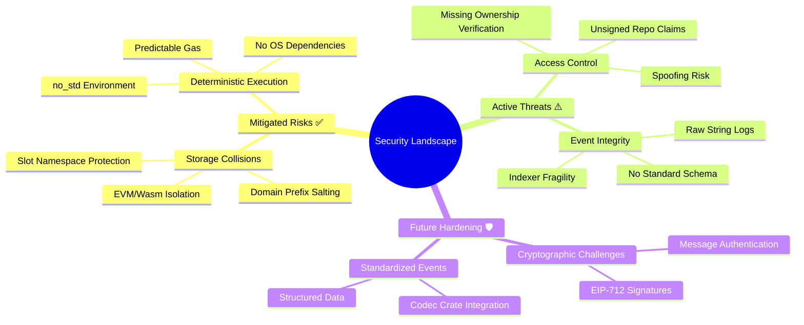
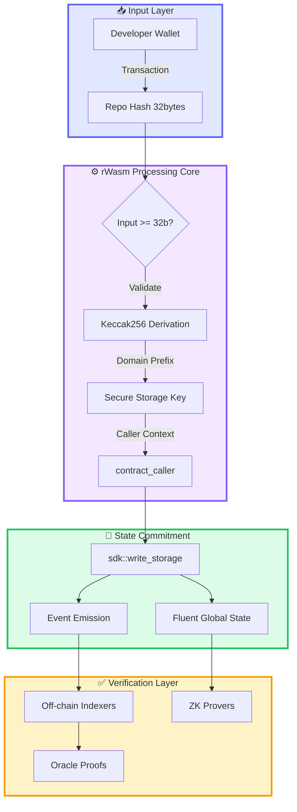
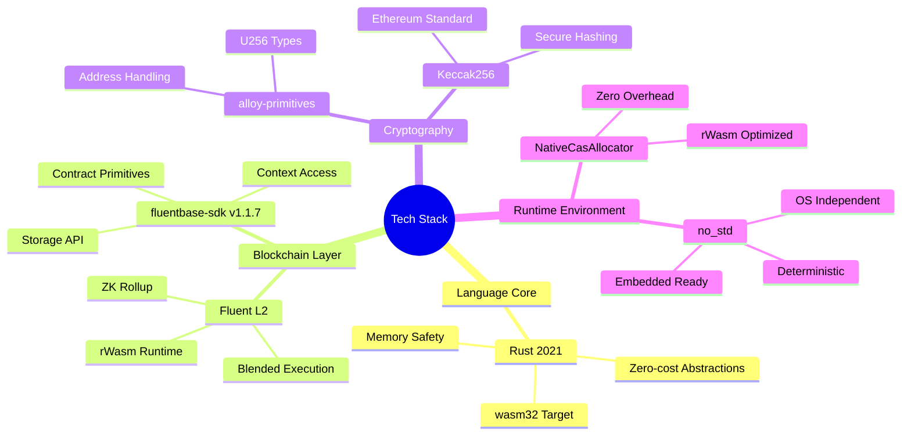
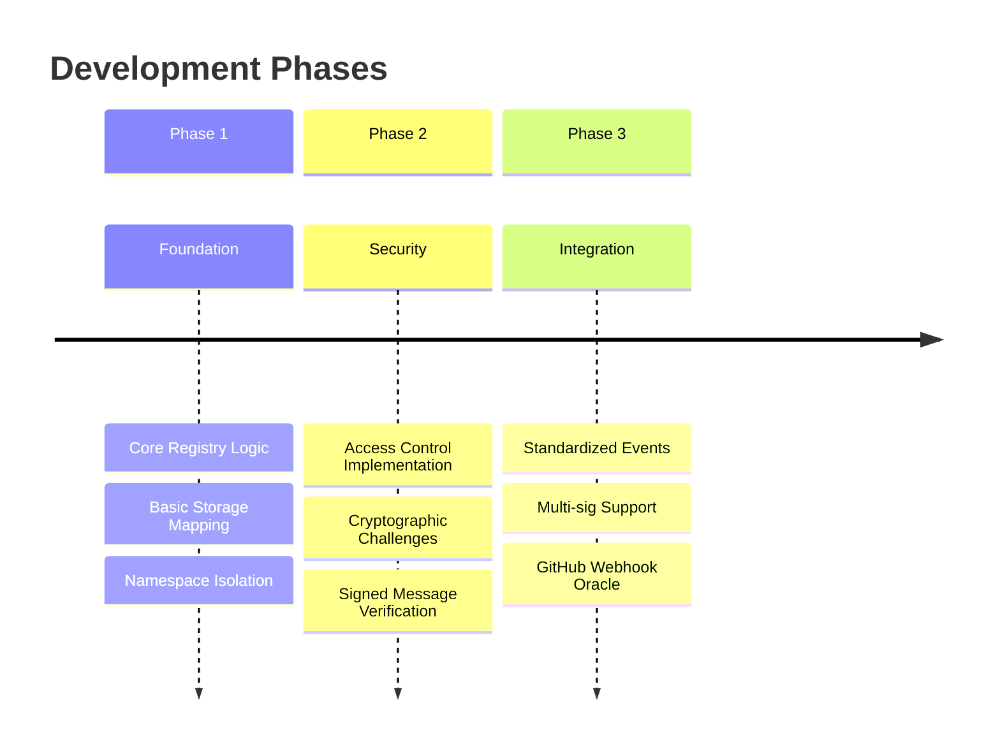
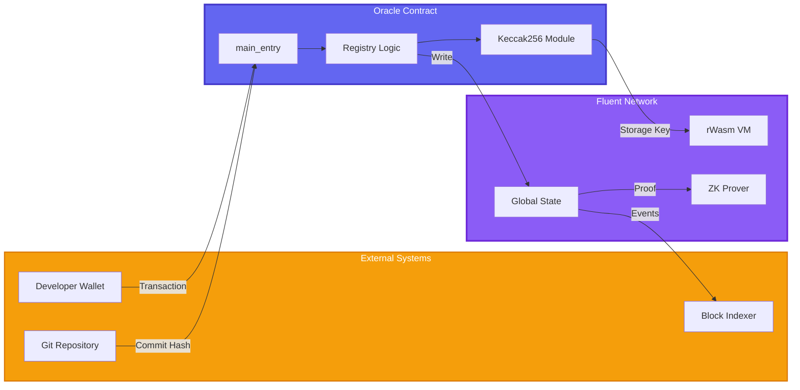
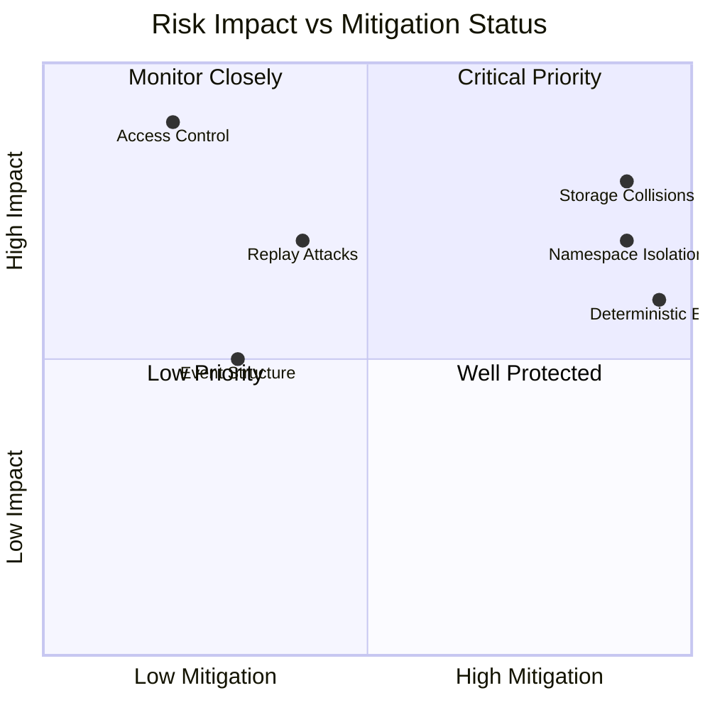
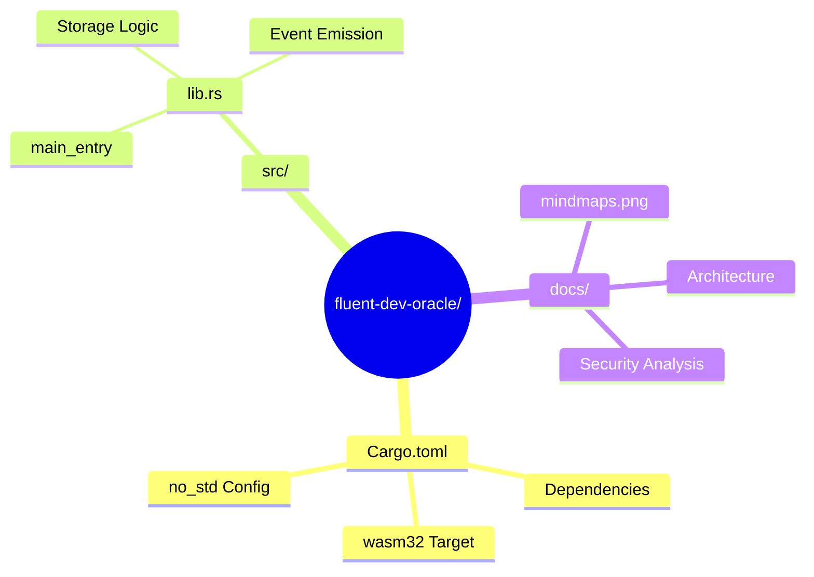

أعتذر! يبدو أن الرد السابق لم يظهر بشكل صحيح. سأعيد تقديم README.md الاحترافي بالخرائط الذهنية:

```markdown
<div align="center">

# 🔐 fluent-dev-oracle

**Decentralized Developer Identity Registry**  
*Architecting Truth on the Fluent Layer*

[](https://fluent.xyz)
[](https://github.com/fluentlabs-xyz/fluentbase)
[](https://github.com/fluentlabs-xyz/fluentbase/pull/398)

</div>

---

## 🧠 Architecture Mind Map

```mermaid
mindmap
  root((fluent-dev-oracle))
    Core Runtime
      rWasm VM
        wasm32-unknown-unknown
        NativeCasAllocator
        no_std Environment
      Fluent L2
        Blended Execution
        ZK-Friendly State
        Unified Account Space
    Identity Layer
      Repository Hash
        Git Commit SHA
        32-byte Input
        Immutable Anchor
      Developer Wallet
        contract_caller()
        U256 Address
        Verifiable Origin
    Cryptographic Core
      Domain Separation
        fluent.oracle.dev_identity.v1
        Namespace Isolation
        Collision Prevention
      Key Derivation
        keccak256 Prefix + Hash
        Deterministic Slots
        ZK-Provable Paths
    State Management
      Storage Write
        sdk::write_storage
        Atomic Commits
        Global State
      Event Emission
        Structured Logs
        Off-chain Indexers
        Oracle Proofs
```

---

## 🎯 Security Threat Model Map



---

## 🔄 Data Flow Topology



---

## 🗺️ Tech Stack Ecosystem Map



---

## 📊 Project Evolution Timeline



---

## 🎨 Component Interaction Map



---

## 🔍 Risk Assessment Matrix



---

## 📁 Repository Structure Tree



---

<div align="center">

## 🔗 Quick Navigation

[Architecture](#-architecture-mind-map) • [Security](#-security-threat-model-map) • [Tech Stack](#%EF%B8%8F-tech-stack-ecosystem-map) • [Roadmap](#-project-evolution-timeline)

---

**Developed by [@freedroporacle](https://github.com/freedroporacle)**  
*PR #398 | v0.1.0-alpha*

</div>


